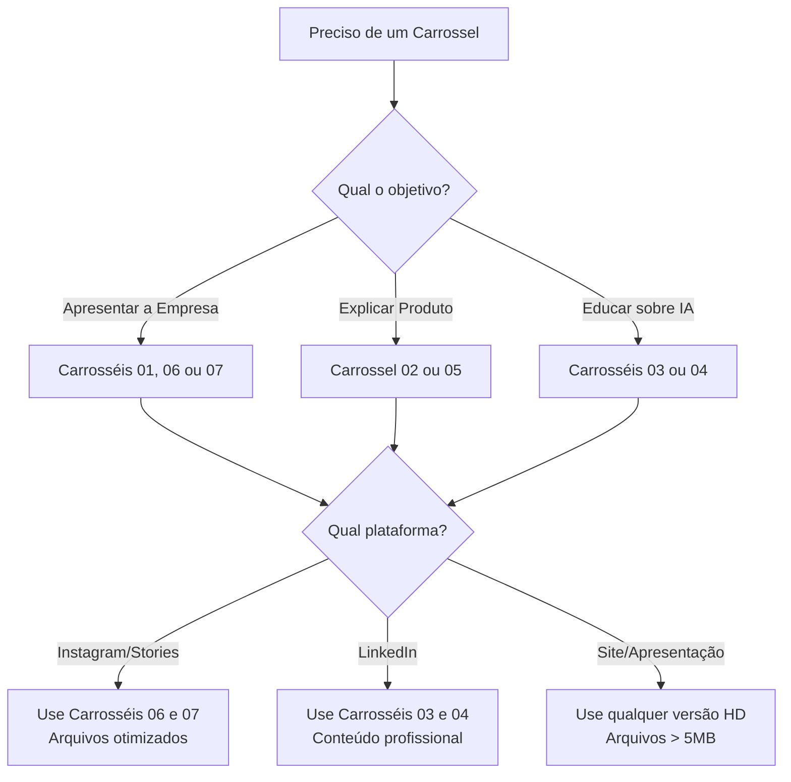

# 🚀 Guia Rápido de Uso dos Carrosséis

## 🎯 Qual Carrossel Usar?



---

## 📊 Tabela de Decisão Rápida

| Preciso de... | Use o Carrossel | Pasta | Arquivos |
|---------------|----------------|-------|----------|
| **Post Instagram "Quem Somos"** | 07 | `07 - CAROUSEL-UZZAI-QUEM-SOMOS` | slides 1-7 (escolha a opção de capa) |
| **Post Instagram "Institucional"** | 06 | `06 - CAROUSEL-4-QUEM-E-UZZAI-VARB` | slides 1-6 |
| **Apresentação sobre o UzzApp** | 02 ou 05 | `02 - Carrosel o que é o uzzapp` ou `05 - Carrosel Processo UzzApp` | Versões HD (> 5MB) |
| **Post LinkedIn sobre IA** | 03 ou 04 | `03 - CARROSSEL 05...` ou `04 - COMO USAR IA...` | Qualquer variação |
| **Material impresso** | Qualquer | Qualquer pasta | Use arquivos > 10MB |
| **Stories Instagram** | 06 ou 07 | Pastas organizadas | Arquivos < 1MB |

---

## 🎨 Hierarquia de Qualidade

### ⭐⭐⭐⭐⭐ Altamente Recomendados (Prontos para Uso)

#### Carrossel 06 - Variação B
```
06 - CAROUSEL-4-QUEM-E-UZZAI-VARB/
├── 📄 CAROUSEL-4-QUEM-E-UZZAI-VARIACAO-B-GUIA.md ← Leia isso primeiro!
├── 🖼️ uzzai_slide_1_capa_identidade_1769546750138.png
├── 🖼️ uzzai_slide_2_missao_1769546773816.png
├── 🖼️ uzzai_slide_3_human_in_loop_1769546794252.png
├── 🖼️ uzzai_slide_4_produtos_solucoes_1769546819814.png
├── 🖼️ uzzai_slide_5_diferenciais_1769546840922.png
└── 🖼️ uzzai_slide_6_cta_variacao_b_1769546864988.png
```

**Por que usar:**
- ✅ Nomes descritivos
- ✅ Sequência clara (1-6)
- ✅ Arquivos otimizados (< 800KB cada)
- ✅ Guia MD completo com copy
- ✅ Pronto para publicar

#### Carrossel 07 - Quem Somos
```
07 - CAROUSEL-UZZAI-QUEM-SOMOS/
├── 📄 CAROUSEL-UZZAI-QUEM-SOMOS-GUIA-COMPLETO.md ← Leia isso primeiro!
├── 🖼️ slide_1_opcao_1_liberdade_1769546185824.png     ┐
├── 🖼️ slide_1_opcao_2_automacao_1769546214496.png    │ Escolha 1
├── 🖼️ slide_1_opcao_3_humanizacao_1769546234753.png  │ dessas 4
├── 🖼️ slide_1_opcao_4_resultados_1769546254568.png   ┘
├── 🖼️ slide_2_origem_uzguri_1769546273189.png
├── 🖼️ slide_3_missao_1769546291721.png
├── 🖼️ slide_4_produtos_ecossistema_1769546312246.png
├── 🖼️ slide_5_time_equipe_1769546330084.png
├── 🖼️ slide_6_diferenciais_porque_1769546349114.png
└── 🖼️ slide_7_cta_proximo_passo_1769546367859.png
```

**Por que usar:**
- ✅ 4 opções de capa (A/B testing)
- ✅ Sequência completa (7 slides)
- ✅ Altamente otimizado
- ✅ Guia MD completo
- ✅ Ideal para Instagram

---

### ⭐⭐⭐ Bons (Necessitam Seleção)

#### Carrosséis 02, 03, 04, 05
- **Problema:** Múltiplas variações do mesmo slide
- **Solução:** Escolha a versão adequada por tamanho:
  - `1.png` → Versão otimizada (~1-2 MB)
  - `1 (2).png` → Versão HD (~6-10 MB)
  - `1 (3).png` → Versão alternativa

---

### ⭐⭐ Necessitam Organização

#### Carrossel 01
- **Problema:** 32 arquivos misturados
- **Solução sugerida:** 

```bash
01 - CARROSEL QUEM SOMOS/
├── FINAIS/           ← Mover: carrosel completo.png, Carrosel.png
├── GEMINI/           ← Mover: todos Gemini_Generated_Image_*
├── INSTAGRAM/        ← Mover: INSTA 0.png, INSTA 1.png.png
├── SCREENSHOTS/      ← Mover: Screenshot_2.png até Screenshot_9.png
└── OUTROS/           ← já existe
```

---

## 🎬 Fluxo de Trabalho Recomendado

### Para Instagram

```
1. Escolha o carrossel:
   ↓
   Institucional? → Carrossel 06 ou 07
   Produto? → Carrossel 02
   Educacional? → Carrossel 03
   
2. Leia o guia MD (se existir)
   ↓
   📄 *-GUIA.md ou *-GUIA-COMPLETO.md
   
3. Selecione os slides
   ↓
   Use versões < 1 MB para Stories
   Use versões 1-5 MB para Feed
   
4. Copie o texto do guia MD
   ↓
   Caption + Hashtags já estão prontas!
   
5. Publique 🚀
```

### Para LinkedIn

```
1. Escolha carrossel educacional
   ↓
   Carrossel 03 ou 04 (Como usar IA)
   
2. Selecione versões intermediárias
   ↓
   Arquivos entre 2-5 MB
   
3. Adapte o copy para tom profissional
   ↓
   Menos emojis, mais dados
   
4. Publique em horário comercial
```

### Para Apresentações/Site

```
1. Escolha por conteúdo, não por otimização
   
2. Prefira arquivos HD
   ↓
   Versões > 5 MB
   
3. Converta para JPG se necessário
   ↓
   PowerPoint funciona melhor com JPG
   
4. Use!
```

---

## 📏 Especificações Técnicas

### Tamanhos Ideais por Plataforma

| Plataforma | Formato | Tamanho Máximo | Resolução Ideal |
|------------|---------|----------------|-----------------|
| **Instagram Feed** | Quadrado (1:1) | 8 MB | 1080x1080 px |
| **Instagram Stories** | Vertical (9:16) | 4 MB | 1080x1920 px |
| **LinkedIn** | Horizontal (1.91:1) | 5 MB | 1200x627 px |
| **Facebook** | Quadrado (1:1) | 8 MB | 1080x1080 px |
| **Site** | Variado | Sem limite* | Otimize para web |
| **Email** | Horizontal | < 1 MB | 600-800 px largura |

\* *Use compressão para melhor performance*

---

## 🛠️ Comandos Úteis

### Copiar Carrossel Específico

```powershell
# Copiar Carrossel 06 para área de trabalho
Copy-Item "c:\19 - Marketing\REPOSITÓRIO\06 - CAROUSEL-4-QUEM-E-UZZAI-VARB\*" `
          "$env:USERPROFILE\Desktop\Carrossel-Instagram\" -Recurse
```

### Listar Apenas Arquivos Otimizados (< 1 MB)

```powershell
Get-ChildItem "c:\19 - Marketing\REPOSITÓRIO\" -Recurse -File | 
    Where-Object {$_.Length -lt 1MB} | 
    Select-Object Name, @{Name="Size(KB)";Expression={[math]::Round($_.Length/1KB,2)}}, DirectoryName
```

### Encontrar Duplicatas

```powershell
Get-ChildItem "c:\19 - Marketing\REPOSITÓRIO\01 - CARROSEL QUEM SOMOS\" -File | 
    Group-Object Length | 
    Where-Object {$_.Count -gt 1}
```

---

## ✅ Checklist de Publicação

```markdown
Antes de publicar qualquer carrossel:

- [ ] Verificar se há guia MD na pasta
- [ ] Ler o guia completo (copy, hashtags, estratégia)
- [ ] Escolher versão adequada ao tamanho
- [ ] Testar visualização no celular
- [ ] Verificar qualidade da imagem
- [ ] Copiar caption do guia MD
- [ ] Adaptar hashtags se necessário
- [ ] Agendar ou publicar
- [ ] Monitorar primeiros comentários
```

---

## 📚 Documentação Adicional

### Guias MD Disponíveis

1. [Carrossel 06 - Guia Variação B](file:///c:/19%20-%20Marketing/REPOSIT%C3%93RIO/06%20-%20CAROUSEL-4-QUEM-E-UZZAI-VARB/CAROUSEL-4-QUEM-E-UZZAI-VARIACAO-B-GUIA.md)
2. [Carrossel 07 - Guia Completo](file:///c:/19%20-%20Marketing/REPOSIT%C3%93RIO/07%20-%20CAROUSEL-UZZAI-QUEM-SOMOS/CAROUSEL-UZZAI-QUEM-SOMOS-GUIA-COMPLETO.md)

### Índice Completo

- [INDICE-CARROSEIS.md](file:///c:/19%20-%20Marketing/REPOSIT%C3%93RIO/INDICE-CARROSEIS.md) - Documentação completa de todos os arquivos

---

## 💡 Dicas Profissionais

### A/B Testing
Os carrosséis 06 e 07 são perfeitos para testar:
- **Carrossel 07:** 4 capas diferentes → teste qual gera mais cliques
- **Variações (2), (3):** Compare performance de diferentes designs

### Reciclagem de Conteúdo
1. **Instagram → LinkedIn:** Use as mesmas imagens, mude o copy
2. **Carrossel → Stories:** Separe cada slide em um story individual
3. **Posts → Site:** Use imagens HD como banners

### Performance
- Arquivos < 800 KB carregam 3x mais rápido
- Instagram comprime automaticamente > 1 MB
- LinkedIn prefere horizontal, Instagram prefere quadrado

---

**Última atualização:** 27/01/2026  
**Versão:** 1.0  
**Autor:** UzzAi Marketing
