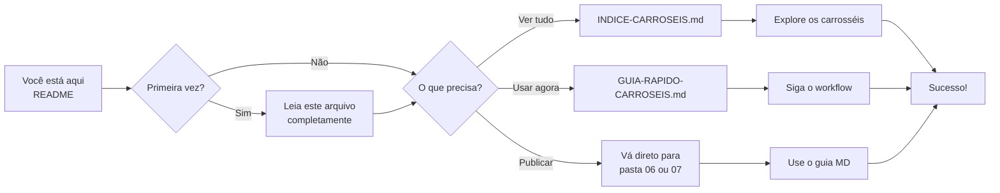

# 📱 README - Carrosséis de Marketing UzzAi

> **Acesso Rápido:** Este é o ponto de partida para usar os carrosséis de marketing

---

## 🎯 O que você vai encontrar aqui

Este repositório contém **7 carrosséis completos** para redes sociais e marketing, totalizando aproximadamente **140 imagens** organizadas por tema e uso.

---

## 📚 Documentação Disponível

| Documento | Descrição | Quando usar |
|-----------|-----------|-------------|
| **[INDICE-CARROSEIS.md](file:///c:/19%20-%20Marketing/REPOSIT%C3%93RIO/INDICE-CARROSEIS.md)** | Índice completo com todos os arquivos | Explorar tudo que está disponível |
| **[GUIA-RAPIDO-CARROSEIS.md](file:///c:/19%20-%20Marketing/REPOSIT%C3%93RIO/GUIA-RAPIDO-CARROSEIS.md)** | Guia prático com fluxos de trabalho | Preciso publicar AGORA |
| Este arquivo (README) | Visão geral e início rápido | Primeira vez aqui |

---

## ⚡ Início Rápido - 3 Passos

### 1️⃣ Escolha seu objetivo

````carousel
**Apresentar a empresa**
- **Melhor opção:** Carrossel 06 ou 07
- **Pasta:** `06 - CAROUSEL-4-QUEM-E-UZZAI-VARB` ou `07 - CAROUSEL-UZZAI-QUEM-SOMOS`
- **Vantagem:** Já tem guia com copy pronto

<!-- slide -->

**Explicar o produto UzzApp**
- **Melhor opção:** Carrossel 02 ou 05
- **Pasta:** `02 - Carrosel o que é o uzzapp` ou `05 - Carrosel Processo UzzApp`
- **Vantagem:** Múltiplas variações de cada slide

<!-- slide -->

**Educar sobre IA**
- **Melhor opção:** Carrossel 03 ou 04
- **Pasta:** `03 - CARROSSEL 05 COMO USAR IA...` ou `04 - COMO USAR IA...`
- **Vantagem:** Conteúdo educacional profissional

````

### 2️⃣ Entre na pasta recomendada

### 3️⃣ Use os arquivos!

- **Para Instagram:** Arquivos < 1 MB (otimizados)
- **Para LinkedIn:** Arquivos 2-5 MB (qualidade média)
- **Para apresentações:** Arquivos > 5 MB (alta qualidade)

---

## 🌟 Carrosséis em Destaque

### ⭐ TOP 1: Carrossel 07 - Quem Somos (MAIS COMPLETO)

```
📁 07 - CAROUSEL-UZZAI-QUEM-SOMOS/

✅ 4 opções de capa (teste A/B)
✅ 7 slides completos
✅ Guia MD com copy pronto
✅ Arquivos otimizados
✅ Nomenclatura descritiva

🎯 Perfeito para: Instagram Feed
```

### ⭐ TOP 2: Carrossel 06 - Variação B (MAIS FOCADO)

```
📁 06 - CAROUSEL-4-QUEM-E-UZZAI-VARB/

✅ 6 slides diretos
✅ Foco em diferenciação
✅ Guia MD completo
✅ Super otimizado (todos < 800 KB)
✅ Nomenclatura profissional

🎯 Perfeito para: Instagram Stories + Feed
```

### ⭐ TOP 3: Carrossel 03 - Como Usar IA (MAIS EDUCATIVO)

```
📁 03 - CARROSSEL 05 COMO USAR IA NA SUA EMPRESA/

✅ 7 slides educativos
✅ Múltiplas variações
✅ Conteúdo rico
✅ Imagens Gemini incluídas

🎯 Perfeito para: LinkedIn + Blog
```

---

## 📊 Todos os Carrosséis

| # | Nome | Slides | Status | Best For |
|---|------|--------|--------|----------|
| **01** | Quem Somos | ~32 | ⚠️ Organizar | Site/Backup |
| **02** | O que é UzzApp | 6 | ✅ Pronto | Instagram |
| **03** | Como Usar IA (v5) | 7 | ✅ Pronto | LinkedIn |
| **04** | Como Usar IA | 6 | ✅ Pronto | LinkedIn |
| **05** | Processo UzzApp | 5 | ✅ Pronto | Apresentações |
| **06** | Quem é UzzAi (Var B) | 6 | ⭐ Excelente | Instagram |
| **07** | Quem Somos Completo | 7 | ⭐ Excelente | Instagram |

**Legenda:**
- ⭐ Excelente: Organização perfeita, pronto para usar
- ✅ Pronto: Utilizável imediatamente
- ⚠️ Organizar: Funcional mas necessita limpeza

---

## 🔍 Exemplos Visuais

### Estrutura de Arquivo Ideal (Carrosséis 06 e 07)

````carousel
**Naming Convention Perfeita**

```
uzzai_slide_1_capa_identidade.png
       │      │  │        └─ Descrição
       │      │  └─────────── Tipo/Função  
       │      └────────────── Número
       └───────────────────── Projeto
```

✅ Fácil de entender
✅ Ordem automática
✅ Busca eficiente

<!-- slide -->

**Tamanhos Otimizados**

```
Slide 1: 612 KB  ✅
Slide 2: 698 KB  ✅
Slide 3: 586 KB  ✅
Slide 4: 774 KB  ✅
Slide 5: 709 KB  ✅
Slide 6: 595 KB  ✅
```

Todos < 800 KB = Instagram FELIZ! 🚀

<!-- slide -->

**Guia MD Incluído**

```markdown
# CAROUSEL-4-QUEM-E-UZZAI-VARIACAO-B-GUIA.md

- Copy pronto ✅
- Hashtags definidas ✅
- Estratégia clara ✅
- Timing recomendado ✅
```

Só copiar e colar! 📋

````

---

## 🎨 Escolha por Plataforma

### 📱 Instagram Feed
→ **Use:** Carrosséis 06 ou 07  
→ **Motivo:** Otimizados, copy pronto, 4 variações de capa para testar

### 💼 LinkedIn
→ **Use:** Carrosséis 03 ou 04  
→ **Motivo:** Conteúdo educacional, tom profissional

### 🖥️ Site
→ **Use:** Qualquer carrossel (versões HD)  
→ **Motivo:** Alta qualidade, múltiplas opções

### 📧 Email Marketing
→ **Use:** Carrosséis 06 ou 07 (versões otimizadas)  
→ **Motivo:** Carregamento rápido

### 📊 Apresentações
→ **Use:** Carrosséis 02, 05 (versões > 5MB)  
→ **Motivo:** Máxima qualidade visual

---

## 📖 Como Usar Este Repositório



---

## ✅ Checklist de Primeiro Uso

```markdown
Para começar a usar os carrosséis:

- [ ] Li este README completo
- [ ] Entendi a diferença entre os carrosséis 06 e 07
- [ ] Sei onde encontrar os guias MD
- [ ] Conheço os tamanhos ideais para cada plataforma
- [ ] Tenho o GUIA-RAPIDO salvo nos favoritos
- [ ] Já escolhi qual carrossel usar primeiro

Pronto! 🚀 Agora é só publicar!
```

---

## 💡 Dicas Profissionais

### 🎯 Para Máximo Engajamento

1. **Use Carrossel 07 com capa "Resultados"** → Gera mais curiosidade
2. **Publique terça ou quinta, 18h-20h** → Melhor horário para B2B
3. **Teste diferentes capas (A/B)** → Carrossel 07 tem 4 opções!

### 🔄 Reciclagem Inteligente

- **Instagram → LinkedIn:** Troque copy, mesmas imagens
- **Carrossel → Stories:** Um slide por story (7 stories!)
- **Feed → Reels:** Adicione narração, mantenha slides

### 📊 Monitoramento

Compare:
- **Variação B (06)** vs **Completo (07)** → Qual gera mais saves?
- **Capa "Liberdade"** vs **"Resultados"** → Qual atrai mais cliques?

---

## 🆘 Precisa de Ajuda?

### Perguntas Frequentes

**P: Qual carrossel usar para Instagram?**  
R: Carrosséis 06 ou 07. Ambos são otimizados e têm copy pronto.

**P: As imagens estão muito grandes, como otimizar?**  
R: Use ferramentas como TinyPNG ou compressor.io. Ou escolha as versões (1) que já são menores.

**P: Onde está o texto para o post?**  
R: Nos arquivos MD dentro das pastas 06 e 07!

**P: Posso misturar slides de diferentes carrosséis?**  
R: Pode, mas mantenha consistência visual. Recomendamos usar um carrossel completo.

**P: Preciso dar crédito às imagens Gemini?**  
R: Não é obrigatório para uso comercial próprio, mas é uma boa prática.

---

## 📞 Próximos Passos

### Agora que você conhece o repositório:

1. ✅ **Imediato:** Vá para pasta [07](file:///c:/19%20-%20Marketing/REPOSIT%C3%93RIO/07%20-%20CAROUSEL-UZZAI-QUEM-SOMOS) e publique!
2. 📚 **Hoje:** Leia o [GUIA-RAPIDO](file:///c:/19%20-%20Marketing/REPOSIT%C3%93RIO/GUIA-RAPIDO-CARROSEIS.md) completo
3. 🔍 **Esta semana:** Explore o [INDICE](file:///c:/19%20-%20Marketing/REPOSIT%C3%93RIO/INDICE-CARROSEIS.md) para conhecer todas as opções
4. 🎨 **Próximo mês:** Teste variações e colete métricas

---

## 📈 Estrutura de Pastas

```
c:\19 - Marketing\REPOSITÓRIO\
│
├── 📄 README-CARROSEIS.md (você está aqui)
├── 📄 INDICE-CARROSEIS.md
├── 📄 GUIA-RAPIDO-CARROSEIS.md
│
├── 📁 01 - CARROSEL QUEM SOMOS/         (~32 arquivos)
├── 📁 02 - Carrosel o que é o uzzapp/   (17 arquivos)
├── 📁 03 - CARROSSEL 05.../             (22 arquivos)
├── 📁 04 - COMO USAR IA.../             (23 arquivos)
├── 📁 05 - Carrosel Processo UzzApp/    (23 arquivos)
├── 📁 06 - CAROUSEL-4-QUEM-E-UZZAI-VARB/ ⭐ (6 slides + guia)
└── 📁 07 - CAROUSEL-UZZAI-QUEM-SOMOS/   ⭐ (10 slides + guia)
```

---

## 🎊 Conclusão

**Você tem em mãos:**
- ✅ 7 carrosséis completos
- ✅ ~140 imagens profissionais
- ✅ 2 guias MD com copy pronto
- ✅ Múltiplas variações para testar
- ✅ Documentação completa

**Tudo pronto para:**
- 📱 Instagram
- 💼 LinkedIn
- 🌐 Site
- 📧 Email
- 📊 Apresentações

---

**Criado em:** 27 de Janeiro de 2026  
**Versão:** 1.0  
**Time:** UzzAi Marketing

---

> 💡 **Dica Final:** Comece pelo Carrossel 07, pasta 07 - CAROUSEL-UZZAI-QUEM-SOMOS. Abra o arquivo `CAROUSEL-UZZAI-QUEM-SOMOS-GUIA-COMPLETO.md` e siga as instruções. Em 10 minutos você terá seu primeiro post publicado! 🚀
