# 🏗️ ARQUITETURA DO SISTEMA - YOUTUBE CONTENT CREATION AGENTS

> **Sistema Multi-Agente de IA para Criação Automatizada de Conteúdo YouTube**
> Next.js 15 + TypeScript + Supabase + OpenAI GPT-4 + DALL-E 3

---

## 📋 Índice

1. [Visão Geral do Sistema](#1-visão-geral-do-sistema)
2. [Arquitetura de Alto Nível](#2-arquitetura-de-alto-nível)
3. [Stack Tecnológica](#3-stack-tecnológica)
4. [Arquitetura dos Agentes](#4-arquitetura-dos-agentes)
5. [Fluxo de Dados](#5-fluxo-de-dados)
6. [Database Schema](#6-database-schema)
7. [Segurança e Autenticação](#7-segurança-e-autenticação)
8. [Performance e Escalabilidade](#8-performance-e-escalabilidade)

---

## 1. Visão Geral do Sistema

### 🎯 Objetivo

Criar um **AI Co-Pilot para YouTube** que automatiza o processo de criação de conteúdo através de 4 agentes especializados trabalhando em orquestração:

1. **Research Agent** 🔍 - Pesquisa de mercado e SEO
2. **Title Agent** 📝 - Geração de títulos otimizados
3. **Outline Agent** 📋 - Estruturação de roteiro
4. **Thumbnail Agent** 🎨 - Criação de thumbnails visuais

### 📊 Métricas de Sucesso

- **Tempo de criação**: Reduzir de 4-6h para 15-20min por vídeo
- **Qualidade**: Score médio ≥ 85% em validação de conteúdo
- **SEO**: 100% títulos com keywords otimizadas
- **Precisão**: 90%+ de aprovação em primeiro draft

---

## 2. Arquitetura de Alto Nível

### Deployment Architecture

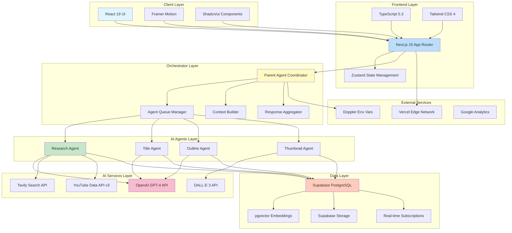

### System Flow

```mermaid
sequenceDiagram
    participant User
    participant Frontend
    participant Orchestrator
    participant Research
    participant Title
    participant Outline
    participant Thumbnail
    participant Database

    User->>Frontend: Input video idea
    Frontend->>Orchestrator: Create project
    Orchestrator->>Database: Save initial project

    Orchestrator->>Research: Start research
    Research->>Research: Web search + YouTube trends
    Research->>Database: Save research report
    Research->>Orchestrator: Return context

    par Parallel Agent Execution
        Orchestrator->>Title: Generate titles (with context)
        Orchestrator->>Outline: Generate outline (with context)
        Orchestrator->>Thumbnail: Generate prompt (with context)
    end

    Title->>Database: Save 10 title options
    Outline->>Database: Save intro + bullets
    Thumbnail->>Thumbnail: Call DALL-E 3
    Thumbnail->>Database: Save image URL

    Database->>Orchestrator: All results ready
    Orchestrator->>Frontend: Complete package
    Frontend->>User: Display results
```

---

## 3. Stack Tecnológica

### Technology Stack

```mermaid
graph TB
    subgraph "Frontend"
        A[React 19]
        B[Next.js 15 App Router]
        C[TypeScript 5.3]
        D[Tailwind CSS 4]
        E[Shadcn/ui + Radix]
        F[Framer Motion 11]
    end

    subgraph "State & Data Fetching"
        G[Zustand 5]
        H[TanStack Query v5]
        I[React Hook Form]
        J[Zod Validation]
    end

    subgraph "Backend & AI"
        K[Next.js API Routes]
        L[Vercel AI SDK 4.0]
        M[LangChain]
        N[OpenAI SDK]
    end

    subgraph "Database & Storage"
        O[Supabase PostgreSQL 15]
        P[pgvector Extension]
        Q[Supabase Storage]
        R[Redis Cache - Upstash]
    end

    subgraph "AI Models"
        S[GPT-4 Turbo]
        T[GPT-4 Vision Preview]
        U[DALL-E 3]
        V[text-embedding-3-large]
    end

    subgraph "External APIs"
        W[Tavily Search API]
        X[YouTube Data API v3]
        Y[Perplexity API]
    end

    subgraph "DevOps & Deployment"
        Z[Vercel Edge]
        AA[GitHub Actions]
        AB[Doppler Secrets]
        AC[Sentry Monitoring]
    end

    style A fill:#61dafb
    style B fill:#000000
    style C fill:#3178c6
    style S fill:#10a37f
    style O fill:#3ecf8e
    style Z fill:#000000
```

### Core Dependencies

```json
{
  "dependencies": {
    "next": "^15.0.0",
    "react": "^19.0.0",
    "typescript": "^5.3.3",
    "@supabase/supabase-js": "^2.39.0",
    "ai": "^4.0.0",
    "@ai-sdk/openai": "^1.0.0",
    "langchain": "^0.3.0",
    "openai": "^4.20.0",
    "zustand": "^5.0.0",
    "@tanstack/react-query": "^5.0.0",
    "zod": "^3.22.0",
    "tailwindcss": "^4.0.0",
    "framer-motion": "^11.0.0"
  }
}
```

---

## 4. Arquitetura dos Agentes

### Multi-Agent System Architecture

```mermaid
graph TB
    subgraph "Parent Orchestrator"
        A[Coordinator Agent]
        A1[Task Queue]
        A2[Context Manager]
        A3[Response Validator]
        A4[Error Handler]
    end

    subgraph "Research Agent 🔍"
        B[Web Search Module]
        B1[YouTube Trends Module]
        B2[SEO Keywords Extractor]
        B3[Report Generator]
        B4[Data Embeddings]
    end

    subgraph "Title Agent 📝"
        C[Title Generator]
        C1[SEO Optimizer]
        C2[CTR Predictor]
        C3[Length Validator]
        C4[Keyword Placer]
    end

    subgraph "Outline Agent 📋"
        D[Hook Writer]
        D1[Structure Builder]
        D2[Bullet Point Generator]
        D3[CTA Creator]
        D4[Flow Validator]
    end

    subgraph "Thumbnail Agent 🎨"
        E[Visual Concept Creator]
        E1[DALL-E Prompt Builder]
        E2[Image Generator]
        E3[Text Overlay Designer]
        E4[A/B Variant Creator]
    end

    subgraph "Shared Resources"
        F[RAG Database]
        G[Vector Search]
        H[Cache Layer]
        I[Analytics Tracker]
    end

    A --> A1
    A --> A2
    A --> A3
    A --> A4

    A1 --> B
    A1 --> C
    A1 --> D
    A1 --> E

    B --> B1
    B --> B2
    B --> B3
    B --> B4

    C --> C1
    C --> C2
    C --> C3
    C --> C4

    D --> D1
    D --> D2
    D --> D3
    D --> D4

    E --> E1
    E --> E2
    E --> E3
    E --> E4

    B --> F
    C --> F
    D --> F
    E --> F

    F --> G
    F --> H

    B --> I
    C --> I
    D --> I
    E --> I

    style A fill:#fff9c4
    style B fill:#c8e6c9
    style C fill:#bbdefb
    style D fill:#f8bbd0
    style E fill:#ffccbc
    style F fill:#e1bee7
```

### Agent Communication Protocol

```mermaid
sequenceDiagram
    participant Orchestrator
    participant Research
    participant Context
    participant Title
    participant Outline
    participant Thumbnail

    Orchestrator->>Research: Execute(video_idea)
    Research->>Research: Web search
    Research->>Research: YouTube trends
    Research->>Research: Generate report
    Research->>Context: Save context

    Context->>Context: Build unified context

    par Parallel Execution
        Context->>Title: Provide context
        Title->>Title: Generate 10 titles
        Title->>Orchestrator: Return titles
    and
        Context->>Outline: Provide context
        Outline->>Outline: Generate structure
        Outline->>Orchestrator: Return outline
    and
        Context->>Thumbnail: Provide context
        Thumbnail->>Thumbnail: Create prompt
        Thumbnail->>Thumbnail: Generate image
        Thumbnail->>Orchestrator: Return thumbnail
    end

    Orchestrator->>Orchestrator: Aggregate results
    Orchestrator->>Orchestrator: Validate quality
```

---

## 5. Fluxo de Dados

### Data Flow Architecture

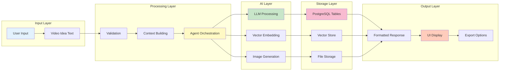

### Context Sharing System

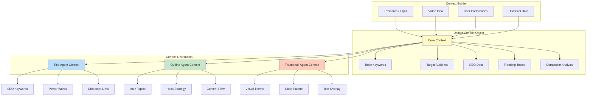

---

## 6. Database Schema

### ERD - YouTube Content System

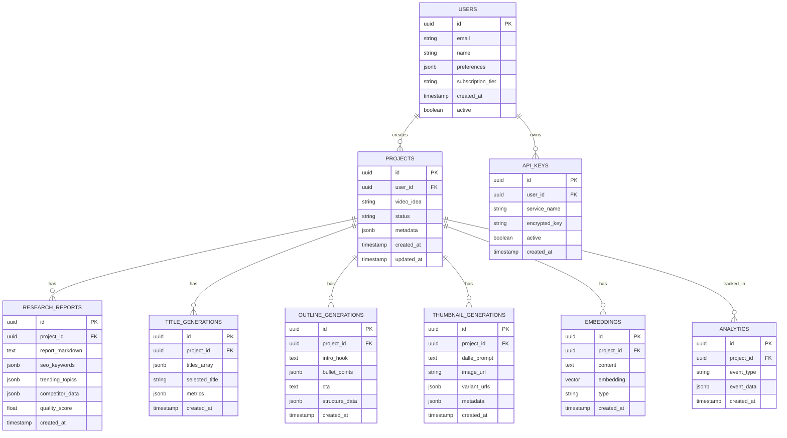

### Table Specifications

#### `projects` Table
```sql
CREATE TABLE projects (
    id UUID PRIMARY KEY DEFAULT gen_random_uuid(),
    user_id UUID REFERENCES auth.users(id) ON DELETE CASCADE,
    video_idea TEXT NOT NULL,
    status VARCHAR(50) DEFAULT 'draft',
    metadata JSONB DEFAULT '{}',
    created_at TIMESTAMPTZ DEFAULT NOW(),
    updated_at TIMESTAMPTZ DEFAULT NOW()
);

CREATE INDEX idx_projects_user_id ON projects(user_id);
CREATE INDEX idx_projects_status ON projects(status);
CREATE INDEX idx_projects_created_at ON projects(created_at DESC);
```

#### `research_reports` Table
```sql
CREATE TABLE research_reports (
    id UUID PRIMARY KEY DEFAULT gen_random_uuid(),
    project_id UUID REFERENCES projects(id) ON DELETE CASCADE,
    report_markdown TEXT NOT NULL,
    seo_keywords JSONB DEFAULT '[]',
    trending_topics JSONB DEFAULT '[]',
    competitor_data JSONB DEFAULT '{}',
    quality_score FLOAT CHECK (quality_score >= 0 AND quality_score <= 1),
    created_at TIMESTAMPTZ DEFAULT NOW()
);

CREATE INDEX idx_research_project_id ON research_reports(project_id);
```

#### `embeddings` Table (pgvector)
```sql
CREATE EXTENSION IF NOT EXISTS vector;

CREATE TABLE embeddings (
    id UUID PRIMARY KEY DEFAULT gen_random_uuid(),
    project_id UUID REFERENCES projects(id) ON DELETE CASCADE,
    content TEXT NOT NULL,
    embedding vector(3072), -- text-embedding-3-large dimension
    type VARCHAR(50) NOT NULL, -- 'research', 'title', 'outline'
    created_at TIMESTAMPTZ DEFAULT NOW()
);

CREATE INDEX idx_embeddings_project ON embeddings(project_id);
CREATE INDEX idx_embeddings_vector ON embeddings
    USING ivfflat (embedding vector_cosine_ops)
    WITH (lists = 100);
```

---

## 7. Segurança e Autenticação

### Authentication Flow

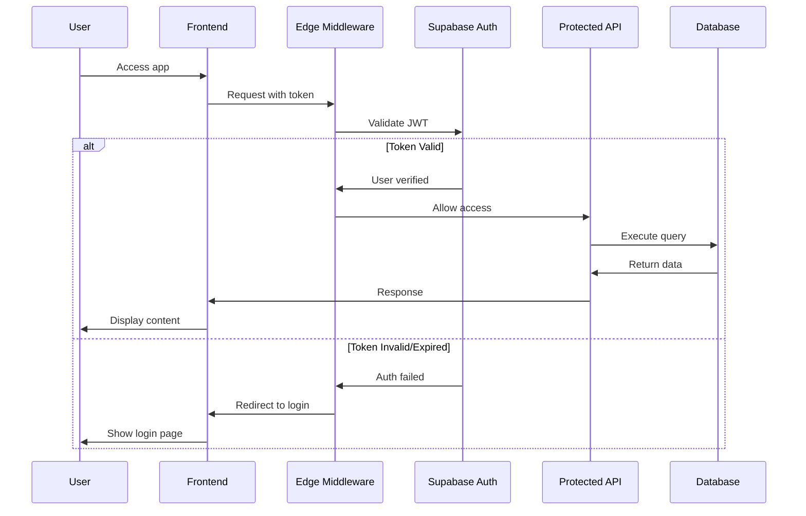

### Security Layers

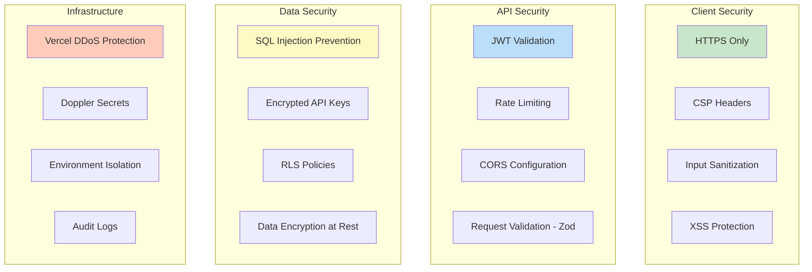

---

## 8. Performance e Escalabilidade

### Performance Optimizations

```mermaid
graph TB
    subgraph "Frontend Performance"
        A[Code Splitting]
        B[Lazy Loading]
        C[Image Optimization]
        D[Streaming SSR]
        E[Edge Rendering]
    end

    subgraph "API Performance"
        F[Response Caching - Redis]
        G[Database Indexes]
        H[Query Optimization]
        I[Connection Pooling]
        J[Parallel Agent Execution]
    end

    subgraph "AI Performance"
        K[Streaming Responses]
        L[Token Optimization]
        M[Model Selection Strategy]
        N[Prompt Caching]
    end

    subgraph "Results"
        O[< 3s Initial Load]
        P[< 20s Agent Processing]
        Q[90% Cache Hit Rate]
        R[99.9% Uptime]
    end

    A --> O
    D --> O
    F --> Q
    J --> P
    K --> P

    style O fill:#c8e6c9
    style P fill:#c8e6c9
    style Q fill:#c8e6c9
    style R fill:#c8e6c9
```

### Scalability Architecture

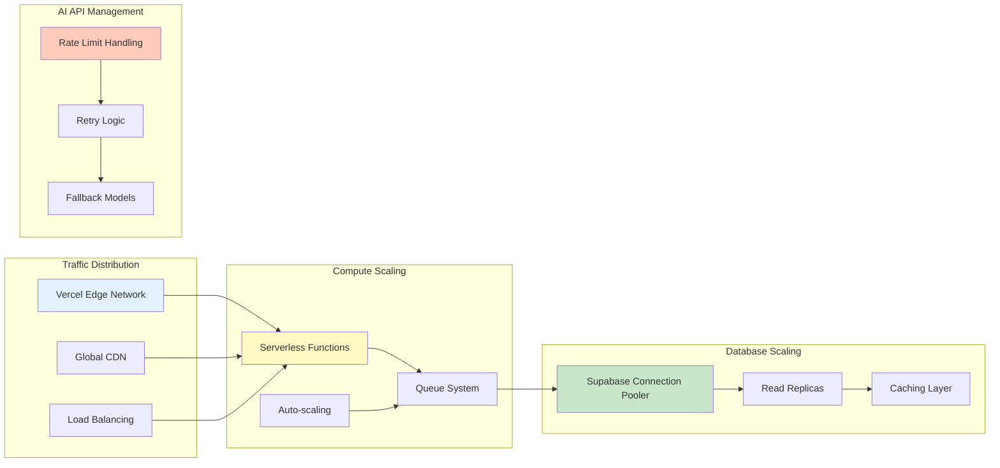

---

## 📊 System Metrics

### Expected Performance

| Métrica | Valor | Observação |
|---------|-------|------------|
| **Tempo Total de Geração** | 15-25s | Com agentes em paralelo |
| **Research Agent** | 8-12s | Inclui web search + YouTube API |
| **Title Agent** | 3-5s | 10 variações otimizadas |
| **Outline Agent** | 4-6s | Intro + 5-10 bullet points |
| **Thumbnail Agent** | 10-15s | DALL-E 3 generation time |
| **Cache Hit Rate** | 85-90% | Para tópicos similares |
| **Database Query Time** | < 100ms | Com indexes otimizados |
| **API Success Rate** | 99%+ | Com retry logic |

### Cost Optimization

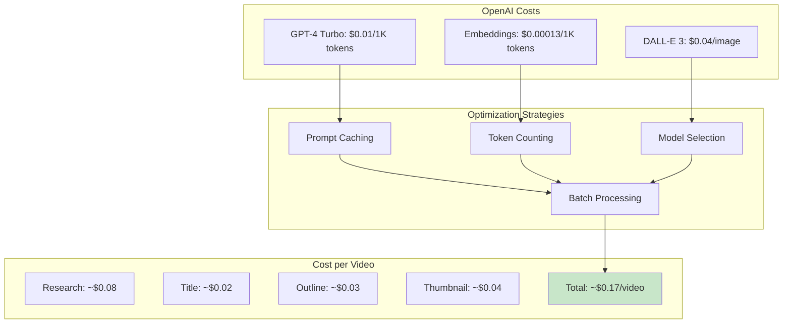

---

## 🔗 Referências e Recursos

### Documentação Oficial
- [Next.js 15 Documentation](https://nextjs.org/docs)
- [Vercel AI SDK](https://sdk.vercel.ai/docs)
- [Supabase Documentation](https://supabase.com/docs)
- [OpenAI API Reference](https://platform.openai.com/docs/api-reference)
- [LangChain Documentation](https://js.langchain.com/docs)

### Best Practices
- [YouTube SEO Best Practices 2024](https://developers.google.com/youtube/v3)
- [Multi-Agent Systems Design](https://www.crewai.com/blog)
- [Edge Computing Patterns](https://vercel.com/docs/edge-network)

---

**Versão**: 1.0.0
**Data**: 2026-01-29
**Mantido por**: Equipe UzzAI
