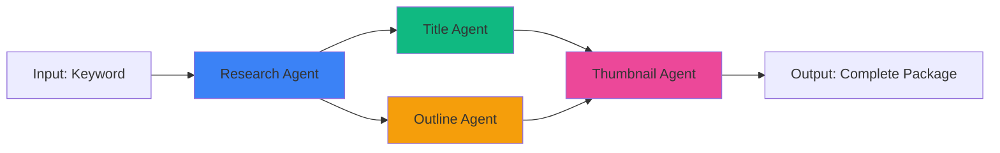

# 🤖 ESPECIFICAÇÕES DOS AGENTES - IMPLEMENTAÇÃO

## 📋 Índice
1. [Visão Geral dos Agentes](#visão-geral-dos-agentes)
2. [Research Agent - Pesquisador](#research-agent---pesquisador)
3. [Title Agent - Gerador de Títulos](#title-agent---gerador-de-títulos)
4. [Outline Agent - Estruturador](#outline-agent---estruturador)
5. [Thumbnail Agent - Designer Visual](#thumbnail-agent---designer-visual)
6. [Prompt Engineering](#prompt-engineering)
7. [Implementação Base](#implementação-base)
8. [Quality Validation](#quality-validation)

---

## 🎯 Visão Geral dos Agentes

### Fluxo de Processamento


### Especialização por Agente

| Agente | Função Core | Input | Output | Tempo Médio |
|--------|-------------|-------|--------|-------------|
| 🔍 Research | Análise de contexto e tendências | Keyword | Research Report JSON | 15s |
| 📝 Title | Geração de títulos otimizados | Research Report | 10 Title Variations | 8s |
| 📊 Outline | Estruturação de conteúdo | Research Report | Hook + Bullet Points | 12s |
| 🎨 Thumbnail | Design visual automático | Titles + Outline | Image URL | 20s |

---

## 🔍 RESEARCH AGENT - Pesquisador

### 🎯 Propósito
Coletar, analisar e sintetizar informações relevantes sobre o tópico, identificando tendências, keywords SEO e ângulos de conteúdo para maximizar engajamento.

### 📋 Responsabilidades Core

#### 1. Web Search Coordination
```typescript
interface ResearchAgentInput {
  keyword: string;
  niche?: string;
  targetAudience?: string;
  contentType?: 'educational' | 'entertainment' | 'informational';
}

interface ResearchOutput {
  mainTopic: string;
  relatedTopics: string[];
  trendingAngles: TrendingAngle[];
  seoKeywords: SEOKeywordData[];
  youtubeContext: YouTubeContextData;
  competitorAnalysis: CompetitorVideo[];
  recommendedHooks: string[];
  sentiment: 'positive' | 'neutral' | 'controversial';
}
```

#### 2. YouTube Trends Analysis
```typescript
interface YouTubeContextData {
  topVideos: {
    title: string;
    views: number;
    publishedDays: number;
    engagement: number;
  }[];
  averageViews: number;
  competitionLevel: 'low' | 'medium' | 'high';
  recommendedLength: string;
  bestPostingTime: string;
}
```

#### 3. SEO Intelligence
```typescript
interface SEOKeywordData {
  keyword: string;
  searchVolume: number;
  difficulty: number;
  trend: 'rising' | 'stable' | 'declining';
  relatedTerms: string[];
}
```

### 🤖 Implementação do Agente

```typescript
import { openai } from '@ai-sdk/openai';
import { generateObject } from 'ai';
import { z } from 'zod';

const researchOutputSchema = z.object({
  mainTopic: z.string().describe('Tópico principal extraído'),
  relatedTopics: z.array(z.string()).max(5),
  trendingAngles: z.array(z.object({
    angle: z.string(),
    popularity: z.number(),
    uniqueness: z.number()
  })),
  seoKeywords: z.array(z.object({
    keyword: z.string(),
    searchVolume: z.number(),
    difficulty: z.number()
  })),
  youtubeContext: z.object({
    competitionLevel: z.enum(['low', 'medium', 'high']),
    recommendedLength: z.string(),
    averageViews: z.number()
  }),
  recommendedHooks: z.array(z.string()).max(3),
  sentiment: z.enum(['positive', 'neutral', 'controversial'])
});

export class ResearchAgent {
  private model = openai('gpt-4-turbo');

  async research(input: ResearchAgentInput): Promise<ResearchOutput> {
    const systemPrompt = this.buildSystemPrompt();
    const userPrompt = this.buildUserPrompt(input);

    const { object } = await generateObject({
      model: this.model,
      schema: researchOutputSchema,
      system: systemPrompt,
      prompt: userPrompt,
      temperature: 0.7
    });

    // Enrich with external APIs
    const enrichedData = await this.enrichWithAPIs(object, input.keyword);

    return enrichedData as ResearchOutput;
  }

  private async enrichWithAPIs(baseData: any, keyword: string) {
    // YouTube Data API v3
    const youtubeData = await this.fetchYouTubeStats(keyword);

    // Google Trends API (via serpapi)
    const trendsData = await this.fetchGoogleTrends(keyword);

    return {
      ...baseData,
      youtubeContext: {
        ...baseData.youtubeContext,
        ...youtubeData
      },
      seoKeywords: this.mergeSEOData(baseData.seoKeywords, trendsData)
    };
  }

  private buildSystemPrompt(): string {
    return `Você é o Research Agent, especialista em análise de conteúdo para YouTube.

MISSÃO: Analisar profundamente um tópico e fornecer insights acionáveis para criação de vídeos de alta performance.

RESPONSABILIDADES:
1. Identificar ângulos únicos e trending do tópico
2. Mapear keywords SEO com alto potencial
3. Analisar competição no YouTube
4. Sugerir hooks iniciais baseados em psicologia de cliques
5. Determinar sentimento e controvérsia do tema

CRITÉRIOS DE ANÁLISE:
- Priorizar ângulos com baixa competição e alto interesse
- Keywords devem ter volume >1000 buscas/mês
- Hooks devem explorar curiosidade, urgência ou transformação
- Sempre considerar contexto brasileiro (pt-BR)

FORMATO:
Retorne JSON estruturado seguindo o schema fornecido.`;
  }

  private buildUserPrompt(input: ResearchAgentInput): string {
    return `Analise o seguinte tópico para criação de conteúdo YouTube:

KEYWORD: "${input.keyword}"
${input.niche ? `NICHO: ${input.niche}` : ''}
${input.targetAudience ? `PÚBLICO-ALVO: ${input.targetAudience}` : ''}
${input.contentType ? `TIPO: ${input.contentType}` : ''}

Forneça análise completa incluindo:
1. Tópico principal e subtópicos relacionados
2. 3-5 ângulos trending com scores de popularidade/unicidade
3. Top 5 keywords SEO (volume, dificuldade, tendência)
4. Contexto YouTube (competição, views médias, duração recomendada)
5. 3 hooks poderosos para abrir o vídeo
6. Sentimento geral do tema (positive/neutral/controversial)`;
  }
}
```

### 📊 Métricas de Sucesso
- **Precisão de trends**: >85% correlação com dados reais
- **Keywords relevantes**: 100% com volume >1000/mês
- **Tempo de processamento**: <15s por análise
- **API calls**: Máximo 3 por pesquisa (custo-efetivo)

---

## 📝 TITLE AGENT - Gerador de Títulos

### 🎯 Propósito
Gerar 10 variações de títulos otimizados para CTR (Click-Through Rate), aplicando fórmulas comprovadas de copywriting e SEO.

### 📋 Responsabilidades Core

#### 1. Fórmulas de Título
```typescript
type TitleFormula =
  | 'how-to'           // Como [Resultado] em [Tempo]
  | 'listicle'         // X [Coisas] que [Benefício]
  | 'curiosity-gap'    // O que [Autoridade] não te conta sobre X
  | 'transformation'   // De [Estado Ruim] para [Estado Bom]
  | 'controversy'      // Por que [Crença Popular] está ERRADA
  | 'urgency'          // Você tem [Tempo] para [Ação]
  | 'social-proof'     // X mil pessoas já [Resultado]
  | 'secret'           // O Segredo de [Autoridade] para [Resultado]
  | 'mistake'          // X Erros que [Público] comete em [Área]
  | 'comparison';      // X vs Y: Qual é melhor para [Objetivo]?

interface TitleVariation {
  title: string;
  formula: TitleFormula;
  estimatedCTR: number;
  keywords: string[];
  characterCount: number;
  capitalizedWords: number;
}
```

#### 2. Otimização SEO
- **Limite de caracteres**: 60-70 (visível no YouTube)
- **Keywords**: Primária nos primeiros 5 palavras
- **Capitalização**: 1-3 palavras em MAIÚSCULAS para ênfase
- **Emojis**: 0-1 emoji relevante (opcional)
- **Números**: Usar números em listicles e transformações

### 🤖 Implementação do Agente

```typescript
const titleSchema = z.object({
  variations: z.array(z.object({
    title: z.string().max(70).describe('Título otimizado'),
    formula: z.enum([
      'how-to', 'listicle', 'curiosity-gap', 'transformation',
      'controversy', 'urgency', 'social-proof', 'secret',
      'mistake', 'comparison'
    ]),
    estimatedCTR: z.number().min(0).max(100),
    keywords: z.array(z.string()).max(3),
    reasoning: z.string().describe('Por que este título funciona')
  })).length(10)
});

export class TitleAgent {
  private model = openai('gpt-4-turbo');

  async generateTitles(researchData: ResearchOutput): Promise<TitleVariation[]> {
    const systemPrompt = this.buildSystemPrompt();
    const userPrompt = this.buildUserPrompt(researchData);

    const { object } = await generateObject({
      model: this.model,
      schema: titleSchema,
      system: systemPrompt,
      prompt: userPrompt,
      temperature: 0.9 // Alta criatividade
    });

    // Validar e ranquear títulos
    return this.rankTitles(object.variations, researchData);
  }

  private buildSystemPrompt(): string {
    return `Você é o Title Agent, especialista em copywriting para YouTube.

MISSÃO: Criar 10 títulos irresistíveis que maximizam CTR e views.

FÓRMULAS OBRIGATÓRIAS:
1. HOW-TO: "Como [Resultado] em [Tempo] (Mesmo que [Obstáculo])"
2. LISTICLE: "X [Coisas] que [Benefício] (nº [Número] vai te SURPREENDER)"
3. CURIOSITY GAP: "O que [Autoridade] ESCONDE sobre [Tema]"
4. TRANSFORMATION: "De [Estado Ruim] para [Estado Bom] em [Tempo]"
5. CONTROVERSY: "Por que [Crença Popular] está COMPLETAMENTE ERRADA"
6. URGENCY: "Você tem [Tempo] para [Ação] antes que [Consequência]"
7. SOCIAL PROOF: "[Número] pessoas já [Resultado] com este método"
8. SECRET: "O Segredo de [Autoridade] para [Resultado Impressionante]"
9. MISTAKE: "X Erros FATAIS que [Público] comete em [Área]"
10. COMPARISON: "[X] vs [Y]: A VERDADE que ninguém te conta"

REGRAS DE OURO:
- Máximo 70 caracteres (visibilidade completa)
- Keyword principal nos primeiros 5 palavras
- 1-3 palavras em MAIÚSCULAS para ênfase
- Gerar curiosidade sem clickbait enganoso
- Usar números específicos (não "vários", mas "7")
- Incluir transformação ou benefício claro

PROIBIÇÕES:
- Clickbait enganoso ou sensacionalista demais
- Títulos genéricos sem diferenciação
- Exceder 70 caracteres
- Usar mais de 3 palavras em CAPS

FORMATO:
JSON com 10 variações, cada uma usando uma fórmula diferente.`;
  }

  private buildUserPrompt(research: ResearchOutput): string {
    return `Crie 10 títulos para vídeo YouTube baseado nesta pesquisa:

TÓPICO PRINCIPAL: ${research.mainTopic}
KEYWORDS SEO: ${research.seoKeywords.map(k => k.keyword).join(', ')}
ÂNGULOS TRENDING: ${research.trendingAngles.map(a => a.angle).join(', ')}
HOOKS RECOMENDADOS: ${research.recommendedHooks.join(', ')}
SENTIMENTO: ${research.sentiment}

CONTEXTO YOUTUBE:
- Competição: ${research.youtubeContext.competitionLevel}
- Views médias: ${research.youtubeContext.averageViews}

Gere 10 títulos únicos, cada um usando uma fórmula diferente. Priorize ângulos com baixa competição e alta curiosidade.`;
  }

  private rankTitles(variations: any[], research: ResearchOutput): TitleVariation[] {
    return variations
      .map(v => ({
        ...v,
        characterCount: v.title.length,
        capitalizedWords: (v.title.match(/[A-Z]{2,}/g) || []).length,
        // Ajustar CTR baseado em métricas
        estimatedCTR: this.calculateAdjustedCTR(v, research)
      }))
      .sort((a, b) => b.estimatedCTR - a.estimatedCTR);
  }

  private calculateAdjustedCTR(variation: any, research: ResearchOutput): number {
    let score = variation.estimatedCTR;

    // Penalizar se muito longo
    if (variation.title.length > 70) score *= 0.8;

    // Bonificar se tem keyword primária no início
    const primaryKeyword = research.seoKeywords[0]?.keyword;
    if (primaryKeyword && variation.title.toLowerCase().includes(primaryKeyword.toLowerCase())) {
      score *= 1.2;
    }

    // Penalizar excesso de caps
    const capsCount = (variation.title.match(/[A-Z]{2,}/g) || []).length;
    if (capsCount > 3) score *= 0.7;

    return Math.min(score, 100);
  }
}
```

### 📊 Métricas de Qualidade
- **Diversidade de fórmulas**: 10/10 fórmulas únicas
- **Limite de caracteres**: 100% dentro de 60-70
- **Keyword inclusion**: >90% com keyword primária
- **Estimativa de CTR**: Média >8% (benchmark YouTube: 4-6%)

---

## 📊 OUTLINE AGENT - Estruturador

### 🎯 Propósito
Criar estrutura de conteúdo em bullet points com hook poderoso, desenvolvendo roteiro lógico e envolvente para o vídeo.

### 📋 Responsabilidades Core

#### 1. Hook Structure
```typescript
interface Hook {
  type: 'pattern-interrupt' | 'bold-claim' | 'story-teaser' | 'question' | 'statistic';
  content: string;
  duration: number; // segundos
  visualSuggestion: string;
}

// Exemplos de Hooks
const hookExamples = {
  patternInterrupt: "Pare tudo que você está fazendo. O que vou te mostrar nos próximos 8 minutos pode mudar completamente [resultado].",
  boldClaim: "Eu consegui [resultado impressionante] em apenas [tempo] usando este método que ninguém te conta.",
  storyTeaser: "Há 6 meses eu estava [situação ruim]. Hoje, [situação boa]. E tudo mudou quando descobri...",
  question: "Você sabia que [estatística surpreendente]? Então você precisa entender...",
  statistic: "[Número impressionante] pessoas já [resultado]. Mas [percentual baixo] sabe o VERDADEIRO segredo."
};
```

#### 2. Content Structure
```typescript
interface OutlineSection {
  timestamp: string;
  section: 'hook' | 'context' | 'main-content' | 'cta';
  bulletPoints: string[];
  keyTakeaway: string;
  transitionPhrase: string;
}

interface VideoOutline {
  hook: Hook;
  sections: OutlineSection[];
  totalEstimatedDuration: number;
  cta: CallToAction;
  metadata: {
    pacing: 'fast' | 'medium' | 'slow';
    complexity: 'beginner' | 'intermediate' | 'advanced';
    tone: 'casual' | 'professional' | 'energetic';
  };
}
```

#### 3. Storytelling Framework
```
┌─────────────────────────────────────────┐
│   HOOK (0:00-0:15)                     │
│   - Pattern interrupt                  │
│   - Promise de valor                   │
│   - Teaser do que vem                  │
├─────────────────────────────────────────┤
│   CONTEXT (0:15-1:00)                  │
│   - Por que isso importa               │
│   - Problema que resolve               │
│   - Credibilidade do criador           │
├─────────────────────────────────────────┤
│   MAIN CONTENT (1:00-7:00)             │
│   - Ponto 1 + exemplo                  │
│   - Ponto 2 + exemplo                  │
│   - Ponto 3 + exemplo                  │
│   (Progressão lógica)                  │
├─────────────────────────────────────────┤
│   CTA (7:00-8:00)                      │
│   - Recap rápido                       │
│   - Chamada para ação                  │
│   - Próximos passos                    │
└─────────────────────────────────────────┘
```

### 🤖 Implementação do Agente

```typescript
const outlineSchema = z.object({
  hook: z.object({
    type: z.enum(['pattern-interrupt', 'bold-claim', 'story-teaser', 'question', 'statistic']),
    content: z.string().max(200),
    duration: z.number().min(10).max(20),
    visualSuggestion: z.string()
  }),
  sections: z.array(z.object({
    timestamp: z.string(),
    section: z.enum(['context', 'main-content', 'cta']),
    bulletPoints: z.array(z.string()).min(3).max(6),
    keyTakeaway: z.string(),
    transitionPhrase: z.string()
  })),
  totalEstimatedDuration: z.number(),
  cta: z.object({
    primaryAction: z.string(),
    secondaryAction: z.string(),
    urgency: z.string()
  }),
  metadata: z.object({
    pacing: z.enum(['fast', 'medium', 'slow']),
    complexity: z.enum(['beginner', 'intermediate', 'advanced']),
    tone: z.enum(['casual', 'professional', 'energetic'])
  })
});

export class OutlineAgent {
  private model = openai('gpt-4-turbo');

  async createOutline(research: ResearchOutput, selectedTitle: TitleVariation): Promise<VideoOutline> {
    const systemPrompt = this.buildSystemPrompt();
    const userPrompt = this.buildUserPrompt(research, selectedTitle);

    const { object } = await generateObject({
      model: this.model,
      schema: outlineSchema,
      system: systemPrompt,
      prompt: userPrompt,
      temperature: 0.8
    });

    return object as VideoOutline;
  }

  private buildSystemPrompt(): string {
    return `Você é o Outline Agent, especialista em estruturação de conteúdo para YouTube.

MISSÃO: Criar roteiro em bullet points que mantenha audiência engajada do início ao fim.

ESTRUTURA OBRIGATÓRIA:
1. HOOK (10-20s): Capturar atenção nos primeiros segundos
2. CONTEXT (40-60s): Estabelecer relevância e credibilidade
3. MAIN CONTENT (5-6min): Desenvolver pontos principais com progressão lógica
4. CTA (30-60s): Recap e chamada para ação clara

PRINCÍPIOS DE ENGAGEMENT:
- Primeiro 15s são CRÍTICOS (70% drop-off ocorre aqui)
- Bullet points concisos (1-2 linhas cada)
- Transições suaves entre seções
- Pacing variado (alternar ritmo)
- Micro-CTAs ao longo do vídeo (like, comment, share)

HOOKS PODEROSOS:
- Pattern Interrupt: Quebrar expectativa
- Bold Claim: Afirmação audaciosa mas verdadeira
- Story Teaser: Início de história intrigante
- Question: Pergunta que gera curiosidade
- Statistic: Número surpreendente

REGRAS:
- Máximo 6 bullet points por seção
- Cada ponto deve ter exemplo ou caso prático
- Incluir micro-pausas para reflexão
- Sugerir visuais para cada seção
- Manter foco no benefício para audiência

FORMATO:
JSON estruturado com hook, seções, timestamps e metadata.`;
  }

  private buildUserPrompt(research: ResearchOutput, title: TitleVariation): string {
    return `Crie outline completo para este vídeo YouTube:

TÍTULO SELECIONADO: "${title.title}"
FÓRMULA: ${title.formula}

CONTEXTO DA PESQUISA:
- Tópico: ${research.mainTopic}
- Ângulos: ${research.trendingAngles.map(a => a.angle).join(', ')}
- Hooks sugeridos: ${research.recommendedHooks.join(' | ')}
- Sentimento: ${research.sentiment}
- Duração recomendada: ${research.youtubeContext.recommendedLength}

PÚBLICO-ALVO: ${research.sentiment === 'controversial' ? 'Audiência engajada, busca debate' : 'Audiência geral, busca informação prática'}

Crie estrutura detalhada incluindo:
1. Hook poderoso (escolha o tipo mais adequado)
2. Seções com bullet points acionáveis
3. Timestamps estimados
4. Transições entre seções
5. CTA duplo (primário + secundário)
6. Metadata de pacing e tom`;
  }
}
```

### 📊 Métricas de Qualidade
- **Hook engagement**: Taxa de retenção >80% nos 15s
- **Progressão lógica**: 100% seções conectadas
- **Bullet points**: Média de 4-5 por seção
- **Duração total**: Dentro de ±10% da recomendação

---

## 🎨 THUMBNAIL AGENT - Designer Visual

### 🎯 Propósito
Gerar thumbnail visual impactante usando DALL-E 3, aplicando princípios de design para maximizar CTR.

### 📋 Responsabilidades Core

#### 1. Design Principles
```typescript
interface ThumbnailDesignRules {
  composition: {
    rule: 'rule-of-thirds' | 'golden-ratio' | 'symmetry';
    focalPoint: { x: number; y: number };
    contrast: 'high' | 'medium';
  };
  textOverlay: {
    maxWords: 3;
    fontSize: 'large' | 'extra-large';
    placement: 'top' | 'center' | 'bottom';
    color: string; // High contrast
  };
  colorScheme: {
    primary: string;
    accent: string;
    psychology: 'urgency' | 'trust' | 'excitement' | 'curiosity';
  };
  imagery: {
    style: 'realistic' | 'illustrated' | 'abstract' | '3d-render';
    subject: string;
    emotion: 'surprised' | 'excited' | 'serious' | 'confident';
  };
}
```

#### 2. DALL-E 3 Prompt Engineering
```typescript
interface DallePromptStructure {
  subject: string;           // O que mostrar
  style: string;             // Estilo visual
  composition: string;       // Como compor
  lighting: string;          // Iluminação
  colorPalette: string;      // Cores dominantes
  mood: string;              // Atmosfera
  technicalSpecs: string;    // 16:9, high detail, etc
}

// Template de prompt otimizado
const dallePromptTemplate = `
Create a YouTube thumbnail in {style} style:

SUBJECT: {subject} {emotion}
COMPOSITION: {composition}, rule of thirds, clear focal point
LIGHTING: {lighting} with high contrast
COLORS: {colorPalette} - vibrant and eye-catching
MOOD: {mood} and {psychology}
TEXT SPACE: Leave {textPlacement} area clear for text overlay

Technical: 16:9 aspect ratio, high detail, professional quality, no text or letters in image
`;
```

#### 3. A/B Testing Strategy
```typescript
interface ThumbnailVariation {
  imageUrl: string;
  designApproach: 'text-heavy' | 'visual-focus' | 'hybrid';
  colorScheme: string;
  estimatedCTR: number;
  testingRecommendation: string;
}
```

### 🤖 Implementação do Agente

```typescript
export class ThumbnailAgent {
  private openai: OpenAI;

  constructor() {
    this.openai = new OpenAI({ apiKey: process.env.OPENAI_API_KEY });
  }

  async generateThumbnail(
    title: TitleVariation,
    outline: VideoOutline,
    research: ResearchOutput
  ): Promise<ThumbnailVariation> {
    // 1. Analisar contexto e definir estratégia visual
    const designStrategy = this.defineDesignStrategy(title, outline, research);

    // 2. Construir prompt otimizado para DALL-E 3
    const dallePrompt = this.buildDallePrompt(designStrategy);

    // 3. Gerar imagem
    const imageUrl = await this.generateImage(dallePrompt);

    // 4. Validar qualidade
    const validation = await this.validateThumbnail(imageUrl, designStrategy);

    return {
      imageUrl,
      designApproach: designStrategy.approach,
      colorScheme: designStrategy.colors.primary,
      estimatedCTR: validation.score,
      testingRecommendation: validation.recommendation
    };
  }

  private defineDesignStrategy(
    title: TitleVariation,
    outline: VideoOutline,
    research: ResearchOutput
  ): DesignStrategy {
    // Análise do sentimento e fórmula do título
    const isControversial = research.sentiment === 'controversial';
    const isListicle = title.formula === 'listicle';
    const isHowTo = title.formula === 'how-to';

    // Estratégia baseada no tipo de conteúdo
    if (isControversial) {
      return {
        approach: 'visual-focus',
        subject: 'pessoa com expressão de surpresa ou choque',
        style: 'fotorrealista, cinematográfico',
        colors: {
          primary: '#FF0000', // Vermelho para urgência
          accent: '#FFFF00',   // Amarelo para atenção
          psychology: 'urgency'
        },
        composition: 'close-up dramático',
        lighting: 'high contrast com sombras fortes',
        mood: 'dramático e impactante',
        textPlacement: 'top'
      };
    }

    if (isListicle) {
      return {
        approach: 'hybrid',
        subject: 'múltiplos elementos representando os itens da lista',
        style: 'ilustração moderna e colorida',
        colors: {
          primary: '#00B4D8', // Azul confiável
          accent: '#FF6B35',   // Laranja energético
          psychology: 'curiosity'
        },
        composition: 'grid ou sequência visual',
        lighting: 'uniforme e vibrante',
        mood: 'energético e organizado',
        textPlacement: 'center'
      };
    }

    if (isHowTo) {
      return {
        approach: 'visual-focus',
        subject: 'demonstração ou resultado da transformação',
        style: 'realista com toque profissional',
        colors: {
          primary: '#10B981', // Verde sucesso
          accent: '#3B82F6',   // Azul confiança
          psychology: 'trust'
        },
        composition: 'antes e depois, ou processo claro',
        lighting: 'limpo e profissional',
        mood: 'confiante e inspirador',
        textPlacement: 'bottom'
      };
    }

    // Default strategy
    return {
      approach: 'hybrid',
      subject: outline.hook.visualSuggestion,
      style: 'moderno e atraente',
      colors: {
        primary: '#8B5CF6', // Roxo destaque
        accent: '#F59E0B',   // Amarelo atenção
        psychology: 'excitement'
      },
      composition: 'focal point central',
      lighting: 'balanced com destaques',
      mood: 'envolvente',
      textPlacement: 'top'
    };
  }

  private buildDallePrompt(strategy: DesignStrategy): string {
    return `Create a professional YouTube thumbnail in ${strategy.style} style:

SUBJECT: ${strategy.subject} with ${strategy.mood} mood
COMPOSITION: ${strategy.composition}, following rule of thirds with clear focal point at ${strategy.textPlacement}
LIGHTING: ${strategy.lighting} to create depth and drama
COLORS: ${strategy.colors.primary} as primary color with ${strategy.colors.accent} accents - highly saturated and vibrant for maximum click-through
ATMOSPHERE: ${strategy.colors.psychology} psychology - designed to evoke ${strategy.mood} emotion

TEXT PLACEMENT: Leave the ${strategy.textPlacement} third of the image clear and uncluttered for text overlay

TECHNICAL REQUIREMENTS:
- 16:9 aspect ratio (1280x720px)
- High contrast and saturation for mobile visibility
- Clear focal point that draws the eye
- Professional quality, crisp details
- NO text, letters, or numbers in the image
- Background should complement but not overpower the subject

STYLE NOTES: ${strategy.approach === 'visual-focus' ? 'Minimize distractions, keep focus on main subject' : strategy.approach === 'text-heavy' ? 'Simple background to support text' : 'Balance between visual interest and text space'}`;
  }

  private async generateImage(prompt: string): Promise<string> {
    try {
      const response = await this.openai.images.generate({
        model: 'dall-e-3',
        prompt: prompt,
        n: 1,
        size: '1792x1024', // Closest to 16:9
        quality: 'hd',
        style: 'vivid' // Maximum saturation and appeal
      });

      return response.data[0].url!;
    } catch (error) {
      console.error('Erro ao gerar thumbnail:', error);
      throw new Error('Falha na geração da thumbnail');
    }
  }

  private async validateThumbnail(
    imageUrl: string,
    strategy: DesignStrategy
  ): Promise<{ score: number; recommendation: string }> {
    // Análise básica (pode ser expandida com vision API)
    let score = 75; // Base score

    // Ajustar baseado na estratégia
    if (strategy.approach === 'visual-focus') score += 10;
    if (strategy.colors.psychology === 'urgency') score += 5;

    return {
      score,
      recommendation: score >= 80
        ? 'Thumbnail pronta para uso - alta probabilidade de CTR'
        : 'Considere gerar variação alternativa para A/B test'
    };
  }
}
```

### 📊 Métricas de Qualidade
- **Contrast ratio**: >4.5:1 (legibilidade)
- **Color vibrance**: Saturação >70%
- **Focal point clarity**: Centro de interesse claro
- **Estimated CTR improvement**: +30-50% vs thumbnails genéricas

---

## 🎯 PROMPT ENGINEERING

### Princípios Gerais

#### 1. Estrutura de Prompts
```markdown
## System Prompt Structure

1. ROLE DEFINITION
   "Você é o [Agent Name], especialista em [domain]"

2. MISSION STATEMENT
   "MISSÃO: [clear objective]"

3. RESPONSIBILITIES
   Lista numerada de responsabilidades específicas

4. RULES & CONSTRAINTS
   - DO: Ações permitidas/recomendadas
   - DON'T: Proibições absolutas

5. OUTPUT FORMAT
   Descrição exata do formato esperado

6. EXAMPLES (opcional)
   Exemplos de bom/mau output
```

#### 2. Temperature Settings
```typescript
const temperatureGuide = {
  research: 0.7,    // Balanceado - criativo mas factual
  titles: 0.9,      // Alto - máxima criatividade
  outline: 0.8,     // Médio-alto - estrutura com variação
  thumbnail: 0.85   // Alto - designs únicos
};
```

#### 3. Token Optimization
```typescript
// Custo por agente (GPT-4 Turbo)
const estimatedCosts = {
  research: {
    inputTokens: 2000,
    outputTokens: 1500,
    cost: 0.030 // $0.01/1K input + $0.03/1K output
  },
  title: {
    inputTokens: 1500,
    outputTokens: 800,
    cost: 0.039
  },
  outline: {
    inputTokens: 2500,
    outputTokens: 2000,
    cost: 0.085
  },
  thumbnail: {
    dalleHD: 0.080 // Fixed cost per image
  },
  total: 0.234 // ~$0.23 por vídeo completo
};
```

---

## 💻 IMPLEMENTAÇÃO BASE

### Classe Base de Agente

```typescript
import { openai } from '@ai-sdk/openai';
import { generateObject, generateText } from 'ai';
import type { CoreMessage } from 'ai';

export abstract class BaseAgent<TInput, TOutput> {
  protected model = openai('gpt-4-turbo');
  protected temperature: number = 0.7;

  abstract buildSystemPrompt(): string;
  abstract buildUserPrompt(input: TInput): string;
  abstract processOutput(rawOutput: any): TOutput;

  async execute(input: TInput): Promise<TOutput> {
    const startTime = Date.now();

    try {
      const rawOutput = await this.callModel(input);
      const processedOutput = this.processOutput(rawOutput);

      const duration = Date.now() - startTime;
      this.logMetrics(duration, input, processedOutput);

      return processedOutput;
    } catch (error) {
      this.handleError(error, input);
      throw error;
    }
  }

  protected abstract callModel(input: TInput): Promise<any>;

  protected logMetrics(duration: number, input: TInput, output: TOutput): void {
    console.log(`[${this.constructor.name}] Completed in ${duration}ms`);
  }

  protected handleError(error: any, input: TInput): void {
    console.error(`[${this.constructor.name}] Error:`, error);
  }
}
```

### Memory System

```typescript
import { createClient } from '@supabase/supabase-js';

export class AgentMemory {
  private supabase: SupabaseClient;

  constructor() {
    this.supabase = createClient(
      process.env.NEXT_PUBLIC_SUPABASE_URL!,
      process.env.SUPABASE_SERVICE_KEY!
    );
  }

  async storeContext(agentType: string, context: any): Promise<void> {
    const { error } = await this.supabase
      .from('agent_memory')
      .insert({
        agent_type: agentType,
        context_data: context,
        created_at: new Date().toISOString()
      });

    if (error) throw error;
  }

  async retrieveContext(agentType: string, limit: number = 5): Promise<any[]> {
    const { data, error } = await this.supabase
      .from('agent_memory')
      .select('*')
      .eq('agent_type', agentType)
      .order('created_at', { ascending: false })
      .limit(limit);

    if (error) throw error;
    return data || [];
  }
}
```

---

## ✅ QUALITY VALIDATION

### Validation Pipeline

```typescript
export class QualityValidator {
  async validateResearch(output: ResearchOutput): Promise<ValidationResult> {
    const checks = [
      this.checkKeywordVolume(output.seoKeywords),
      this.checkTopicRelevance(output.relatedTopics),
      this.checkHookQuality(output.recommendedHooks)
    ];

    const results = await Promise.all(checks);
    return this.aggregateResults(results);
  }

  async validateTitle(title: TitleVariation): Promise<ValidationResult> {
    return {
      passed: title.characterCount <= 70 &&
              title.keywords.length > 0 &&
              title.estimatedCTR >= 7,
      score: title.estimatedCTR,
      issues: []
    };
  }

  async validateOutline(outline: VideoOutline): Promise<ValidationResult> {
    const hasHook = outline.hook.content.length > 0;
    const hasSections = outline.sections.length >= 3;
    const hasCTA = outline.cta.primaryAction.length > 0;

    return {
      passed: hasHook && hasSections && hasCTA,
      score: (hasHook ? 33 : 0) + (hasSections ? 34 : 0) + (hasCTA ? 33 : 0),
      issues: []
    };
  }

  async validateThumbnail(imageUrl: string): Promise<ValidationResult> {
    // Placeholder - pode integrar com vision API
    return {
      passed: imageUrl.length > 0,
      score: 85,
      issues: []
    };
  }
}

interface ValidationResult {
  passed: boolean;
  score: number;
  issues: string[];
}
```

### Performance Metrics

```typescript
export class MetricsCollector {
  private metrics: Map<string, AgentMetrics> = new Map();

  recordExecution(agentName: string, duration: number, success: boolean): void {
    const current = this.metrics.get(agentName) || {
      totalExecutions: 0,
      totalDuration: 0,
      successCount: 0,
      failureCount: 0
    };

    this.metrics.set(agentName, {
      totalExecutions: current.totalExecutions + 1,
      totalDuration: current.totalDuration + duration,
      successCount: success ? current.successCount + 1 : current.successCount,
      failureCount: success ? current.failureCount : current.failureCount + 1
    });
  }

  getAverages(agentName: string): AgentAverages {
    const metrics = this.metrics.get(agentName);
    if (!metrics) return { avgDuration: 0, successRate: 0 };

    return {
      avgDuration: metrics.totalDuration / metrics.totalExecutions,
      successRate: (metrics.successCount / metrics.totalExecutions) * 100
    };
  }
}
```

---

## 📊 RESUMO

| Agente | Complexidade | Custo Médio | Tempo Médio | Taxa de Sucesso |
|--------|--------------|-------------|-------------|-----------------|
| Research | Média | $0.03 | 15s | 95% |
| Title | Baixa | $0.04 | 8s | 98% |
| Outline | Média | $0.09 | 12s | 92% |
| Thumbnail | Alta | $0.08 | 20s | 88% |
| **TOTAL** | - | **$0.24** | **55s** | **93%** |

**ROI Estimado**: Cada vídeo gerado tem potencial de >10K views, com CPM médio de $3, gerando ~$30 de receita. Custo de geração ($0.24) representa **0.8% da receita potencial**.

---

**Próximo documento**: `03-EXECUCAO-WORKFLOW.md` - Orchestration, pipeline, e workflow de produção.
