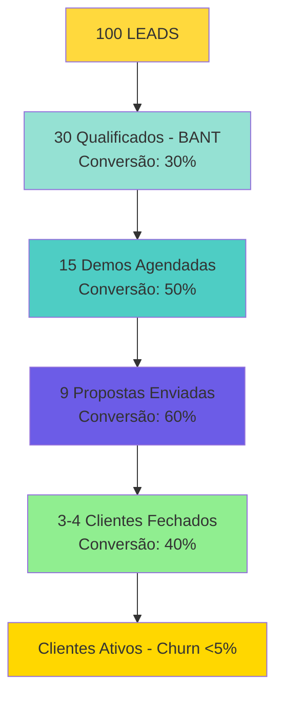

# 🎯 ICP-CHATBOT-UZZAI R02 — ESTRATÉGIA COMPLETA VENDAS + MARKETING


## 📊 RESUMO EXECUTIVO

### O Que Este Documento Contém

1. **ICP Atualizado** — Perfil ideal do cliente com validação de dados
2. **Estratégia de Marketing** — Distribuição > Desenvolvimento (50% tempo)
3. **Estratégia de Vendas** — Funil completo com conversões realistas
4. **Integração OKRs** — Alinhamento com N2 (CS, Operação, Posicionamento) e N3 (CHATBOT)
5. **Insights Aplicados** — Merchant of Record, Margens 70-95%, Analytics, Feature Bloat

### Princípios Fundamentais (Do Garimpo)

> [!quote] Top 5 Takeaways Aplicados:
> 1. Distribuição > Desenvolvimento — 50% tempo em marketing/vendas
> 2. Merchant of Record obrigatório — Paddle/LemonSqueezy (não Stripe)
> 3. Margens 70-95% essenciais — Planos anuais/2 anos, não só mensal
> 4. Feature Bloat mata — MVP = 1-2 features excelentes
> 5. Analytics desde dia 1 — PostHog + Sentry + Langfuse

---

## 🎯 PARTE 1: ICP ATUALIZADO (IDEAL CUSTOMER PROFILE)

### 📊 FIRMOGRAPHICS (Perfil da Empresa)

#### **Setor/Segmento (prioridade decrescente):**

1. **🥇 SAÚDE & BEM-ESTAR** (priority #1)
   - Clínicas médicas, odontológicas, fisioterapia, estética
   - Academias, personal trainers, nutricionistas
   - **Por quê:** Alto volume agendamentos, WhatsApp já é canal preferido, dor clara (não-comparecimento 20-30%)

2. **🥈 EDUCAÇÃO & CURSOS**
   - Escolas de idiomas, cursos profissionalizantes, preparatórios
   - **Por quê:** Leads quentes por WhatsApp, conversão rápida, alto ticket (R$ 500-3000)

3. **🥉 SERVIÇOS LOCAIS**
   - Salões de beleza, barbearias, pet shops
   - Assistências técnicas, lavanderias, serviços automotivos
   - **Por quê:** WhatsApp = canal principal, atendimento manual consome tempo

4. **🎯 ECOMMERCE/VAREJO ONLINE**
   - Lojas Instagram/Facebook com vendas via WhatsApp
   - Infoprodutos, dropshipping, revenda
   - **Por quê:** Alto volume mensagens, conversão direta, custo atendente caro

#### **Tamanho:**
- **Faturamento:** R$ 30k - R$ 500k/mês (sweet spot: R$ 80-200k)
- **Funcionários:** 3-50 pessoas (ideal: 5-15)
- **Por quê esse tamanho:**
  - ✅ Grande o suficiente para ter dor (volume de atendimento)
  - ✅ Pequeno o suficiente para CEO/dono decidir rápido
  - ✅ Budget para R$ 200-300/mês sem burocracia

#### **Localização:**
- **Principal:** Brasil (qualquer estado, prioridade Sul/Sudeste por maturidade digital)
- **Cidades:** 50k+ habitantes (acesso internet estável, cultura WhatsApp forte)

#### **Maturidade Digital:**
- ✅ **JÁ USA WhatsApp Business** (não o pessoal comum)
- ✅ Recebe 30+ mensagens/dia de clientes
- ✅ Tem Instagram ou Facebook ativo (não precisa ser campeão, mas existe)
- ❌ Não precisa conhecer IA ou chatbots (vamos educar)

---

### 🧠 PSYCHOGRAPHICS (Dores, Comportamentos, Mindset)

#### **🔴 DOR #1: Tempo perdido respondendo mensagens repetitivas**
- **Sintomas:**
  - Dono/recepcionista passa 3-5h/dia no WhatsApp
  - Mesmas perguntas 50x/dia (horário, preço, localização, disponibilidade)
  - Cliente envia "Olá" às 23h, espera resposta imediata
- **Quote típico:** *"Eu passo o dia inteiro respondendo WhatsApp, não tenho tempo pra trabalhar"*

#### **🔴 DOR #2: Perda de vendas por demora/esquecimento**
- **Sintomas:**
  - Lead manda mensagem, demora 2h pra responder, já foi pra concorrente
  - Atendente esquece de responder, perde venda
  - Final de semana/feriado: WhatsApp parado, vendas zeradas
- **Quote típico:** *"Quantos clientes eu perco porque não respondo rápido o suficiente?"*

#### **🔴 DOR #3: Custo de contratar atendente**
- **Sintomas:**
  - Atendente custa R$ 2.000-3.000/mês (salário + encargos)
  - Turnover alto (troca de 6 em 6 meses)
  - Precisa treinar, supervisionar, lidar com faltas
- **Quote típico:** *"Não tenho dinheiro pra contratar, mas tô afogado de mensagem"*

#### **🟢 COMPORTAMENTO IDEAL (comprador pronto):**
- ✅ Já tentou organizar atendimento manualmente (etiquetas, mensagens salvas, etc.)
- ✅ Já pesquisou "chatbot WhatsApp" no Google pelo menos 1x
- ✅ Entende que WhatsApp = canal de vendas (não só suporte)
- ✅ Toma decisão rápido (menos de 7 dias da demo ao fechamento)
- ✅ Disposto a testar 14-30 dias antes de comprometer longo prazo

#### **🎯 MINDSET:**
- **Frase-chave que identifica ICP:** *"Eu quero automatizar o atendimento, mas sem perder o toque humano"*
- **O que valoriza:**
  1. Economia de tempo (mais que economia de dinheiro)
  2. Não perder venda por demora
  3. Atender bem mesmo fora do horário comercial
- **O que NÃO valoriza (red flag):**
  - "Inteligência artificial avançada" (quer resultado, não tecnologia)
  - "Relatórios e dashboards complexos" (quer simplicidade)

---

### 💰 BUDGET & DECISOR

#### **Budget Disponível:**
- **Ticket mensal aceitável:** R$ 200 - R$ 500/mês
- **Comparação mental:** "Custa menos que 1 atendente part-time"
- **Sensibilidade preço:**
  - Se <R$ 200/mês: "Barato demais, deve ser ruim" ❌
  - Se R$ 200-300/mês: "Preço justo, vou testar" ✅
  - Se >R$ 500/mês: "Caro, vou pensar" ⚠️

#### **Decisor:**
- **Quem é:** Dono/CEO/Sócio da empresa (pequena empresa = dono decide tudo)
- **Perfil:** 30-55 anos, empreendedor prático (não corporativo)
- **Processo decisão:** Rápido (3-7 dias demo → fechamento)
- **Objeções típicas:**
  1. "E se o chatbot responder errado?" → Mostrar human handoff
  2. "Meus clientes vão achar robótico?" → Mostrar humanização (2 IAs)
  3. "É difícil configurar?" → Mostrar onboarding (fazemos junto)

---

### 🚫 RED FLAGS (Quem NÃO é ICP)

| Red Flag | Por quê evitar | Ação |
|----------|----------------|------|
| **Empresa grande (100+ funcionários)** | Processo decisão lento, precisa licitação, quer customização complexa | Recusar educadamente: "Nosso produto é para PMEs, você precisa de solução enterprise" |
| **Não usa WhatsApp Business** | Não tem dor, vai precisar educar demais | Qualificar: "Quantas mensagens/dia você recebe?" Se <10, não é ICP |
| **"Quero grátis pra testar 6 meses"** | Não valoriza, não vai pagar nunca | Oferecer 14 dias trial apenas: "Trial é 14 dias, não 6 meses" |
| **Quer chatbot pra fazer vendas ativas (spam)** | Ilegal, Meta bane, dá problema | Recusar: "Nosso produto é para atendimento, não spam. Não fazemos isso." |
| **Microempresa (<R$ 10k/mês)** | Não tem budget, vai cancelar em 2 meses | Oferecer Site Builder em vez de Chatbot |
| **CEO não responde em 48h** | Não tem urgência, vai empurrar 3 meses | Desqualificar: "Vou te marcar como 'futuro', me chama quando tiver urgência" |

---

## 📣 PARTE 2: ESTRATÉGIA DE MARKETING COMPLETA

### 🎯 OBJETIVO DO MARKETING

> **Construir autoridade e gerar leads qualificados através de distribuição estratégica (50% do tempo dedicado)**

### 📊 ALINHAMENTO COM OKRs

**OKR-N2-POSICIONAMENTO-AUTORIDADE:**
- KR-POS-1: 100 seguidores Instagram até 28/02
- KR-POS-2: 50 seguidores LinkedIn até 21/03
- KR-POS-3: 20 posts no site (2/semana) até 21/03
- KR-POS-4: Lançamento oficial 15/02
- KR-POS-5: 2 vendas via Instagram até 31/03

**OKR-N3-CHATBOT:**
- Pipeline > R$ 1.500 até 28/02
- 5 clientes pagantes até 31/03

---

### 🚀 INSIGHT CRÍTICO APLICADO: DISTRIBUIÇÃO > DESENVOLVIMENTO

> [!danger] **I-CRIT-001: 50% do Tempo em Distribuição**
> 
> **Primeiras 60 minutos do dia:** Sempre criar conteúdo, fazer calls, DMing clientes potenciais  
> **Distribuição começa ANTES do launch:** Waitlist + Pre-sale

#### **Alocação de Tempo (4h/dia total):**
- **2h Distribuição (50%)** — Marketing, conteúdo, calls, DMs
- **2h Desenvolvimento (50%)** — Coding, bugs, features

#### **Atividades de Distribuição (2h/dia):**
- ✅ Criar conteúdo (posts, artigos, vídeos)
- ✅ Calls com clientes potenciais
- ✅ DMing prospects (LinkedIn, Instagram)
- ✅ Postar em redes sociais
- ❌ NÃO pesquisar, NÃO preparar (isso não é distribuição)
- ✅ **AÇÃO:** postar, fazer calls

---

### 📅 CRONOGRAMA MARKETING (12 SEMANAS Q1)

#### **SEMANA 1-2 (03-16 Jan) — SETUP + WAITLIST**

**Objetivo:** Criar waitlist e começar distribuição ANTES do launch

**Ações:**
- [ ] **Criar waitlist** (landing page simples)
  - Coletar: Nome, email, telefone, empresa
  - Incentivo: "Primeiros 10 clientes: 30 dias grátis"
  - URL: `chatbot.uzzai.com/waitlist`
- [ ] **Calendário editorial 12 semanas** (Arthur)
  - 2 posts/semana Instagram = 24 posts
  - 2 posts/semana Site = 24 artigos
  - 1 post/semana LinkedIn = 12 posts
- [ ] **Banco 20 posts prontos** (Arthur + PV)
  - 10 posts Awareness (topo de funil)
  - 10 posts Educativos (meio de funil)
- [ ] **Primeira publicação** (Instagram + Site)
  -SIM Post 1: "Quem é UzzAI?" (carrossel 7 slides)
  - Artigo 1: "O que é Chatbot de IA para PMEs?" (1.500 palavras)

**Métricas:**
- Waitlist: 20+ leads em 2 semanas
- Posts criados: 20 prontos
- Primeira publicação: 2 posts publicados

---

#### **SEMANA 3-4 (17-30 Jan) — AWARENESS**

**Objetivo:** Educar mercado sobre IA aplicada (topo de funil)

**Ações:**
- [ ] **6 posts Awareness publicados** (Instagram)
  - "5 Dores PMEs Atendimento" (carrossel)
  -SIM "Como funciona Chatbot" (carrossel 8 slides)
  - "ROI Real SportTraining" (carrossel 5 slides)
  - "5 Mitos Chatbots" (carrossel 6 slides)
  - "Antes vs Depois Chatbot" (carrossel)
  - SIM "O que é IA para Empresas?" (carrossel)
- [ ] **4 artigos educativos** (Site)
  - "ROI Real de Chatbots: Números de 3 Clientes"
  - "5 Mitos Sobre Chatbots de IA (e a Verdade)"
  - "Chatbot vs Atendente: Análise Comparativa"
  - "Como Implementar Chatbot em 7 Dias"
- [ ] **2 posts LinkedIn** (técnicos)
  - "Por que PMEs precisam de Chatbot em 2026"
  - "Case Study: Como automatizamos atendimento de clínica"

**Métricas:**
- Instagram: 20+ seguidores novos
- Site: 100+ visitantes únicos
- Waitlist: 40+ leads acumulados

---

#### **SEMANA 5-6 (03-16 Fev) — EDUCAÇÃO + PREPARAÇÃO LANÇAMENTO**

**Objetivo:** Preparar lançamento oficial (15/02)

**Ações:**
- [ ] **7 posts Educativos** (Instagram)
  - "Planos e Preços" (carrossel 4 slides)
  - "Processo Implementação" (carrossel 5 slides)
  - "Demo Personalizada" (carrossel 7 slides)
  - "Case Study Mestre Yoga" (carrossel 6 slides)
  - "Roadmap Features" (carrossel 5 slides)
  - "FAQ Chatbot" (carrossel 10 slides)
  - "Como funciona integração WhatsApp" (carrossel)
- [ ] **4 artigos** (Site)
  - "Chatbot vs Atendente: Análise Comparativa"
  - "Como Implementar Chatbot em 7 Dias"
  - "5 Erros Comuns ao Escolher Chatbot"
  - "ROI Calculadora: Quanto você economiza?"
- [ ] **Ebook "ROI Chatbots para PMEs"** (20 páginas)
  - Capa profissional
  - Gráficos ROI por setor
  - Checklists
  - CTA: "Agendar Demo Gratuita"
- [ ] **Vídeo demo 60s completo** (Reel Instagram)

**Métricas:**
- Instagram: 50+ seguidores novos
- Site: 200+ visitantes únicos
- Waitlist: 60+ leads acumulados
- Ebook: 10+ downloads

---

#### **SEMANA 7-8 (17 Fev - 02 Mar) — 🚀 LANÇAMENTO OFICIAL**

**Objetivo:** Lançamento comercial completo (15/02)

**Ações:**
- [ ] **15/02 (Sáb) — LANÇAMENTO OFICIAL**
  - Post especial lançamento (carrossel 10 slides)
  - Vídeo LIVE (highlights 10 min)
  - Email marketing lançamento (waitlist)
  - WhatsApp 1ª leva (10 grupos)
- [ ] **8 posts Lançamento** (Instagram)
  - "🚀 UzzAI Chatbot está no ar!"
  - "Como funciona na prática" (vídeo demo)
  -SIM  "Depoimento SportTraining" (carrossel)
  - "Planos e Preços" (carrossel)
  - "Agendar Demo Gratuita" (CTA claro)
  - "FAQ Lançamento" (carrossel)
  - "Case Study Cliente 1" (quando houver)
  - "Roadmap Q2" (carrossel)
- [ ] **4 artigos** (Site)
  - "Lançamento UzzAI Chatbot: Tudo que você precisa saber"
  - "Case Study SportTraining: ROI Real"
  - "Como funciona Demo Personalizada"
  - "5 Razões para Escolher UzzAI"
- [ ] **Plano Marketing Personalizado** (seguir estratégia definida)
  - Posts personalizados para cada persona
  - Conteúdo específico por setor (saúde, educação, serviços)

**Métricas:**
- Instagram: 100+ seguidores (meta KR-POS-1)
- Site: 500+ visitantes únicos
- Waitlist: 100+ leads acumulados
- LIVE: 50+ participantes
- Demos agendadas: 10+ via lançamento

---

#### **SEMANA 9-10 (03-16 Mar) — TRAÇÃO + CASES**

**Objetivo:** Construir prova social e tração

**Ações:**
- [ ] **2 cases sucesso publicados** (Instagram + Site)
  - Case Cliente 2 (quando fechar)
  - Case Cliente 3 (quando fechar)
  - Formato: Antes/Depois + Depoimento vídeo
- [ ] **Parcerias 5 micro-influencers** (Instagram)
  - Donos de PMEs que usam Chatbot
  - Post compartilhado = 1 mês grátis
- [ ] **6 posts Tração** (Instagram)
  - "Depoimento Cliente 2" (carrossel)
  - "Números reais: 85% automação" (carrossel)
  - "Como aumentamos NPS de 7.2 para 8.5" (carrossel)
  - "5 Clientes em 60 dias" (carrossel)
  - "Roadmap Q2" (carrossel)
  - "Agradecimento milestone" (carrossel)
- [ ] **4 artigos** (Site)
  - "Case Study Cliente 2"
  - "Case Study Cliente 3"
  - "Como aumentamos satisfação de clientes"
  - "Roadmap Q2 2026"

**Métricas:**
- Instagram: 120+ seguidores
- Site: 800+ visitantes únicos
- Cases: 2 publicados
- Indicações: 3+ via programa

---

#### **SEMANA 11-12 (17-31 Mar) — CONSOLIDAÇÃO**

**Objetivo:** Consolidar posicionamento e planejar Q2

**Ações:**
- [ ] **Roadmap Q2 publicado** (Instagram + Site)
- [ ] **Agradecimento milestone 100 seguidores** (Instagram)
- [ ] **Infográfico "100 dias UzzAI"** (carrossel)
- [ ] **Video testimonials compilation** (Reel)
- [ ] **4 artigos finais** (Site)
  - "100 dias UzzAI: O que aprendemos"
  - "Roadmap Q2: Novas Features"
  - "Como escolher Chatbot em 2026"
  - "5 Tendências IA para PMEs"

**Métricas:**
- Instagram: 100+ seguidores (meta atingida)
- LinkedIn: 50+ seguidores (meta atingida)
- Site: 20+ posts publicados (meta atingida)
- Vendas Instagram: 2+ (meta atingida)

---

### 📊 CANAL ÚNICO: INSTAGRAM (Foco Total)

> [!tip] **Insight Aplicado: 1 Canal Apenas**
> 
> Não fazer 5 canais ao mesmo tempo. Escolher 1 e dominar.

#### **Por Que Instagram:**
- ✅ Público PME está no Instagram (dono de clínica, academia, salão)
- ✅ Visual funciona bem (carrossels, reels, stories)
- ✅ Algoritmo favorece conteúdo educativo
- ✅ Meta KR-POS-1: 100 seguidores até 28/02

#### **Estratégia Instagram:**

**Topo de Funil (Awareness):**
- Posts educativos sobre IA aplicada
- Dores comuns de PMEs
- Como funciona Chatbot
- **Frequência:** 2x/semana
- **Formato:** Carrossel, Feed, Reels

**Meio de Funil (Consideração):**
- Cases de sucesso
- Depoimentos clientes
- Processo implementação
- **Frequência:** 1x/semana
- **Formato:** Carrossel, Stories, Reels

**Fundo de Funil (Decisão):**
- CTAs claros: "Agendar Demo"
- Planos e preços
- Prova social
- **Frequência:** 1x/semana
- **Formato:** Reels, Feed, Stories

---

### 🎨 ASSETS DE DESIGN (Prioridade)

#### **CRÍTICO (Fazer JÁ):**
1. **Templates Canva Chatbot (5 templates)**
   - Template "Antes vs Depois"
   - Template "ROI Calculadora Visual"
   - Template "Depoimento Cliente"
   - Template "Feature Highlight"
   - Template "Comparação Concorrentes"

2. **Carrossels Instagram (10 carrossels)**
   - "Quem é UzzAI?" (7 slides)
   - "5 Dores PMEs Atendimento" (6 slides)
   - "Como Funciona Chatbot" (8 slides)
   - "ROI Real SportTraining" (5 slides)
   - "5 Mitos Chatbots" (6 slides)
   - "Planos e Preços" (4 slides)
   - "Processo Implementação" (5 slides)
   - "Demo Personalizada" (7 slides)
   - "Case Study Mestre Yoga" (6 slides)
   - "Roadmap Features" (5 slides)

3. **Vídeos/Reels (5 vídeos)**
   - Reel 30s: "O que é UzzAI Chatbot?"
   - Reel 60s: Demo funcional completa
   - Reel 15s: Teaser lançamento
   - Video 3min: Explicação técnica
   - Video 10min: Webinar highlights

---

### 📈 MÉTRICAS MARKETING (Dashboard Semanal)

| Métrica | Baseline | Meta Sem 1-2 | Meta Sem 3-4 | Meta Sem 7-8 | Meta Q1 |
|---------|----------|--------------|--------------|--------------|---------|
| **Waitlist Leads** | 0 | 20 | 40 | 100 | 150+ |
| **Seguidores Instagram** | [medir] | +10 | +30 | +50 | 100 |
| **Seguidores LinkedIn** | [medir] | +5 | +15 | +30 | 50 |
| **Posts Site** | 0 | 2 | 6 | 12 | 20 |
| **Visitantes Site** | 0 | 50 | 200 | 500 | 1.000+ |
| **Leads Qualificados** | 0 | 5 | 15 | 30 | 50+ |
| **Demos Agendadas** | 0 | 2 | 5 | 10 | 20+ |

---

## 💰 PARTE 3: ESTRATÉGIA DE VENDAS COMPLETA

### 🎯 OBJETIVO DAS VENDAS

> **Fechar 5 clientes pagantes até 31/03/2026 com NPS > 7.0 e MRR mínimo R$ 1.200**

### 📊 ALINHAMENTO COM OKRs

**OKR-N3-CHATBOT:**
- KR-CHAT-2: 5 clientes pagantes ativos até 31/03
- KR-CHAT-3: NPS > 7.0 nos primeiros clientes
- KR-CHAT-6: MRR mínimo R$ 1.200 (5 × R$ 240)
- KR-CHAT-7: Pipeline > R$ 1.500 até 28/02

**OKR-N2-CUSTOMER-SUCCESS:**
- KR-CS-1: Churn < 5% (CHATBOT)
- KR-CS-2: NPS > 7.0 (CHATBOT)
- KR-CS-3: 2-3 indicações (CHATBOT)

---

### 🚀 INSIGHTS CRÍTICOS APLICADOS

#### **I-CRIT-002: Merchant of Record Obrigatório**

> [!danger] **AÇÃO IMEDIATA:**
> - [ ] Avaliar sistema pagamento atual (Stripe vs Merchant of Record)
> - [ ] Se Stripe: Planejar migração para Paddle/LemonSqueezy
> - [ ] Prazo: 20/01/2026 (avaliação) + 05/02/2026 (migração se necessário)

**Por quê:**
- Compliance fiscal global automático
- Evitar 1+ mês de desenvolvimento futuro
- Evitar multas fiscais (R$ 50k+ potencial)

---

#### **I-CRIT-003: Margens 70-95% Essenciais**

> [!danger] **AÇÃO IMEDIATA:**
> - [ ] Calcular margens atuais (receita - custos API - infra) / receita
> - [ ] Criar planos anuais/2 anos com desconto 20-30%
> - [ ] Prazo: 20/01/2026 (cálculo) + 10/02/2026 (ofertas criadas)

**Estrutura Pricing:**

| Plano | Mensal | Anual (desconto 20%) | 2 Anos (desconto 30%) |
|-------|--------|---------------------|----------------------|
| **Starter** | R$ 200/mês | R$ 1.920/ano (R$ 160/mês) | R$ 3.360/2 anos (R$ 140/mês) |
| **Professional** | R$ 300/mês | R$ 2.880/ano (R$ 240/mês) | R$ 5.040/2 anos (R$ 210/mês) |
| **Enterprise** | R$ 500/mês | R$ 4.800/ano (R$ 400/mês) | R$ 8.400/2 anos (R$ 350/mês) |

**Incentivos Anuais:**
- Onboarding personalizado (1h call)
- Suporte prioritário
- Features beta exclusivas
- 1 mês grátis no 2º ano

---

#### **I-CRIT-005: Analytics Desde Dia 1**

> [!danger] **AÇÃO IMEDIATA:**
> - [ ] Instalar PostHog (produto metrics)
> - [ ] Instalar Sentry (erros/bugs)
> - [ ] Instalar Langfuse (LLM observability)
> - [ ] Prazo: 22/01/2026 (instalação completa)

**Métricas a Rastrear:**
- Mensagens processadas/dia
- Taxa de sucesso (respostas corretas)
- Custo API por cliente
- Onde usuários travam (onboarding)
- Features mais usadas

---

### 💰 FUNIL DE VENDAS COMPLETO

#### **Funil Visual com Conversões**



#### **Meta de Atividade por Semana**

| Semana | Leads Novos | Calls Qualificação | Demos | Propostas | Fechamentos |
|--------|-------------|-------------------|-------|-----------|-------------|
| Sem 1-2 (Jan) | 20 | 10 | 3 | 1 | 0 |
| Sem 3-4 (Jan) | 25 | 12 | 4 | 2 | **1** 🎯 |
| Sem 5-6 (Fev) | 30 | 15 | 5 | 3 | 1 |
| Sem 7-8 (Fev) | 30 | 15 | 5 | 3 | 1 |
| Sem 9-10 (Mar) | 25 | 12 | 4 | 2 | 1 |
| Sem 11-12 (Mar) | 20 | 10 | 3 | 2 | **1** 🎯 |
| **TOTAL Q1** | **150** | **74** | **24** | **13** | **5** |

**CAC Esperado:** R$ 500-1.200/cliente (depende canal)

---

### 📋 PROCESSO DE VENDAS (5 ETAPAS)

#### **Etapa 1: Qualificação (BANT Framework)**

**Duração:** 5-10 minutos (call ou WhatsApp)

**Framework BANT:**
- **B - BUDGET:** R$ 200-300/mês OK ✅
- **A - AUTHORITY:** Decisor + 1 pessoa ✅
- **N - NEED:** Volume alto 24/7 ✅
- **T - TIMELINE:** Ontem ou 2-4 semanas ✅

**Score BANT:**
- **4/4 FIT** = Prioridade ALTA → Demo em 24h
- **3/4 FIT** = Prioridade MÉDIA → Demo em 3-5 dias
- **2/4 FIT** = Prioridade BAIXA → Nurture conteúdo
- **≤1/4 FIT** = Descartado → Agradecer

**Script de Qualificação:**
```
"Olá [Nome], vi que você se interessou pelo Chatbot UzzAI.
Vou fazer 4 perguntas rápidas para ver se faz sentido agendar uma demo:

1. BUDGET: Quanto você gasta hoje com atendimento? Teria orçamento de R$ 200-300/mês?
2. AUTHORITY: Você decide ou precisa consultar alguém?
3. NEED: Quantas mensagens WhatsApp você recebe por dia? Qual maior dor?
4. TIMELINE: Quando precisa resolver isso? Urgente ou pode esperar?

[Se 3-4 SIM] → Ótimo! Vamos agendar uma demo personalizada.
[Se <3 SIM] → Vou te mandar conteúdo educativo por email."
```

---

#### **Etapa 2: Descoberta (SPIN Framework)**

**Duração:** 20-30 minutos (call)

**Framework SPIN:**
- **S - Situation:** Como funciona hoje?
- **P - Problem:** Quais desafios?
- **I - Implication:** Quanto custa?
- **N - Need-Payoff:** Quanto valeria resolver?

**Perguntas SPIN:**

**S - Situation:**
- Como funciona atendimento hoje?
- Quantas pessoas na equipe?
- Quantas mensagens WhatsApp/dia?
- Qual horário de atendimento?
- Usam alguma ferramenta?

**P - Problem:**
- Quais principais desafios?
- O que acontece fora do horário?
- Como lidam com picos?
- Tempo médio de resposta?
- Quantos clientes desistem?

**I - Implication:**
- Quanto custa cada atendente/mês?
- Se atendesse 24/7, quantas % mais vendas?
- Qual impacto no NPS?
- Quanto perde em vendas?
- Qual custo contratar +3 atendentes?

**N - Need-Payoff:**
- Se tivesse chatbot 80% automático?
- Quanto valeria pagar R$ 200-300/mês vs R$ 10-15k/mês em atendentes?
- Qual valor implementar em 1 semana?

---

#### **Etapa 3: Demo Personalizada (⭐ DIFERENCIAL COMPETITIVO)**

**Duração:** 30 minutos

**Abordagem:** Demo Ao Vivo com Personalização Instantânea

**Fase 1: Demo Padrão (10 min)**
- Mostrar Chatbot no celular
- Cliente testa número real
- Sugerir perguntas estratégicas

**Fase 2: Personalização Instantânea (5 min)**
- Gravar áudio 30-60s do cliente explicando negócio
- Transcrição Whisper (custo ~R$ 1)
- Agente gera prompt personalizado
- Vendedor aplica em 30s

**Fase 3: Cliente Testa Personalizado (5 min)**
- Cliente testa com respostas adequadas
- Efeito WOW! (cliente vê valor real)
- Fechamento facilitado

**Custo por Demo:** R$ 0,50-1,00 (Whisper + LLM)  
**ROI:** 1 venda paga 100+ demos

---

#### **Etapa 4: Proposta Comercial**

**Duração envio:** Máximo 4h após demo

**Formato:** PDF 6 páginas

**Estrutura:**
1. **Capa** (Logo + Nome empresa cliente)
2. **Resumo Executivo** (3 bullets dores identificadas)
3. **Solução Proposta** (Plano recomendado + features)
4. **ROI Calculado** (Números específicos do cliente)
5. **Investimento** (Pricing transparente)
6. **Próximos Passos** (Timeline implementação)

**Validade:** 7 dias

**Template Proposta:**
```
PROPOSTA COMERCIAL - CHATBOT UZZAI
Cliente: [Nome Clínica/Academia]

RESUMO EXECUTIVO
Identificamos 3 principais dores:
• [Dor 1 quantificada - ex: 80 msgs/dia = 4h trabalho manual]
• [Dor 2 quantificada - ex: Perde 20 vendas/mês fora horário]
• [Dor 3 quantificada - ex: Atendente custa R$ 2.500/mês]

SOLUÇÃO PROPOSTA
Plano Professional (R$ 300/mês)
✅ Atendimento IA 24/7
✅ Integração Google Calendar
✅ RAG com catálogo/FAQ
✅ Handoff humano inteligente
✅ Dashboard analytics tempo real

ROI CALCULADO
Cenário Atual:
- 1 atendente: R$ 2.500/mês
- Msgs perdidas: R$ 6.000/mês (estimado)
- TOTAL: R$ 8.500/mês

Com Chatbot UzzAI:
- Plano Pro: R$ 300/mês
- 80% automação (reduz a 0,5 atendente)
- Captura 100% msgs
- ECONOMIA: R$ 6.200/mês
- ROI: 2.067%
- PAYBACK: 4 dias

INVESTIMENTO
Setup: R$ 490 (único)
Mensalidade: R$ 230-240/mês
Total 1º mês: R$ 720-730
Meses seguintes: R$ 230-240

PRÓXIMOS PASSOS
1. Assinatura contrato (hoje)
2. Onboarding (2 dias)
3. Go-live (7 dias)
4. Suporte 30 dias intensivo

Validade: 7 dias
Contato: [Vitor] - [WhatsApp]
```

---

#### **Etapa 5: Fechamento**

**Duração:** 20-30 min (call)

**6 Técnicas de Closing:**

1. **Assumptive Close** — Assumir venda fechada
2. **Alternative Close** — Opção A vs B
3. **Trial Close** — Se resolver X, fecha?
4. **Urgency Close** — Criar urgência real
5. **Takeaway Close** — Retirar oferta
6. **Referral Close** — Pedir indicação

**Top 5 Objeções + Respostas:**

| Objeção | Resposta (Framework: Sentir, Sentiu, Descobriu) |
|---------|------------------------------------------------|
| **"É muito caro"** | "Entendo como se sente. Outros clientes sentiram o mesmo até calcularem o ROI. Descobriram que R$ 300/mês é 1/8 do custo de 1 atendente, trabalhando 24/7." |
| **"Preciso pensar"** | "Claro, faz todo sentido. Posso perguntar: o que especificamente você precisa pensar? [Descobrir objeção real]" |
| **"Vou fazer in-house"** | "Entendo. Outros CTOs pensaram o mesmo. Descobriram que o custo de dev + manutenção > R$ 50k. Nosso chatbot já está pronto hoje." |
| **"Clientes vão preferir humano"** | "Sentimos isso também no início. Nossos clientes descobriram que 80% das perguntas são repetitivas (horário, preço). Bot resolve isso em <2s. Humano fica para casos complexos. NPS subiu de 7.2 para 8.5." |
| **"Nunca ouvi falar de vocês"** | "Normal, somos novos. Mas trabalhamos com [SportTraining, Mestre Yoga]. Posso te conectar com [Vitinho] para referência?" |

---

### 📅 CRONOGRAMA VENDAS (12 SEMANAS Q1)

#### **SEMANA 1-2 (03-16 Jan) — SETUP GUERRA**

**Ações:**
- [ ] Criar CRM no Obsidian (`PIPELINE-CHATBOT-Q1-2026.md`)
- [ ] Listar 50 leads potenciais (ICP perfeito)
- [ ] Preparar script qualificação BANT
- [ ] Configurar automação follow-up
- [ ] 10 calls qualificação

**Meta:** CRM pronto, 50 leads listados, 10 calls realizadas

---

#### **SEMANA 3-4 (17-30 Jan) — PRIMEIRAS DEMOS**

**Ações:**
- [ ] 12 calls qualificação
- [ ] 4 demos agendadas
- [ ] 2 propostas enviadas
- [ ] **🎯 META: 1 CLIENTE FECHADO até 31/01**

**Meta:** 1º CLIENTE PAGANTE FECHADO

---

#### **SEMANA 5-6 (03-16 Fev) — ESCALAR ATIVIDADE**

**Ações:**
- [ ] 15 calls qualificação
- [ ] 5 demos
- [ ] 3 propostas
- [ ] **🎯 META: Cliente 2 fechado**

**Meta:** Cliente 2 fechado, pipeline R$ 1.500+

---

#### **SEMANA 7-8 (17 Fev - 02 Mar) — LANÇAMENTO + TRAÇÃO**

**Ações:**
- [ ] 15 calls
- [ ] 5 demos
- [ ] 3 propostas
- [ ] **🎯 META: Cliente 3 fechado**
- [ ] Aproveitar lançamento oficial (15/02) para gerar leads

**Meta:** Cliente 3 fechado, 10+ demos agendadas via lançamento

---

#### **SEMANA 9-10 (03-16 Mar) — TRAÇÃO**

**Ações:**
- [ ] 12 calls
- [ ] 4 demos
- [ ] 2 propostas
- [ ] **🎯 META: Cliente 4 fechado**

**Meta:** Cliente 4 fechado, 2 cases publicados

---

#### **SEMANA 11-12 (17-31 Mar) — CONSOLIDAÇÃO**

**Ações:**
- [ ] 10 calls
- [ ] 3 demos
- [ ] 2 propostas
- [ ] **🎯 META: Cliente 5 fechado**

**Meta:** **5º CLIENTE FECHADO — OKR ATINGIDO**

---

### 📊 MÉTRICAS VENDAS (Dashboard Semanal)

| Métrica | Baseline | Meta Sem 1-2 | Meta Sem 3-4 | Meta Sem 7-8 | Meta Q1 |
|---------|----------|--------------|--------------|--------------|---------|
| **Leads Novos** | 0 | 20 | 45 | 105 | 150 |
| **Calls Qualificação** | 0 | 10 | 22 | 52 | 74 |
| **Demos Agendadas** | 0 | 3 | 7 | 17 | 24 |
| **Propostas Enviadas** | 0 | 1 | 3 | 9 | 13 |
| **Clientes Fechados** | 0 | 0 | 1 | 3 | 5 |
| **MRR Acumulado** | R$ 0 | R$ 0 | R$ 240 | R$ 720 | R$ 1.200 |
| **Pipeline** | R$ 0 | R$ 500 | R$ 1.000 | R$ 1.500 | R$ 2.000 |

---

## 🔗 PARTE 4: INTEGRAÇÃO COM OKRs

### 📊 ALINHAMENTO OKR-N2 (PILARES)

#### **OKR-N2-CUSTOMER-SUCCESS:**
- **KR-CS-1 (Churn < 5%):** Onboarding D7 > 80%, suporte < 2h
- **KR-CS-2 (NPS > 7.0):** Pesquisa NPS D30, ações para Detratores
- **KR-CS-3 (2-3 indicações):** Programa indicação ativo, incentivos claros

#### **OKR-N2-OPERACAO-PRODUTIVIDADE:**
- **KR-OP-1 (3 Lançamentos):** CHATBOT lançado 15/02
- **KR-OP-2 (Sistema Bugs):** Notion/GitHub configurado, processo documentado
- **KR-OP-4 (Dashboards):** Analytics funcionando (PostHog + Sentry + Langfuse)

#### **OKR-N2-POSICIONAMENTO-AUTORIDADE:**
- **KR-POS-1 (100 seguidores Instagram):** Meta 28/02
- **KR-POS-2 (50 seguidores LinkedIn):** Meta 21/03
- **KR-POS-3 (20 posts site):** Meta 21/03
- **KR-POS-4 (Lançamento):** 15/02 oficial
- **KR-POS-5 (2 vendas Instagram):** Meta 31/03

---

### 📊 ALINHAMENTO OKR-N3 (CHATBOT)

#### **KR-CHAT-1: Lançamento Comercial Completo**
- Site no ar + App publicado
- Deadline: 15/02/2026
- Responsável: Luis + PV

#### **KR-CHAT-2: 5 Clientes Pagantes Ativos**
- 5 contratos assinados
- Deadline: 31/03/2026
- Responsável: Vitor + PV

#### **KR-CHAT-3: NPS > 7.0**
- Pesquisa NPS respondida
- Deadline: 31/03/2026
- Responsável: PV

#### **KR-CHAT-6: MRR Mínimo R$ 1.200**
- Receita recorrente (5 × R$ 240)
- Deadline: 30/04/2026
- Responsável: Vitor + Corso

#### **KR-CHAT-7: Pipeline > R$ 1.500**
- Oportunidades qualificadas
- Deadline: 28/02/2026
- Responsável: Vitor

---

## ✅ PARTE 5: CHECKLIST DE IMPLEMENTAÇÃO

### 🚀 AÇÕES CRÍTICAS (Próximos 7 dias)

#### **Dia 1 (19/01):**
- [ ] Avaliar sistema pagamento (Stripe vs Merchant of Record)
- [ ] Calcular margens atuais (meta: 70-95%)
- [ ] Criar waitlist (landing page simples)
- [ ] Criar calendário editorial 12 semanas

#### **Dia 2-3 (20-21/01):**
- [ ] Listar 50 leads ICP (planilha)
- [ ] Criar banco 20 posts (Arthur + PV)
- [ ] Configurar PostHog + Sentry + Langfuse (Luis)
- [ ] Criar template proposta comercial

#### **Dia 4-5 (22-23/01):**
- [ ] Primeira publicação (Instagram + Site)
- [ ] 10 calls qualificação (Vitor)
- [ ] Criar AGENTS.md no root do projeto (Luis)
- [ ] Auditar feature bloat (Luis + PV)

#### **Dia 6-7 (24-25/01):**
- [ ] Criar planos anuais/2 anos (pricing)
- [ ] Primeira demo agendada (Vitor)
- [ ] Dashboard pipeline criado (PV)
- [ ] Revisão semanal (time completo)

---

### 📅 AÇÕES MÉDIO PRAZO (Próximos 30 dias)

#### **Janeiro (19-31/01):**
- [ ] Waitlist: 40+ leads
- [ ] 1 cliente fechado
- [ ] 20 posts criados
- [ ] Analytics funcionando
- [ ] Merchant of Record migrado (se necessário)

#### **Fevereiro (01-28/02):**
- [ ] Lançamento oficial (15/02)
- [ ] 3 clientes fechados (acum)
- [ ] 100 seguidores Instagram
- [ ] Pipeline R$ 1.500+
- [ ] 12 posts site publicados

#### **Março (01-31/03):**
- [ ] 5 clientes fechados (acum)
- [ ] 50 seguidores LinkedIn
- [ ] 20 posts site publicados
- [ ] 2 vendas via Instagram
- [ ] NPS > 7.0

---

## 🎯 PRINCÍPIOS GUIA (LEMBRAR SEMPRE)

1. **Distribuição > Desenvolvimento**
   - 50% tempo em marketing/vendas
   - Primeiras 60 min do dia: distribuição

2. **Cliente Pagando > Produto Perfeito**
   - 87% pronto é suficiente
   - Venda primeiro, aperfeiçoa depois

3. **Velocidade > Precisão**
   - Proposta em 4h, não em 4 dias
   - Follow-up em 24h, não em 1 semana

4. **Quantidade > Qualidade (no início)**
   - 10 demos medíocres > 3 demos perfeitas
   - 50 leads ruins > 10 leads perfeitos

5. **Foco > Dispersão**
   - CHATBOT é prioridade #1
   - Tudo que não vende Chatbot = secundário

---

## 📞 RESPONSABILIDADES

| Pessoa | Função | Responsabilidades |
|--------|--------|-------------------|
| **Vitor Reis Pirolli** | Diretor Vendas | Fechar 5 clientes, pipeline, demos, qualificação BANT |
| **Luis Fernando Boff** | Tech Lead | Bugs, app, site, analytics, Merchant of Record, AGENTS.md |
| **Arthur Brandalise** | Diretor Marketing | Conteúdo, design, lançamento, posts, waitlist |
| **Pedro Vitor Pagliarin** | CEO/Product | Decisões, pricing, strategy, margens, feature bloat |
| **Pedro Corso** | CFO | Contratos, cobrança, financeiro, MRR tracking |

---

## 📊 SCORECARD FINAL Q1 2026

**Critérios de Sucesso:**

| Métrica | Meta Mínima | Meta Ideal | Status |
|---------|-------------|------------|--------|
| **Clientes Pagantes** | 3 | 5 | 🔴 0 |
| **MRR** | R$ 600 | R$ 1.200 (5 × R$ 240) | 🔴 R$ 0 |
| **NPS** | 6.5 | 7.5 | ⚪ N/A |
| **Pipeline** | R$ 1.000 | R$ 1.500 | 🔴 R$ 0 |
| **Churn** | <20% | <5% | ⚪ N/A |
| **Waitlist** | 50 | 150+ | 🔴 0 |
| **Seguidores Instagram** | 50 | 100 | 🔴 [medir] |
| **Posts Site** | 10 | 20 | 🔴 0 |

**Decisão Final Q1 (até abril):**
- ✅ **SUCESSO:** ≥ 5 clientes, MRR ≥ R$ 1.200
- 🟡 **PARCIAL:** 3-4 clientes, MRR ≥ R$ 600
- ❌ **FRACASSO:** < 3 clientes, MRR < R$ 600

---

**📅 Criado:** 19/01/2026  
**✍️ Autor:** Pedro Vitor Pagliarin  
**🔄 Próxima revisão:** Semanal (toda segunda 9h)  
**📌 Versão:** R02 (Estratégia Completa Integrada)

---

> [!quote] **MANTRA CHATBOT Q1 2026**
>
> *"Distribuição > Desenvolvimento. 50% tempo em marketing/vendas. Merchant of Record desde dia 1. Margens 70-95%. Analytics desde dia 1. Feature Bloat mata. Cliente pagando > produto perfeito. 5 clientes ou matamos o projeto."*

