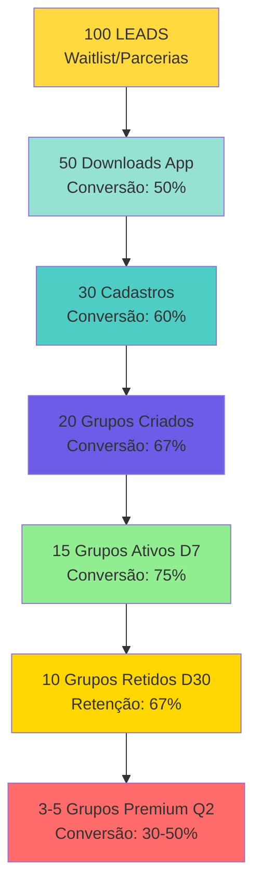

# 🎯 ICP-PELADEIROS-R02 — ESTRATÉGIA COMPLETA VENDAS + MARKETING


## 📊 RESUMO EXECUTIVO

### O Que Este Documento Contém

1. **ICP Atualizado** — Perfil ideal do grupo com validação de dados
2. **Estratégia de Marketing** — Distribuição > Desenvolvimento (50% tempo) + Growth Hacking
3. **Estratégia de Vendas** — Funil completo com conversões realistas (Free → Premium)
4. **Integração OKRs** — Alinhamento com N2 (CS, Operação, Posicionamento) e N3 (PELADEIROS)
5. **Insights Aplicados** — Merchant of Record, Margens 70-95%, Analytics, Feature Bloat, Agents Builder

### Princípios Fundamentais (Do Garimpo)

> [!quote] **Top 5 Takeaways Aplicados:**
> 
> 1. **Distribuição > Desenvolvimento** — 50% tempo em marketing/vendas
> 2. **Merchant of Record obrigatório** — Paddle/LemonSqueezy (não Stripe)
> 3. **Margens 70-95% essenciais** — Freemium com Premium R$ 30-50/mês
> 4. **Feature Bloat mata** — MVP = Split Pix + Sorteio IA (2 features core)
> 5. **Analytics desde dia 1** — PostHog + Sentry + Mixpanel
> 6. **Waitlist antes do launch** — Coletar leads antes de rebranding completo

---

## 🎯 PARTE 1: ICP ATUALIZADO (IDEAL CUSTOMER PROFILE)

### 📊 FIRMOGRAPHICS (Perfil do Grupo)

#### **Tipo de Grupo (prioridade decrescente):**

1. **🥇 GRUPOS RECORRENTES ORGANIZADOS** (priority #1)
   - Peladas semanais fixas (toda terça, todo sábado)
   - 15-30 jogadores por grupo
   - Organizador dedicado ("o síndico")
   - **Por quê:** Dor clara (inadimplência, cancelamentos), frequência alta, disposição a pagar

2. **🥈 LIGAS AMADORAS / CAMPEONATOS**
   - Múltiplos grupos sob mesma gestão
   - Calendário estruturado (8-12 rodadas)
   - **Por quê:** Precisa de features avançadas (tabela, estatísticas), budget maior

3. **🥉 GRUPOS UNIVERSITÁRIOS / CORPORATIVOS**
   - Peladas de faculdade, empresa
   - 20-40 jogadores, rotatividade média
   - **Por quê:** Early adopters tech-savvy, viralização rápida

4. **🎯 GRUPOS SOCIAIS CASUAIS**
   - Peladas esporádicas (1-2x/mês)
   - 10-20 jogadores
   - **Por quê:** Menor dor, mas volume grande (93% do mercado ainda usa só WhatsApp)

#### **Tamanho do Grupo:**
- **Jogadores:** 15-30 pessoas (sweet spot: 18-22)
- **Frequência:** 1-2x/semana (ideal: semanal fixo)
- **Por quê esse tamanho:**
  - ✅ Grande o suficiente para ter dor de organização (WhatsApp vira caos)
  - ✅ Pequeno o suficiente para organizador conhecer todos (social)
  - ✅ Permite sorteio de 2 times completos (7v7 ou 11v11)

#### **Localização:**
- **Principal:** Brasil (qualquer estado, foco SP/RJ/MG/RS)
- **Cidades:** 100k+ habitantes (acesso quadras, cultura futebol forte)

#### **Maturidade Digital:**
- ✅ **Usa WhatsApp** para organizar (100% do ICP)
- ✅ Já tentou planilhas ou apps anteriores (50%+)
- ✅ Organizador tem smartphone Android/iOS
- ❌ Não precisa conhecer tech (UX simples)

---

### 🧠 PSYCHOGRAPHICS (Dores, Comportamentos, Mindset)

#### **🔴 DOR #1: Inadimplência financeira (organizador paga do próprio bolso)**
- **Sintomas:**
  - Organizador paga quadra sozinho 2x/mês (R$ 50-100/vez)
  - Constrangimento de cobrar amigos
  - Planilha Excel manual de "quem pagou"
  - Mensagens WhatsApp ignoradas sobre pagamento
- **Quote típico:** *"Eu pago a quadra e depois fico cobrando um por um. Metade não paga e eu perco R$ 100 todo mês."*

#### **🔴 DOR #2: Cancelamentos por falta de quórum (frustração emocional)**
- **Sintomas:**
  - Jogo cancelado 30min antes (menos de 14 confirmados)
  - Perda de R$ 50-100 (quadra já reservada)
  - Estresse de confirmar 20 pessoas no WhatsApp
  - 2h/semana perdidas em confirmações
- **Quote típico:** *"Toda terça eu passo 2 horas confirmando. Chega sábado, 5 desistem de última hora e o jogo não rola."*

#### **🔴 DOR #3: Times desbalanceados (reclamações constantes)**
- **Sintomas:**
  - 15min na quadra montando times
  - Sempre os mesmos times (panelinhas)
  - Jogos 8x2, sem graça
  - Reclamações: "time injusto"
- **Quote típico:** *"Sempre sobra os mesmos no time fraco. Aí o jogo fica chato e a galera reclama."*

#### **🟢 COMPORTAMENTO IDEAL (comprador pronto):**
- ✅ Já é organizador há 6+ meses (não é novato)
- ✅ Sofre com inadimplência ou cancelamentos frequentes
- ✅ Já tentou apps anteriores (Chega+, Appito) mas abandonou
- ✅ Valoriza tecnologia mas quer simplicidade
- ✅ Toma decisão rápido (testa em 1 semana)

#### **🎯 MINDSET:**
- **Frase-chave que identifica ICP:** *"Eu quero automatizar a organização, mas sem perder o clima de amizade da pelada"*
- **O que valoriza:**
  1. **Economia de tempo** (mais que economia de dinheiro)
  2. **Evitar conflitos sociais** (app cobra, não ele)
  3. **Jogos mais justos** (times balanceados)
- **O que NÃO valoriza (red flag):**
  - "Quero app grátis forever" (não vai converter nunca)
  - "Meu grupo é muito desorganizado" (problema é o grupo, não a ferramenta)

---

### 💰 BUDGET & DECISOR

#### **Budget Disponível:**
- **Ticket aceitável:** R$ 0-50/grupo/mês
- **Comparação mental:** "Preço de 1 cerveja por pessoa" (R$ 50 ÷ 20 = R$ 2,50/pessoa)
- **Sensibilidade preço:**
  - Se R$ 0 (Free): "Vou testar" ✅
  - Se R$ 29,90/mês (Premium): "Vale a pena se funcionar" ✅
  - Se R$ 50-80/mês: "Tá caro, vou pensar" ⚠️
  - Se >R$ 100/mês: "Absurdo, igual Chega+" ❌

#### **Decisor:**
- **Quem é:** Organizador do grupo ("o síndico da pelada")
- **Perfil:** 25-45 anos, classe B/C+, geralmente líder natural
- **Processo decisão:** Rápido (7 dias trial → conversão)
- **Objeções típicas:**
  1. "E se a galera não quiser baixar?" → Mostrar modo Proxy (organizador confirma por todos)
  2. "Vai ficar caro?" → Mostrar freemium (grátis para sempre, Premium opcional)
  3. "É complicado?" → Mostrar onboarding 60 segundos

---

### 🚫 RED FLAGS (Quem NÃO é ICP)

| Red Flag | Por quê evitar | Ação |
|----------|----------------|------|
| **Grupo <10 jogadores** | WhatsApp suficiente, sem dor real | Recusar: "Nosso app é para grupos 15+" |
| **Pelada esporádica (1x/mês)** | Baixa frequência, não cria hábito | Qualificar: "Quantas vezes/mês jogam?" Se <2x, não é ICP |
| **"Quero grátis forever"** | Nunca vai converter para Premium | Aceitar no Free, mas não investir tempo em onboarding |
| **Grupo corporativo 500+ pessoas** | Complexidade enterprise, não é nosso foco | Recusar: "Nosso foco é grupos 15-30" |
| **Organizador não tem smartphone** | Não consegue usar app | Recusar educadamente |
| **"Meu grupo é muito desorganizado"** | Problema é o grupo, não a ferramenta | Educar: "App ajuda, mas precisa de mínimo de comprometimento" |

---

## 📣 PARTE 2: ESTRATÉGIA DE MARKETING COMPLETA

### 🎯 OBJETIVO DO MARKETING

> **Construir autoridade em gestão de peladas e gerar adoção orgânica através de distribuição estratégica (50% do tempo dedicado) + Growth Hacking**

### 📊 ALINHAMENTO COM OKRs

**OKR-N2-POSICIONAMENTO-AUTORIDADE:**
- KR-POS-1: 100 seguidores Instagram até 28/02
- KR-POS-2: 50 seguidores LinkedIn até 21/03
- KR-POS-3: 20 posts no site (2/semana) até 21/03
- KR-POS-4: Lançamento oficial (quando rebranding completo)

**OKR-N3-PELADEIROS:**
- KR-PEL-1: Rebranding completo (ResenhaFC) até 25/01
- KR-PEL-2: 10 grupos piloto ativos até 31/03
- KR-PEL-3: 100 pessoas no app até 31/03
- KR-PEL-6: Waitlist 100+ inscritos até 15/02

---

### 🚀 INSIGHT CRÍTICO APLICADO: DISTRIBUIÇÃO > DESENVOLVIMENTO

> [!danger] **I-CRIT-001: 50% do Tempo em Distribuição**
> 
> **Primeiras 60 minutos do dia:** Sempre criar conteúdo, fazer calls, DMing grupos potenciais  
> **Distribuição começa ANTES do launch:** Waitlist + Parcerias com quadras

#### **Alocação de Tempo (4h/dia total):**
- **2h Distribuição (50%)** — Marketing, conteúdo, calls, parcerias
- **2h Desenvolvimento (50%)** — Features, bugs, melhorias

#### **Atividades de Distribuição (2h/dia):**
- ✅ Criar conteúdo (posts, reels, stories)
- ✅ Calls com organizadores potenciais
- ✅ DMing grupos WhatsApp/Facebook
- ✅ Postar em redes sociais
- ✅ Parcerias com quadras (flyers, QR codes)
- ❌ NÃO pesquisar, NÃO preparar (isso não é distribuição)
- ✅ **AÇÃO:** postar, fazer calls, visitar quadras

---

### 📅 CRONOGRAMA MARKETING (12 SEMANAS Q1)

#### **SEMANA 1-2 (03-16 Jan) — SETUP + REBRANDING**

**Objetivo:** Completar rebranding e criar waitlist

**Ações:**
- [ ] **Rebranding completo (ResenhaFC)**
  - Nome registrado INPI (se possível)
  - Logo novo + identidade visual
  - App renomeado (Play Store + App Store)
  - Deadline: 25/01/2026
- [ ] **Criar waitlist** (landing page simples)
  - Coletar: Nome, email, telefone, cidade, tamanho grupo
  - Incentivo: "Primeiros 10 grupos: Premium 3 meses grátis"
  - URL: `resenhafc.com/waitlist`
- [ ] **Calendário editorial 12 semanas** (Arthur)
  - 2 posts/semana Instagram = 24 posts
  - 1 post/semana LinkedIn = 12 posts
  - 2 posts/semana Site = 24 artigos
- [ ] **Banco 15 posts prontos** (Arthur + PV)
  - 10 posts Awareness (topo de funil)
  - 5 posts Educativos (meio de funil)
- [ ] **Primeira publicação** (Instagram + Site)
  - Post 1: "ResenhaFC: Nova identidade, mesmo propósito" (carrossel)
  - Artigo 1: "Por que organizadores de pelada precisam de app?" (1.500 palavras)

**Métricas:**
- Rebranding: 100% completo
- Waitlist: 20+ leads em 2 semanas
- Posts criados: 15 prontos
- Primeira publicação: 2 posts publicados

---

#### **SEMANA 3-4 (17-30 Jan) — AWARENESS + PARCERIAS**

**Objetivo:** Educar mercado sobre gestão de peladas (topo de funil)

**Ações:**
- [ ] **6 posts Awareness publicados** (Instagram)
  - "5 Dores Organizadores de Pelada" (carrossel)
  - "WhatsApp vs App: Qual você usa?" (carrossel)
  - "Split Pix Automático: Como funciona?" (carrossel)
  - "Sorteio IA: Times Balanceados" (carrossel)
  - "Chega+ vs ResenhaFC: Comparação" (carrossel)
  - "Por que grupos abandonam apps?" (carrossel)
- [ ] **4 artigos educativos** (Site)
  - "ROI de App de Pelada: Números Reais"
  - "5 Erros Comuns ao Organizar Pelada"
  - "Split Pix vs Cobrança Manual: Análise"
  - "Como Escolher App de Pelada Certo"
- [ ] **Parcerias 3 quadras/complexos** (Vitor)
  - Flyer na quadra + QR Code
  - Trial grátis para grupos da quadra
  - Comissão para quadra (10% por grupo Premium)
- [ ] **2 posts LinkedIn** (técnicos)
  - "Por que apps de pelada falham?"
  - "Freemium vs Premium: Modelo ResenhaFC"

**Métricas:**
- Instagram: 30+ seguidores novos
- Site: 100+ visitantes únicos
- Waitlist: 40+ leads acumulados
- Parcerias: 3 quadras ativas

---

#### **SEMANA 5-6 (03-16 Fev) — EDUCAÇÃO + PREPARAÇÃO LANÇAMENTO**

**Objetivo:** Preparar lançamento oficial (quando tiver 5+ grupos piloto)

**Ações:**
- [ ] **7 posts Educativos** (Instagram)
  - "Processo ResenhaFC: Do Cadastro ao Primeiro Jogo" (carrossel)
  - "Onboarding 60 Segundos" (carrossel)
  - "Features Premium vs Free" (carrossel)
  - "FAQ ResenhaFC" (carrossel)
  - "Depoimento Grupo Piloto 1" (carrossel)
  - "Gamificação: Rankings e Badges" (carrossel)
  - "Roadmap Features" (carrossel)
- [ ] **4 artigos** (Site)
  - "Processo Completo: Como Funciona ResenhaFC"
  - "Pricing Transparente: Free vs Premium"
  - "5 Dicas para Organizar Pelada Perfeita"
  - "ROI Calculadora: Quanto você economiza?"
- [ ] **Ebook "Guia Completo Organização de Peladas"** (20 páginas)
  - Capa profissional
  - Checklist antes/depois
  - Comparação WhatsApp vs App
  - CTA: "Baixar App Gratuito"
- [ ] **Vídeo demo 60s** (Reel Instagram)
  - Mostrar app funcionando
  - Split Pix automático
  - Sorteio IA

**Métricas:**
- Instagram: 60+ seguidores novos
- Site: 300+ visitantes únicos
- Waitlist: 80+ leads acumulados
- Ebook: 10+ downloads
- Grupos piloto: 5+ ativos

---

#### **SEMANA 7-8 (17 Fev - 02 Mar) — 🚀 LANÇAMENTO OFICIAL**

**Objetivo:** Lançamento comercial completo (quando tiver 5+ grupos piloto)

**Ações:**
- [ ] **LANÇAMENTO OFICIAL** (data a definir)
  - Post especial lançamento (carrossel 10 slides)
  - Vídeo LIVE (highlights 10 min)
  - Email marketing lançamento (waitlist)
  - Instagram + LinkedIn simultâneo
- [ ] **8 posts Lançamento** (Instagram)
  - "🚀 ResenhaFC está no ar!"
  - "Como funciona na prática" (vídeo demo)
  - "Depoimento Grupo Piloto 1" (carrossel)
  - "Pricing Transparente" (carrossel)
  - "Baixar App Gratuito" (CTA claro)
  - "FAQ Lançamento" (carrossel)
  - "Case Study Grupo 2" (quando houver)
  - "Roadmap Q2" (carrossel)
- [ ] **4 artigos** (Site)
  - "Lançamento ResenhaFC: Tudo que você precisa saber"
  - "Case Study Grupo Piloto 1: ROI Real"
  - "Como funciona Trial Gratuito"
  - "5 Razões para Escolher ResenhaFC"
- [ ] **Parcerias 5 quadras/complexos** (Vitor)
  - Flyers atualizados
  - QR Codes funcionando
  - Trial grátis ativo

**Métricas:**
- Instagram: 100+ seguidores (meta KR-POS-1)
- Site: 500+ visitantes únicos
- Waitlist: 100+ leads acumulados (meta KR-PEL-6)
- LIVE: 30+ participantes
- Grupos piloto: 7+ ativos

---

#### **SEMANA 9-10 (03-16 Mar) — TRAÇÃO + CASES**

**Objetivo:** Construir prova social e tração

**Ações:**
- [ ] **2 cases sucesso publicados** (Instagram + Site)
  - Case Grupo 2 (quando fechar)
  - Case Grupo 3 (quando fechar)
  - Formato: Antes/Depois + Depoimento vídeo
- [ ] **Parcerias 10 quadras/complexos** (Vitor)
  - Programa parceria ativo
  - Comissão 10% por grupo Premium
- [ ] **6 posts Tração** (Instagram)
  - "Depoimento Grupo 2" (carrossel)
  - "Números reais: 10 grupos em 60 dias" (carrossel)
  - "Como aumentamos retenção D30" (carrossel)
  - "5 Grupos em 30 dias" (carrossel)
  - "Roadmap Q2" (carrossel)
  - "Agradecimento milestone" (carrossel)
- [ ] **4 artigos** (Site)
  - "Case Study Grupo 2"
  - "Case Study Grupo 3"
  - "Como aumentamos engajamento de grupos"
  - "Roadmap Q2 2026"

**Métricas:**
- Instagram: 120+ seguidores
- Site: 800+ visitantes únicos
- Cases: 3+ publicados
- Grupos piloto: 10+ ativos (meta KR-PEL-2)
- Pessoas no app: 100+ (meta KR-PEL-3)

---

#### **SEMANA 11-12 (17-31 Mar) — CONSOLIDAÇÃO**

**Objetivo:** Consolidar posicionamento e planejar Q2

**Ações:**
- [ ] **Roadmap Q2 publicado** (Instagram + Site)
- [ ] **Agradecimento milestone 100 seguidores** (Instagram)
- [ ] **Infográfico "90 dias ResenhaFC"** (carrossel)
- [ ] **Video testimonials compilation** (Reel)
- [ ] **4 artigos finais** (Site)
  - "90 dias ResenhaFC: O que aprendemos"
  - "Roadmap Q2: Novas Features"
  - "Como escolher App de Pelada em 2026"
  - "5 Tendências Sportstech para Grupos"

**Métricas:**
- Instagram: 100+ seguidores (meta atingida)
- LinkedIn: 50+ seguidores (meta atingida)
- Site: 20+ posts publicados (meta atingida)
- Grupos piloto: 10+ ativos (meta atingida)
- Pessoas no app: 100+ (meta atingida)

---

### 📊 CANAL ÚNICO: INSTAGRAM (Foco Total)

> [!tip] **Insight Aplicado: 1 Canal Apenas**
> 
> Não fazer 5 canais ao mesmo tempo. Escolher 1 e dominar.

#### **Por Que Instagram:**
- ✅ Público B2C está no Instagram (organizadores 25-45 anos)
- ✅ Visual funciona bem (reels, stories, carrossels)
- ✅ Algoritmo favorece conteúdo educativo
- ✅ Meta KR-POS-1: 100 seguidores até 28/02

#### **Estratégia Instagram:**

**Topo de Funil (Awareness):**
- Posts educativos sobre organização de peladas
- Dores comuns de organizadores
- Como funciona app
- **Frequência:** 2x/semana
- **Formato:** Carrossel, Reels, Stories

**Meio de Funil (Consideração):**
- Cases de sucesso
- Depoimentos grupos
- Processo onboarding
- **Frequência:** 1x/semana
- **Formato:** Carrossel, Stories, Reels

**Fundo de Funil (Decisão):**
- CTAs claros: "Baixar App Gratuito"
- Pricing transparente
- Prova social
- **Frequência:** 1x/semana
- **Formato:** Reels, Feed, Stories

---

### 🎨 ASSETS DE DESIGN (Prioridade)

#### **CRÍTICO (Fazer JÁ):**
1. **Templates Canva ResenhaFC (5 templates)**
   - Template "Antes vs Depois"
   - Template "Depoimento Grupo"
   - Template "Features Highlight"
   - Template "Processo Onboarding"
   - Template "Pricing Transparente"

2. **Carrossels Instagram (10 carrossels)**
   - "Quem é ResenhaFC?" (7 slides)
   - "5 Dores Organizadores" (6 slides)
   - "Como Funciona App" (8 slides)
   - "Split Pix Automático" (5 slides)
   - "Sorteio IA" (6 slides)
   - "Pricing Free vs Premium" (4 slides)
   - "FAQ ResenhaFC" (10 slides)
   - "Onboarding 60s" (5 slides)
   - "Portfolio Grupos" (7 slides)
   - "Roadmap Features" (5 slides)

3. **Vídeos/Reels (5 vídeos)**
   - Reel 30s: "O que é ResenhaFC?"
   - Reel 60s: Demo app completo
   - Reel 15s: Teaser lançamento
   - Video 3min: Processo completo explicado
   - Video 10min: Webinar highlights

---

### 📈 MÉTRICAS MARKETING (Dashboard Semanal)

| Métrica | Baseline | Meta Sem 1-2 | Meta Sem 3-4 | Meta Sem 7-8 | Meta Q1 |
|---------|----------|--------------|--------------|--------------|---------|
| **Waitlist Leads** | 0 | 20 | 40 | 100 | 150+ |
| **Seguidores Instagram** | [medir] | +10 | +30 | +50 | 100 |
| **Seguidores LinkedIn** | [medir] | +5 | +15 | +30 | 50 |
| **Posts Site** | 0 | 2 | 6 | 12 | 20 |
| **Visitantes Site** | 0 | 50 | 200 | 500 | 1.000+ |
| **Parcerias Quadras** | 0 | 3 | 5 | 10 | 15+ |
| **Grupos Piloto** | 3 | 3 | 5 | 7 | 10 |

---

## 💰 PARTE 3: ESTRATÉGIA DE VENDAS COMPLETA

### 🎯 OBJETIVO DAS VENDAS

> **Validar MVP com 10 grupos piloto ativos (free Q1) e 100 pessoas no app até 31/03/2026**

### 📊 ALINHAMENTO COM OKRs

**OKR-N3-PELADEIROS:**
- KR-PEL-1: Rebranding completo até 25/01
- KR-PEL-2: 10 grupos piloto ativos até 31/03
- KR-PEL-3: 100 pessoas no app até 31/03
- KR-PEL-4: Retenção D30 >60% até 28/02
- KR-PEL-5: NPS >70 até 31/03
- KR-PEL-6: Waitlist 100+ inscritos até 15/02
- KR-PEL-7: CAC orgânico (free Q1)

**Nota:** PELADEIROS é **validação Q1** (sem receita). Premium será Q2+.

---

### 🚀 INSIGHTS CRÍTICOS APLICADOS

#### **I-CRIT-001: Distribuição > Desenvolvimento**

> [!danger] **AÇÃO IMEDIATA:**
> - [ ] Criar waitlist HOJE (coletar leads antes do launch)
> - [ ] Começar parcerias com quadras ANTES do rebranding completo
> - [ ] Prazo: 19/01/2026 (waitlist) + 20/01/2026 (primeira parceria)

**Por quê:**
- MVP 100% pronto mas 0 grupos ativos
- Validação precisa de adoção, não de features
- Waitlist permite lançamento com base de leads

---

#### **I-CRIT-004: Feature Bloat Mata**

> [!danger] **AÇÃO IMEDIATA:**
> - [ ] Auditar features atuais
> - [ ] Identificar 2 features core: Split Pix + Sorteio IA
> - [ ] Considerar remover features não essenciais
> - [ ] Prazo: 21/01/2026 (auditoria completa)

**Features Core (MVP):**
1. **Split Pix Automático** — Resolve dor #1 (inadimplência)
2. **Sorteio IA** — Resolve dor #3 (times balanceados)

**Features Secundárias (pode remover se necessário):**
- Gamificação (rankings, badges) — Nice-to-have
- Estatísticas avançadas — Nice-to-have
- Múltiplos grupos — Para Q2

---

#### **I-CRIT-005: Analytics Desde Dia 1**

> [!danger] **AÇÃO IMEDIATA:**
> - [ ] Instalar PostHog (produto metrics)
> - [ ] Instalar Sentry (erros/bugs)
> - [ ] Instalar Mixpanel (cohort analysis, retenção)
> - [ ] Prazo: 22/01/2026 (instalação completa)

**Métricas a Rastrear:**
- Grupos criados/dia
- Pessoas cadastradas/dia
- Retenção D7/D30/D90 (cohort analysis)
- Taxa conversão Free → Premium (quando houver)
- Onde usuários travam (onboarding)
- Features mais usadas

---

### 💰 FUNIL DE VENDAS COMPLETO (Free → Premium)

#### **Funil Visual com Conversões**



#### **Meta de Atividade por Semana**

| Semana | Leads Novos | Downloads | Cadastros | Grupos Criados | Grupos Ativos D7 | Grupos Retidos D30 |
|--------|-------------|-----------|-----------|----------------|------------------|-------------------|
| Sem 1-2 (Jan) | 20 | 10 | 6 | 4 | 3 | 0 |
| Sem 3-4 (Jan) | 25 | 12 | 7 | 5 | 4 | 2 |
| Sem 5-6 (Fev) | 30 | 15 | 9 | 6 | 5 | 3 |
| Sem 7-8 (Fev) | 30 | 15 | 9 | 6 | 5 | 4 |
| Sem 9-10 (Mar) | 25 | 12 | 7 | 5 | 4 | 3 |
| Sem 11-12 (Mar) | 20 | 10 | 6 | 4 | 3 | 2 |
| **TOTAL Q1** | **150** | **74** | **44** | **30** | **24** | **14** |

**Meta Conservadora Q1:**
- 10 grupos piloto ativos (free)
- 100 pessoas no app
- Retenção D30 >60%

---

### 📋 PROCESSO DE VENDAS (5 ETAPAS)

#### **Etapa 1: Qualificação (Checklist ICP)**

**Duração:** 5-10 minutos (call ou WhatsApp)

**Checklist ICP:**
- [ ] **Tipo de Grupo:** Frequência? (se <2x/mês, não é ICP ❌)
- [ ] **Tamanho:** Quantas pessoas? (se <15, não é ICP ❌)
- [ ] **Dor:** Qual maior problema? (inadimplência/cancelamentos?)
- [ ] **Ferramenta Atual:** WhatsApp ou outro app?
- [ ] **Decisor:** Você é organizador?
- [ ] **Urgência:** Quando quer resolver?
- [ ] **Budget:** Pagaria R$ 30-50/mês? (se não, Free apenas)

**Score:**
- **6-7 SIM** = ICP perfeito, liberar trial hoje
- **4-5 SIM** = ICP borderline, qualificar mais
- **<4 SIM** = NÃO é ICP, recusar educadamente

**Script de Qualificação:**
```
"Olá [Nome], vi que você se interessou pelo ResenhaFC.
Vou fazer 7 perguntas rápidas para ver se faz sentido testar:

1. Frequência: Vocês jogam quantas vezes por mês?
2. Tamanho: Quantas pessoas no grupo?
3. Dor: Qual o maior problema hoje? (inadimplência? cancelamentos?)
4. Ferramenta: Usam WhatsApp ou outro app?
5. Decisor: Você é o organizador?
6. Urgência: Quando quer resolver isso?
7. Budget: Pagaria R$ 30-50/mês para resolver?

[Se 6-7 SIM] → Ótimo! Vamos liberar trial grátis de 7 dias.
[Se <6 SIM] → Vou te mandar conteúdo educativo por email."
```

---

#### **Etapa 2: Onboarding 60 Segundos**

**Duração:** 60 segundos (app)

**Objetivo:** Cliente cria grupo e agenda primeira pelada em <1 minuto

**Estrutura:**
1. **0-10s:** Cadastro rápido (nome, email, telefone)
2. **10-30s:** Criar grupo (nome, local, frequência)
3. **30-50s:** Convidar jogadores (link WhatsApp)
4. **50-60s:** Agendar primeira pelada (data, hora)

**Checklist Pós-Onboarding:**
- [ ] Grupo criado
- [ ] 8+ jogadores convidados
- [ ] Primeira pelada agendada
- [ ] Organizador entendeu Split Pix

---

#### **Etapa 3: Ativação D7 (Primeiro Jogo)**

**Duração:** 1 semana (automático + follow-up)

**Objetivo:** Cliente realiza primeira pelada usando app

**Ações Automáticas:**
- [ ] Lembrete 24h antes (push notification)
- [ ] Lembrete 2h antes (push notification)
- [ ] Confirmação automática (quando 14+ confirmados)

**Ações Manuais (se necessário):**
- [ ] Follow-up WhatsApp (Vitor) se grupo não ativou
- [ ] Suporte onboarding (Luis) se houver dúvidas

**Métrica de Sucesso:**
- 75% grupos ativam D7 (primeira pelada realizada)

---

#### **Etapa 4: Retenção D30 (Hábito Criado)**

**Duração:** 30 dias (automático + follow-up)

**Objetivo:** Cliente usa app regularmente (2+ peladas)

**Ações Automáticas:**
- [ ] Lembretes semanais (push notification)
- [ ] Relatório semanal (email com estatísticas)
- [ ] Badges e gamificação (engajamento)

**Ações Manuais:**
- [ ] Pesquisa NPS D30 (Google Forms)
- [ ] Follow-up se retenção <60% (Vitor)
- [ ] Oferecer Premium se grupo ativo (Q2)

**Métrica de Sucesso:**
- 60%+ grupos retidos D30 (meta KR-PEL-4)

---

#### **Etapa 5: Conversão Premium (Q2+)**

**Quando oferecer:** Após D30, se grupo ativo

**Proposta:**
```
"Parabéns! Seu grupo está ativo há 30 dias! 🎉

Que tal desbloquear features Premium?
✅ Estatísticas avançadas
✅ Múltiplos grupos
✅ Suporte prioritário
✅ Sem anúncios

Investimento: R$ 29,90/mês (menos que 1 cerveja por pessoa)

Quer testar 7 dias grátis?"
```

**ROI Cliente:**
- Economia tempo: 2h/semana = 8h/mês
- Economia dinheiro: R$ 100-200/mês (inadimplência)
- Payback: Imediato

---

### 📅 CRONOGRAMA VENDAS (12 SEMANAS Q1)

#### **SEMANA 1-2 (03-16 Jan) — SETUP + REBRANDING**

**Ações:**
- [ ] Rebranding completo (ResenhaFC)
  - Nome registrado INPI (se possível)
  - Logo novo + identidade visual
  - App renomeado
  - Deadline: 25/01/2026
- [ ] Criar waitlist (landing page)
- [ ] Listar 20 leads potenciais (grupos piloto)
- [ ] 5 qualificações realizadas

**Meta:** Rebranding completo, waitlist 20+ leads, 3 grupos piloto ativos

---

#### **SEMANA 3-4 (17-30 Jan) — PRIMEIRAS PARCERIAS**

**Ações:**
- [ ] Parcerias 3 quadras/complexos (Vitor)
- [ ] 8 qualificações realizadas
- [ ] 5 grupos criados
- [ ] **🎯 META: 5 grupos piloto ativos até 31/01**

**Meta:** 5 grupos piloto ativos, waitlist 40+ leads

---

#### **SEMANA 5-6 (03-16 Fev) — ESCALAR PARCERIAS**

**Ações:**
- [ ] Parcerias 5 quadras/complexos (total 8)
- [ ] 10 qualificações realizadas
- [ ] 6 grupos criados
- [ ] **🎯 META: 7 grupos piloto ativos até 16/02**

**Meta:** 7 grupos piloto ativos, waitlist 80+ leads, 50+ pessoas no app

---

#### **SEMANA 7-8 (17 Fev - 02 Mar) — LANÇAMENTO + TRAÇÃO**

**Ações:**
- [ ] Lançamento oficial (quando tiver 7+ grupos)
- [ ] Parcerias 10 quadras/complexos (total 15)
- [ ] 10 qualificações realizadas
- [ ] 6 grupos criados
- [ ] **🎯 META: 10 grupos piloto ativos até 02/03**

**Meta:** 10 grupos piloto ativos, waitlist 100+ leads, 70+ pessoas no app

---

#### **SEMANA 9-10 (03-16 Mar) — CONSOLIDAÇÃO**

**Ações:**
- [ ] Parcerias 15 quadras/complexos (total 20)
- [ ] 8 qualificações realizadas
- [ ] 5 grupos criados
- [ ] **🎯 META: 10 grupos piloto ativos (mantido)**

**Meta:** 10 grupos piloto ativos, 100+ pessoas no app, retenção D30 >60%

---

#### **SEMANA 11-12 (17-31 Mar) — VALIDAÇÃO FINAL**

**Ações:**
- [ ] Pesquisa NPS (todos grupos D30+)
- [ ] Cohort analysis D30 (retenção)
- [ ] Documentar cases 3 grupos
- [ ] Planejar Q2 (Premium, monetização)

**Meta:** **10 GRUPOS PILOTO ATIVOS — OKR ATINGIDO**

---

### 📊 MÉTRICAS VENDAS (Dashboard Semanal)

| Métrica | Baseline | Meta Sem 1-2 | Meta Sem 3-4 | Meta Sem 7-8 | Meta Q1 |
|---------|----------|--------------|--------------|--------------|---------|
| **Leads Novos** | 0 | 20 | 45 | 105 | 150 |
| **Downloads App** | 0 | 10 | 22 | 52 | 74 |
| **Cadastros** | 0 | 6 | 13 | 31 | 44 |
| **Grupos Criados** | 0 | 4 | 9 | 21 | 30 |
| **Grupos Ativos D7** | 3 | 3 | 7 | 15 | 24 |
| **Grupos Retidos D30** | 0 | 0 | 2 | 8 | 14 |
| **Pessoas no App** | 0 | 20 | 50 | 80 | 100+ |

---

## 🔗 PARTE 4: INTEGRAÇÃO COM OKRs

### 📊 ALINHAMENTO OKR-N2 (PILARES)

#### **OKR-N2-CUSTOMER-SUCCESS:**
- **KR-CS-1 (Churn < 15%):** PELADEIROS = Retenção D30 >60% (meta KR-PEL-4)
- **KR-CS-2 (NPS > 70):** Pesquisa NPS D30, ações para Detratores
- **KR-CS-3 (8+ indicações):** Programa indicação ativo, incentivos claros

#### **OKR-N2-OPERACAO-PRODUTIVIDADE:**
- **KR-OP-1 (3 Lançamentos):** PELADEIROS lançado quando tiver 5+ grupos piloto
- **KR-OP-2 (Sistema Bugs):** Notion/GitHub configurado, processo documentado
- **KR-OP-4 (Dashboards):** Analytics funcionando (PostHog + Sentry + Mixpanel)

#### **OKR-N2-POSICIONAMENTO-AUTORIDADE:**
- **KR-POS-1 (100 seguidores Instagram):** Meta 28/02 (PRINCIPAL para PELADEIROS)
- **KR-POS-2 (50 seguidores LinkedIn):** Meta 21/03 (secundário)
- **KR-POS-3 (20 posts site):** Meta 21/03
- **KR-POS-4 (Lançamento):** Quando tiver 5+ grupos piloto

---

### 📊 ALINHAMENTO OKR-N3 (PELADEIROS)

#### **KR-PEL-1: Rebranding Completo (ResenhaFC)**
- Nome registrado + App publicado
- Deadline: 25/01/2026
- Responsável: PV + Arthur

#### **KR-PEL-2: 10 Grupos Piloto Ativos**
- 10 grupos free ativos
- Deadline: 31/03/2026
- Responsável: Vitor + PV

#### **KR-PEL-3: 100 Pessoas no App**
- 100 pessoas cadastradas
- Deadline: 31/03/2026
- Responsável: Vitor + Luis

#### **KR-PEL-4: Retenção D30 >60%**
- Cohort analysis D30
- Deadline: 28/02/2026
- Responsável: Luis

#### **KR-PEL-5: NPS >70**
- Pesquisa satisfação
- Deadline: 31/03/2026
- Responsável: PV

#### **KR-PEL-6: Waitlist 100+ Inscritos**
- Landing page analytics
- Deadline: 15/02/2026
- Responsável: Arthur

#### **KR-PEL-7: CAC Orgânico (Free Q1)**
- Dashboard financeiro
- Deadline: 31/03/2026
- Responsável: Vitor

---

## ✅ PARTE 5: CHECKLIST DE IMPLEMENTAÇÃO

### 🚀 AÇÕES CRÍTICAS (Próximos 7 dias)

#### **Dia 1 (19/01):**
- [ ] Rebranding completo (ResenhaFC) — finalizar
- [ ] Criar waitlist (landing page simples)
- [ ] Criar calendário editorial 12 semanas

#### **Dia 2-3 (20-21/01):**
- [ ] Listar 20 leads potenciais (grupos piloto)
- [ ] Criar banco 15 posts (Arthur + PV)
- [ ] Configurar PostHog + Sentry + Mixpanel (Luis)
- [ ] Primeira parceria quadra (Vitor)

#### **Dia 4-5 (22-23/01):**
- [ ] Primeira publicação (Instagram + Site)
- [ ] 5 qualificações realizadas (Vitor)
- [ ] Auditar feature bloat (Luis + PV)
- [ ] Criar CRM pipeline (PV)

#### **Dia 6-7 (24-25/01):**
- [ ] Rebranding 100% completo
- [ ] 3 grupos piloto ativos
- [ ] Dashboard pipeline criado (PV)
- [ ] Revisão semanal (time completo)

---

### 📅 AÇÕES MÉDIO PRAZO (Próximos 30 dias)

#### **Janeiro (19-31/01):**
- [ ] Rebranding: 100% completo
- [ ] 5 grupos piloto ativos
- [ ] Waitlist: 40+ leads
- [ ] Analytics funcionando
- [ ] Parcerias: 3 quadras

#### **Fevereiro (01-28/02):**
- [ ] 7 grupos piloto ativos
- [ ] Waitlist: 100+ leads (meta KR-PEL-6)
- [ ] 50+ pessoas no app
- [ ] Retenção D30 >60% (meta KR-PEL-4)
- [ ] Parcerias: 10 quadras

#### **Março (01-31/03):**
- [ ] 10 grupos piloto ativos (meta KR-PEL-2)
- [ ] 100+ pessoas no app (meta KR-PEL-3)
- [ ] NPS >70 (meta KR-PEL-5)
- [ ] Parcerias: 15+ quadras
- [ ] Planejar Q2 (Premium, monetização)

---

## 🎯 PRINCÍPIOS GUIA (LEMBRAR SEMPRE)

1. **Distribuição > Desenvolvimento**
   - 50% tempo em marketing/vendas
   - Primeiras 60 min do dia: distribuição

2. **Grupo Ativo > Produto Perfeito**
   - MVP 100% pronto é suficiente
   - Validação primeiro, features depois

3. **Velocidade > Precisão**
   - Onboarding 60s, não 10min
   - Trial 7 dias, não 30 dias

4. **Quantidade > Qualidade (no início)**
   - 10 grupos medíocres > 3 grupos perfeitos
   - 30 leads ruins > 10 leads perfeitos

5. **Foco > Dispersão**
   - PELADEIROS é validação Q1 (sem receita)
   - Tudo que não valida PELADEIROS = secundário

---

## 📞 RESPONSABILIDADES

| Pessoa | Função | Responsabilidades |
|--------|--------|-------------------|
| **Vitor Reis Pirolli** | Growth Lead | Fechar 10 grupos piloto, parcerias quadras, qualificação, waitlist |
| **Luis Fernando Boff** | Tech Lead | Bugs, app, analytics, retenção, feature bloat |
| **Arthur Brandalise** | Diretor Marketing | Conteúdo, design, rebranding, posts, waitlist |
| **Pedro Vitor Pagliarin** | CEO/Product | Decisões, pricing, strategy, margens, feature bloat |

---

## 📊 SCORECARD FINAL Q1 2026

**Critérios de Sucesso:**

| Métrica | Meta Mínima | Meta Ideal | Status |
|---------|-------------|------------|--------|
| **Grupos Piloto Ativos** | 7 | 10 | 🔴 3 |
| **Pessoas no App** | 70 | 100+ | 🔴 0 |
| **NPS** | 60 | 70+ | ⚪ N/A |
| **Retenção D30** | 50% | 60%+ | ⚪ N/A |
| **Waitlist** | 50 | 100+ | 🔴 0 |
| **Parcerias Quadras** | 5 | 15+ | 🔴 0 |
| **Seguidores Instagram** | 50 | 100 | 🔴 [medir] |
| **Posts Site** | 10 | 20 | 🔴 0 |

**Decisão Final Q1 (até abril):**
- ✅ **SUCESSO:** ≥ 10 grupos piloto, 100+ pessoas, retenção D30 >60%
- 🟡 **PARCIAL:** 7-9 grupos piloto, 70-99 pessoas, retenção D30 50-60%
- ❌ **FRACASSO:** < 7 grupos piloto, < 70 pessoas, retenção D30 <50%

---

**📅 Criado:** 19/01/2026  
**✍️ Autor:** Pedro Vitor Pagliarin  
**🔄 Próxima revisão:** Semanal (toda segunda 9h)  
**📌 Versão:** R02 (Estratégia Completa Integrada)

---

> [!quote] **MANTRA PELADEIROS Q1 2026**
> 
> *"Distribuição > Desenvolvimento. 50% tempo em marketing/vendas. Analytics desde dia 1. Feature Bloat mata (Split Pix + Sorteio IA = core). Waitlist antes do launch. Parcerias com quadras = canal #1. Grupo ativo > produto perfeito. 10 grupos piloto ou pausamos para focar Chatbot/UzzBuilder."*

