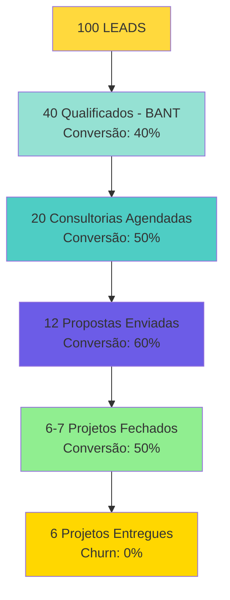

# 🎯 ICP-UZZBUILDER-R02 — ESTRATÉGIA COMPLETA VENDAS + MARKETING


## 📊 RESUMO EXECUTIVO

### O Que Este Documento Contém

1. **ICP Atualizado** — Perfil ideal do cliente com validação de dados
2. **Estratégia de Marketing** — Distribuição > Desenvolvimento (50% tempo) + Automação de Ads via Agentes
3. **Estratégia de Vendas** — Funil completo com conversões realistas
4. **Integração OKRs** — Alinhamento com N2 (CS, Operação, Posicionamento) e N3 (UZZBUILDER)
5. **Insights Aplicados** — Merchant of Record, Margens 70-95%, Analytics, Feature Bloat, Agents Builder

### Princípios Fundamentais (Do Garimpo)

> [!quote] Top 5 Takeaways Aplicados:
> 1. Distribuição > Desenvolvimento — 50% tempo em marketing/vendas
> 2. Merchant of Record obrigatório — Paddle/LemonSqueezy (não Stripe)
> 3. Margens 70-95% essenciais — Planos anuais/2 anos, não só mensal
> 4. Feature Bloat mata — MVP = 1-2 features excelentes
> 5. Analytics desde dia 1 — PostHog + Sentry + Langfuse
> 6. Agentes de Tráfego — Automação de ads Meta como diferencial competitivo

---

## 🎯 PARTE 1: ICP ATUALIZADO (IDEAL CUSTOMER PROFILE)

### 📊 FIRMOGRAPHICS (Perfil da Empresa)

#### **Setor/Segmento (prioridade decrescente):**

1. **🥇 SERVIÇOS PROFISSIONAIS** (priority #1)
   - Advogados, contadores, arquitetos, engenheiros
   - Consultores, coaches, psicólogos, terapeutas
   - **Por quê:** Alto valor percebido de presença digital, budget adequado (R$ 2-6k), decisão rápida (dono decide)

2. **🥈 COMÉRCIO LOCAL**
   - Restaurantes, cafeterias, lojas físicas
   - Oficinas, assistências técnicas, pet shops
   - **Por quê:** Precisam site para credibilidade, querem algo rápido, budget R$ 1.500-4.000

3. **🥉 SAÚDE & BEM-ESTAR**
   - Clínicas médicas/odontológicas, estúdios yoga/pilates
   - Personal trainers, nutricionistas, fisioterapeutas
   - **Por quê:** Site = credibilidade profissional, agendamento online, faturamento adequado

4. **🎯 STARTUPS EARLY-STAGE**
   - Founders pré-revenue ou seed
   - Validando MVP, precisam site institucional rápido
   - **Por quê:** Urgência (lançar em 1-2 semanas), budget limitado (R$ 1-3k), decisão ultra-rápida

#### **Tamanho:**
- **Faturamento:** R$ 50k - R$ 500k/ano (sweet spot: R$ 100-300k)
- **Funcionários:** 1-20 pessoas (ideal: 1-5)
- **Por quê esse tamanho:**
  - ✅ Pequeno o suficiente para não precisar de agência enterprise
  - ✅ Grande o suficiente para ter budget R$ 2-6k
  - ✅ Dono/fundador decide diretamente (sem burocracia)

#### **Localização:**
- **Principal:** Brasil (qualquer estado, online-first)
- **Cidades:** 30k+ habitantes (acesso internet, cultura digital mínima)

#### **Maturidade Digital:**
- ✅ **Tem presença digital básica** (Instagram, Facebook, LinkedIn)
- ✅ Entende valor de site profissional (não quer "só rede social")
- ✅ Tem ou planeja ter domínio próprio (.com.br ou .com)
- ❌ Não precisa conhecer Next.js ou tech (vamos entregar tudo pronto)

---

### 🧠 PSYCHOGRAPHICS (Dores, Comportamentos, Mindset)

#### **🔴 DOR #1: Site desatualizado ou inexistente**
- **Sintomas:**
  - Tem site antigo (WordPress 2015, Flash, não responsivo)
  - OU não tem site, só Instagram/Facebook
  - Clientes perguntam "qual seu site?" e ele não tem
  - Envergonhado de mostrar site atual para prospects
- **Quote típico:** *"Meu site parece dos anos 2000, preciso algo moderno mas não sei por onde começar"*

#### **🔴 DOR #2: Custo alto de agências tradicionais**
- **Sintomas:**
  - Recebeu orçamentos de R$ 10-30k de agências
  - Não tem budget para isso (é pequeno negócio)
  - Já foi "queimado" por freelancer que sumiu no meio
  - Quer algo profissional mas com preço justo
- **Quote típico:** *"R$ 15 mil por um site? Eu não sou uma multinacional!"*

#### **🔴 DOR #3: Tempo lento para entrega**
- **Sintomas:**
  - Precisa site para evento/lançamento em 2-3 semanas
  - Agências falam "2-3 meses" de prazo
  - Perdeu oportunidades por não ter site pronto
  - Quer validar negócio rápido (startup)
- **Quote típico:** *"Preciso do site no ar semana que vem, tenho reunião com investidor"*

#### **🟢 COMPORTAMENTO IDEAL (comprador pronto):**
- ✅ Já pesquisou "criar site profissional preço" no Google
- ✅ Entende diferença entre Wix/Squarespace e site custom
- ✅ Valoriza velocidade + qualidade (não só preço)
- ✅ Tem materiais prontos (logo, fotos, textos) ou disposição a criar
- ✅ Toma decisão rápido (1-2 semanas da proposta ao fechamento)

#### **🎯 MINDSET:**
- **Frase-chave que identifica ICP:** *"Quero site profissional que demore 1-2 semanas e custe R$ 2-4k, não R$ 15k em 3 meses"*
- **O que valoriza:**
  1. **Velocidade** (mais que tudo — tem urgência)
  2. **Preço justo** (não quer barato, quer custo-benefício)
  3. **Qualidade profissional** (design moderno, mobile-first, rápido)
- **O que NÃO valoriza (red flag):**
  - "Quero o site mais barato possível" (vai para Wix)
  - "Preciso de e-commerce complexo" (não é nosso foco)
  - "Quero contratar agência grande" (não é nosso perfil)

---

### 💰 BUDGET & DECISOR

#### **Budget Disponível:**
- **Ticket aceitável:** R$ 1.500 - R$ 6.000
- **Comparação mental:** "Custa menos que contratar dev freelancer por 1 mês"
- **Sensibilidade preço:**
  - Se <R$ 1.500: "Muito barato, vou para Wix" ❌
  - Se R$ 2.000-4.000: "Preço justo, vou fechar" ✅
  - Se >R$ 6.000: "Caro demais, vou pesquisar mais" ⚠️

#### **Decisor:**
- **Quem é:** Dono/Fundador/Sócio (pequeno negócio = dono decide tudo)
- **Perfil:** 25-55 anos, empreendedor prático (não corporativo)
- **Processo decisão:** Rápido (3-7 dias proposta → fechamento)
- **Objeções típicas:**
  1. "E se eu não gostar do resultado?" → Mostrar portfolio + revisões incluídas
  2. "Demora quanto tempo?" → Mostrar timeline 10-15 dias
  3. "É difícil atualizar depois?" → Mostrar documentação + suporte 30 dias

---

### 🚫 RED FLAGS (Quem NÃO é ICP)

| Red Flag | Por quê evitar | Ação |
|----------|----------------|------|
| **Empresa grande (50+ funcionários)** | Processo lento, quer RFP/licitação, 6 meses para fechar | Recusar educadamente: "Nosso foco é PMEs, você precisa de agência enterprise" |
| **Quer e-commerce complexo** | Não é nosso core (temos template institucional, não loja) | Oferecer parceria com dev Shopify ou recusar |
| **"Quero de graça/teste"** | Não valoriza, nunca paga | Oferecer portfolio para ver qualidade, mas contrato formal |
| **Quer customizações mega-complexas** | Sai do template, vira projeto custom (não escala) | Recusar ou cobrar add-on R$ 2-4k extra |
| **Microempresa (<R$ 30k/ano)** | Não tem budget nem para R$ 1.500 | Sugerir Wix/Squarespace DIY |
| **Não responde em 1 semana** | Não tem urgência, vai enrolar 6 meses | Desqualificar: "Volte quando tiver urgência real" |

---

## 📣 PARTE 2: ESTRATÉGIA DE MARKETING COMPLETA

### 🎯 OBJETIVO DO MARKETING

> **Construir autoridade em sites profissionais rápidos e gerar leads qualificados através de distribuição estratégica (50% do tempo dedicado) + Automação de Ads via Agentes**

### 📊 ALINHAMENTO COM OKRs

**OKR-N2-POSICIONAMENTO-AUTORIDADE:**
- KR-POS-1: 100 seguidores Instagram até 28/02
- KR-POS-2: 50 seguidores LinkedIn até 21/03
- KR-POS-3: 20 posts no site (2/semana) até 21/03
- KR-POS-4: Lançamento oficial (quando UzzBuilder estiver pronto)

**OKR-N3-UZZBUILDER:**
- KR-UZZB-1: 6 projetos entregues até 31/03
- KR-UZZB-2: R$ 12-18k receita até 31/03
- KR-UZZB-7: Pipeline >R$ 60k até 28/02

---

### 🚀 INSIGHT CRÍTICO APLICADO: DISTRIBUIÇÃO > DESENVOLVIMENTO

> [!danger] **I-CRIT-001: 50% do Tempo em Distribuição**
> 
> **Primeiras 60 minutos do dia:** Sempre criar conteúdo, fazer calls, DMing clientes potenciais  
> **Distribuição começa ANTES do launch:** Portfolio + Cases + Waitlist

#### **Alocação de Tempo (4h/dia total):**
- **2h Distribuição (50%)** — Marketing, conteúdo, calls, DMs
- **2h Desenvolvimento (50%)** — Sites, ajustes, melhorias

#### **Atividades de Distribuição (2h/dia):**
- ✅ Criar conteúdo (posts, artigos, cases)
- ✅ Calls com clientes potenciais
- ✅ DMing prospects (LinkedIn, Instagram)
- ✅ Postar em redes sociais
- ✅ **DIFERENCIAL:** Automação de ads Meta via agentes (quando cliente já tem site)
- ❌ NÃO pesquisar, NÃO preparar (isso não é distribuição)
- ✅ **AÇÃO:** postar, fazer calls

---

### 🤖 INSIGHT AGENTS BUILDER: AUTOMAÇÃO DE ADS COMO DIFERENCIAL

> [!danger] **I-AGENTS-001: Agente de Tráfego Meta como Upsell**
> 
> **O que é:** Cliente compra site → Oferecer agente que otimiza campanhas Meta Ads automaticamente  
> **Por que importa:** Diferencial competitivo, aumenta ticket médio, cria receita recorrente  
> **Como aplicar:** Após entrega do site, oferecer "Agente de Tráfego" que monitora e otimiza ads

#### **Proposta de Valor:**
- **Site entregue:** Cliente tem presença digital
- **Problema:** Site sozinho não gera tráfego
- **Solução:** Agente IA que:
  - Analisa campanhas Meta Ads
  - Pausa criativos caros (CPL alto)
  - Escala criativos vencedores
  - Envia relatórios via Telegram
  - Otimiza budget automaticamente

#### **Pricing Sugerido:**
- **Add-on Agente de Tráfego:** R$ 500-1.000/mês
- **Setup inicial:** R$ 490 (configuração Meta API + Telegram)
- **ROI Cliente:** Reduz CAC em 20-30% via otimização automática

---

### 📅 CRONOGRAMA MARKETING (12 SEMANAS Q1)

#### **SEMANA 1-2 (03-16 Jan) — SETUP + PORTFOLIO**

**Objetivo:** Criar portfolio e começar distribuição

**Ações:**
- [ ] **Criar portfolio público** (site UzzBuilder.com/portfolio)
  - Case Yoga Master (já entregue)
  - Screenshots antes/depois
  - Depoimento cliente (se possível)
- [ ] **Calendário editorial 12 semanas** (Arthur)
  - 2 posts/semana LinkedIn = 24 posts
  - 1 post/semana Instagram = 12 posts
  - 2 posts/semana Site = 24 artigos
- [ ] **Banco 15 posts prontos** (Arthur + PV)
  - 10 posts Portfolio/Cases
  - 5 posts Educativos (topo de funil)
- [ ] **Primeira publicação** (LinkedIn + Site)
  - Post 1: "Case Yoga Master: Site em 5h30" (carrossel)
  - Artigo 1: "Por que PMEs precisam de site profissional em 2026?" (1.500 palavras)

**Métricas:**
- Portfolio: 1 case documentado
- Posts criados: 15 prontos
- Primeira publicação: 2 posts publicados

---

#### **SEMANA 3-4 (17-30 Jan) — AWARENESS + CASES**

**Objetivo:** Educar mercado sobre sites profissionais (topo de funil)

**Ações:**
- [ ] **6 posts Awareness publicados** (LinkedIn)
  - "5 Erros Comuns ao Criar Site" (carrossel)
  - "Site vs Rede Social: Qual você precisa?" (carrossel)
  - "Quanto custa um site profissional?" (carrossel)
  - "Wix vs Site Custom: Análise Comparativa" (carrossel)
  - "Por que agências cobram R$ 15k?" (carrossel)
  - "Site em 10 dias: É possível?" (carrossel)
- [ ] **4 artigos educativos** (Site)
  - "ROI de Site Profissional: Números Reais"
  - "5 Erros Comuns ao Escolher Agência de Sites"
  - "Site vs Landing Page: Qual você precisa?"
  - "Como Escolher Template de Site Certo"
- [ ] **2 posts Instagram** (visual)
  - "Antes vs Depois" (site antigo vs novo)
  - "Portfolio UzzBuilder" (carrossel 5 sites)

**Métricas:**
- LinkedIn: 20+ seguidores novos
- Site: 100+ visitantes únicos
- Portfolio: 2 cases documentados

---

#### **SEMANA 5-6 (03-16 Fev) — EDUCAÇÃO + PREPARAÇÃO LANÇAMENTO**

**Objetivo:** Preparar lançamento oficial (quando tiver 3+ cases)

**Ações:**
- [ ] **7 posts Educativos** (LinkedIn)
  - "Processo UzzBuilder: Do Brief ao Site no Ar" (carrossel)
  - "Timeline Real: 10-15 dias" (carrossel)
  - "Pricing Transparente: 3 Pacotes" (carrossel)
  - "FAQ Sites Profissionais" (carrossel)
  - "Como funciona Revisão Incluída" (carrossel)
  - "Suporte 30 dias: O que inclui?" (carrossel)
  - "Portfolio Completo" (carrossel 5+ sites)
- [ ] **4 artigos** (Site)
  - "Processo Completo: Como Criamos Sites em 10 Dias"
  - "Pricing Sites Profissionais: Guia Completo"
  - "5 Dicas para Escolher Agência de Sites"
  - "ROI Calculadora: Quanto você economiza?"
- [ ] **Ebook "Guia Completo Sites Profissionais"** (20 páginas)
  - Capa profissional
  - Checklist antes/depois
  - Comparação Wix vs Custom
  - CTA: "Agendar Consultoria Gratuita"
- [ ] **Vídeo demo 60s** (Reel Instagram)
  - Mostrar site antes/depois
  - Timeline 10 dias
  - Pricing transparente

**Métricas:**
- LinkedIn: 40+ seguidores novos
- Site: 300+ visitantes únicos
- Portfolio: 3+ cases documentados
- Ebook: 10+ downloads

---

#### **SEMANA 7-8 (17 Fev - 02 Mar) — 🚀 LANÇAMENTO OFICIAL**

**Objetivo:** Lançamento comercial completo (quando tiver 3+ cases)

**Ações:**
- [ ] **LANÇAMENTO OFICIAL** (data a definir)
  - Post especial lançamento (carrossel 10 slides)
  - Vídeo LIVE (highlights 10 min)
  - Email marketing lançamento (waitlist se houver)
  - LinkedIn + Instagram simultâneo
- [ ] **8 posts Lançamento** (LinkedIn)
  - "🚀 UzzBuilder está no ar!"
  - "Como funciona na prática" (vídeo demo)
  - "Depoimento Cliente 1" (carrossel)
  - "Pricing Transparente" (carrossel)
  - "Agendar Consultoria Gratuita" (CTA claro)
  - "FAQ Lançamento" (carrossel)
  - "Case Study Cliente 2" (quando houver)
  - "Roadmap Q2" (carrossel)
- [ ] **4 artigos** (Site)
  - "Lançamento UzzBuilder: Tudo que você precisa saber"
  - "Case Study Yoga Master: ROI Real"
  - "Como funciona Consultoria Gratuita"
  - "5 Razões para Escolher UzzBuilder"
- [ ] **Plano Marketing Personalizado** (seguir estratégia definida)
  - Posts personalizados para cada persona
  - Conteúdo específico por setor (advogados, restaurantes, startups)

**Métricas:**
- LinkedIn: 50+ seguidores (meta KR-POS-2)
- Site: 500+ visitantes únicos
- Portfolio: 3+ cases publicados
- LIVE: 30+ participantes
- Consultorias agendadas: 5+ via lançamento

---

#### **SEMANA 9-10 (03-16 Mar) — TRAÇÃO + CASES**

**Objetivo:** Construir prova social e tração

**Ações:**
- [ ] **2 cases sucesso publicados** (LinkedIn + Site)
  - Case Cliente 2 (quando fechar)
  - Case Cliente 3 (quando fechar)
  - Formato: Antes/Depois + Depoimento vídeo
- [ ] **Parcerias 5 profissionais** (contadores, advogados)
  - Programa indicação (10% desconto)
  - Comissão 15-20% por cliente fechado
- [ ] **6 posts Tração** (LinkedIn)
  - "Depoimento Cliente 2" (carrossel)
  - "Números reais: Site em 10 dias" (carrossel)
  - "Como aumentamos conversão de leads" (carrossel)
  - "3 Projetos em 30 dias" (carrossel)
  - "Roadmap Q2" (carrossel)
  - "Agradecimento milestone" (carrossel)
- [ ] **4 artigos** (Site)
  - "Case Study Cliente 2"
  - "Case Study Cliente 3"
  - "Como aumentamos presença digital de clientes"
  - "Roadmap Q2 2026"

**Métricas:**
- LinkedIn: 50+ seguidores (meta atingida)
- Site: 800+ visitantes únicos
- Cases: 3+ publicados
- Indicações: 2+ via programa

---

#### **SEMANA 11-12 (17-31 Mar) — CONSOLIDAÇÃO**

**Objetivo:** Consolidar posicionamento e planejar Q2

**Ações:**
- [ ] **Roadmap Q2 publicado** (LinkedIn + Site)
- [ ] **Agradecimento milestone 50 seguidores** (LinkedIn)
- [ ] **Infográfico "90 dias UzzBuilder"** (carrossel)
- [ ] **Video testimonials compilation** (Reel)
- [ ] **4 artigos finais** (Site)
  - "90 dias UzzBuilder: O que aprendemos"
  - "Roadmap Q2: Novas Features"
  - "Como escolher Agência de Sites em 2026"
  - "5 Tendências Web Design para PMEs"

**Métricas:**
- LinkedIn: 50+ seguidores (meta atingida)
- Site: 20+ posts publicados (meta atingida)
- Portfolio: 6+ cases documentados

---

### 📊 CANAL ÚNICO: LINKEDIN (Foco Total)

> [!tip] **Insight Aplicado: 1 Canal Apenas**
> 
> Não fazer 5 canais ao mesmo tempo. Escolher 1 e dominar.

#### **Por Que LinkedIn:**
- ✅ Público B2B está no LinkedIn (advogados, contadores, consultores)
- ✅ Posts técnicos funcionam bem (carrossels, artigos)
- ✅ Algoritmo favorece conteúdo educativo
- ✅ Meta KR-POS-2: 50 seguidores até 21/03

#### **Estratégia LinkedIn:**

**Topo de Funil (Awareness):**
- Posts educativos sobre sites profissionais
- Dores comuns de PMEs
- Como funciona processo
- **Frequência:** 2x/semana
- **Formato:** Carrossel, Artigo, Feed

**Meio de Funil (Consideração):**
- Cases de sucesso
- Depoimentos clientes
- Processo implementação
- **Frequência:** 1x/semana
- **Formato:** Carrossel, Artigo

**Fundo de Funil (Decisão):**
- CTAs claros: "Agendar Consultoria Gratuita"
- Pricing transparente
- Prova social
- **Frequência:** 1x/semana
- **Formato:** Carrossel, Feed

---

### 🎨 ASSETS DE DESIGN (Prioridade)

#### **CRÍTICO (Fazer JÁ):**
1. **Templates Canva UzzBuilder (5 templates)**
   - Template "Antes vs Depois"
   - Template "Portfolio Site"
   - Template "Depoimento Cliente"
   - Template "Processo 10 Dias"
   - Template "Pricing Transparente"

2. **Carrossels LinkedIn (10 carrossels)**
   - "Quem é UzzBuilder?" (7 slides)
   - "5 Erros Comuns ao Criar Site" (6 slides)
   - "Processo Completo" (8 slides)
   - "Case Yoga Master" (5 slides)
   - "Wix vs Custom" (6 slides)
   - "Pricing Transparente" (4 slides)
   - "FAQ Sites" (10 slides)
   - "Timeline 10 Dias" (5 slides)
   - "Portfolio Completo" (7 slides)
   - "Roadmap Q2" (5 slides)

3. **Vídeos/Reels (3 vídeos)**
   - Reel 30s: "O que é UzzBuilder?"
   - Reel 60s: Demo site antes/depois
   - Video 3min: Processo completo explicado

---

### 📈 MÉTRICAS MARKETING (Dashboard Semanal)

| Métrica | Baseline | Meta Sem 1-2 | Meta Sem 3-4 | Meta Sem 7-8 | Meta Q1 |
|---------|----------|--------------|--------------|--------------|---------|
| **Portfolio Cases** | 1 | 1 | 2 | 3 | 6 |
| **Seguidores LinkedIn** | [medir] | +10 | +20 | +30 | 50 |
| **Posts Site** | 0 | 2 | 6 | 12 | 20 |
| **Visitantes Site** | 0 | 50 | 200 | 500 | 1.000+ |
| **Leads Qualificados** | 0 | 3 | 8 | 15 | 25+ |
| **Consultorias Agendadas** | 0 | 1 | 3 | 6 | 12+ |

---

## 💰 PARTE 3: ESTRATÉGIA DE VENDAS COMPLETA

### 🎯 OBJETIVO DAS VENDAS

> **Fechar 6 projetos até 31/03/2026 com ticket médio R$ 3.200 e receita total R$ 12-18k**

### 📊 ALINHAMENTO COM OKRs

**OKR-N3-UZZBUILDER:**
- KR-UZZB-1: 6 projetos entregues até 31/03
- KR-UZZB-2: R$ 12-18k receita até 31/03
- KR-UZZB-3: Ticket médio R$ 3.200
- KR-UZZB-4: Tempo médio 10 dias
- KR-UZZB-5: NPS >8.5
- KR-UZZB-7: Pipeline >R$ 60k até 28/02

---

### 🚀 INSIGHTS CRÍTICOS APLICADOS

#### **I-CRIT-002: Merchant of Record Obrigatório**

> [!danger] **AÇÃO IMEDIATA:**
> - [ ] Avaliar sistema pagamento atual (Stripe vs Merchant of Record)
> - [ ] Se Stripe: Planejar migração para Paddle/LemonSqueezy
> - [ ] Prazo: 20/01/2026 (avaliação) + 05/02/2026 (migração se necessário)

**Por quê:**
- Compliance fiscal global automático
- Evitar 1+ mês de desenvolvimento futuro
- Evitar multas fiscais (R$ 50k+ potencial)

---

#### **I-CRIT-003: Margens 70-95% Essenciais**

> [!danger] **AÇÃO IMEDIATA:**
> - [ ] Calcular margens atuais (receita - custos infra) / receita
> - [ ] Criar pacotes com margem > 70%
> - [ ] Prazo: 20/01/2026 (cálculo) + 10/02/2026 (pacotes criados)

**Estrutura Pricing (Margem 80%+):**

| Pacote | Preço | Custo Infra | Margem | Entrega |
|--------|-------|-------------|--------|---------|
| **Básico** | R$ 2.000 | R$ 200 | 90% | 10 dias |
| **Completo** | R$ 4.000 | R$ 400 | 90% | 12 dias |
| **Enterprise** | R$ 6.000 | R$ 600 | 90% | 15 dias |

**Add-ons (Margem 95%+):**
- **Agente de Tráfego Meta:** R$ 500-1.000/mês (custo API ~R$ 50)
- **Manutenção Mensal:** R$ 200-400/mês (custo infra ~R$ 20)
- **SEO Básico:** R$ 1.000 (custo ~R$ 50)

---

#### **I-CRIT-005: Analytics Desde Dia 1**

> [!danger] **AÇÃO IMEDIATA:**
> - [ ] Instalar PostHog (produto metrics)
> - [ ] Instalar Sentry (erros/bugs)
> - [ ] Prazo: 22/01/2026 (instalação completa)

**Métricas a Rastrear:**
- Tempo médio projeto (assinatura → entrega)
- Taxa de conversão (consultoria → fechamento)
- Ticket médio por pacote
- NPS por projeto
- Churn (cancelamentos pós-entrega)

---

### 💰 FUNIL DE VENDAS COMPLETO

#### **Funil Visual com Conversões**



#### **Meta de Atividade por Semana**

| Semana | Leads Novos | Consultorias | Propostas | Fechamentos |
|--------|-------------|--------------|-----------|-------------|
| Sem 1-2 (Jan) | 15 | 5 | 2 | 0 |
| Sem 3-4 (Jan) | 20 | 8 | 3 | 0 |
| Sem 5-6 (Fev) | 25 | 10 | 4 | **1** 🎯 |
| Sem 7-8 (Fev) | 25 | 10 | 4 | **1** 🎯 |
| Sem 9-10 (Mar) | 20 | 8 | 3 | **2** 🎯 |
| Sem 11-12 (Mar) | 15 | 5 | 2 | **2** 🎯 |
| **TOTAL Q1** | **120** | **46** | **18** | **6** |

**CAC Esperado:** R$ 200-500/projeto (depende canal)

---

### 📋 PROCESSO DE VENDAS (5 ETAPAS)

#### **Etapa 1: Qualificação (BANT Framework)**

**Duração:** 5-10 minutos (call ou WhatsApp)

**Framework BANT:**
- **B - BUDGET:** R$ 2-6k OK ✅
- **A - AUTHORITY:** Decisor direto ✅
- **N - NEED:** Urgência real (2-3 semanas) ✅
- **T - TIMELINE:** Agora ou nunca ✅

**Score BANT:**
- **4/4 FIT** = Prioridade ALTA → Consultoria em 24h
- **3/4 FIT** = Prioridade MÉDIA → Consultoria em 3-5 dias
- **2/4 FIT** = Prioridade BAIXA → Nurture conteúdo
- **≤1/4 FIT** = Descartado → Agradecer

**Script de Qualificação:**
```
"Olá [Nome], vi que você se interessou pelo UzzBuilder.
Vou fazer 4 perguntas rápidas para ver se faz sentido agendar uma consultoria:

1. BUDGET: Você tem orçamento de R$ 2-6k para site profissional?
2. AUTHORITY: Você decide ou precisa consultar alguém?
3. NEED: Quando precisa do site no ar? (urgência real?)
4. TIMELINE: Se a proposta fizer sentido, fecha em 1 semana?

[Se 3-4 SIM] → Ótimo! Vamos agendar uma consultoria gratuita de 30min.
[Se <3 SIM] → Vou te mandar conteúdo educativo por email."
```

---

#### **Etapa 2: Consultoria Gratuita (Discovery)**

**Duração:** 30 minutos (call)

**Objetivo:** Entender necessidade, mostrar portfolio, alinhar expectativas

**Estrutura:**
1. **0-5min:** Boas-vindas + entender necessidade
2. **5-15min:** Mostrar portfolio (3 sites similares)
3. **15-25min:** Explicar processo (10-15 dias, 2 revisões)
4. **25-30min:** Alinhar budget + próximos passos

**Checklist Pré-Consultoria:**
- [ ] Lead qualificado (BANT 3-4/4)
- [ ] Portfolio atualizado (3+ cases)
- [ ] Google Meet agendado (link enviado)
- [ ] Briefing template preparado

**Pós-Consultoria:**
- [ ] Enviar proposta em 4h (máximo)
- [ ] Follow-up em 24h se não responder
- [ ] Agendar reunião fechamento se interessado

---

#### **Etapa 3: Proposta Comercial**

**Duração envio:** Máximo 4h após consultoria

**Formato:** PDF 4 páginas

**Estrutura:**
1. **Capa** (Logo + Nome empresa cliente)
2. **Resumo Executivo** (Necessidade identificada + Solução)
3. **Investimento** (Pacote recomendado + Add-ons)
4. **Próximos Passos** (Timeline 10-15 dias)

**Template Proposta:**
```
PROPOSTA COMERCIAL - UZZBUILDER
Cliente: [Nome Empresa]

RESUMO EXECUTIVO
Identificamos sua necessidade:
• Site profissional em 10-15 dias
• Design moderno, mobile-first
• SEO básico incluído
• Suporte 30 dias

SOLUÇÃO PROPOSTA
Pacote Completo (R$ 4.000)
✅ Site institucional completo
✅ Design responsivo (mobile-first)
✅ SEO básico (Google Search Console)
✅ Integração WhatsApp
✅ 2 revisões incluídas
✅ Suporte 30 dias
✅ Documentação completa

ADD-ONS DISPONÍVEIS
• Agente de Tráfego Meta: R$ 500/mês (otimização automática ads)
• Manutenção Mensal: R$ 200/mês (atualizações + backup)
• SEO Avançado: R$ 1.000 (one-time)

INVESTIMENTO
Pacote Completo: R$ 4.000
Pagamento: 50% entrada + 50% entrega

PRÓXIMOS PASSOS
1. Assinatura contrato (hoje)
2. Discovery detalhada (2 dias)
3. Desenvolvimento (8 dias)
4. Preview cliente (dia 10)
5. Ajustes finais (2 dias)
6. Go-live (dia 12)

Validade: 7 dias
Contato: [Guilherme] - [WhatsApp]
```

---

#### **Etapa 4: Fechamento**

**Duração:** 20-30 min (call)

**Objetivo:** Tratar objeções e fechar

**Top 5 Objeções + Respostas:**

| Objeção | Resposta (Framework: Sentir, Sentiu, Descobriu) |
|---------|------------------------------------------------|
| **"É muito caro"** | "Entendo como se sente. Outros clientes sentiram o mesmo até verem o ROI. Descobriram que R$ 4k é 1/4 do preço de agência, com entrega 10x mais rápida." |
| **"Preciso pensar"** | "Claro, faz todo sentido. Posso perguntar: o que especificamente você precisa pensar? [Descobrir objeção real]" |
| **"Vou fazer no Wix"** | "Entendo. Outros clientes pensaram o mesmo. Descobriram que Wix é limitado, SEO ruim, e você fica preso na plataforma. Nosso site é seu, custom, e você controla tudo." |
| **"Não tenho materiais prontos"** | "Sem problema! Fazemos juntos. Logo, textos, fotos — tudo criamos durante o processo. Incluído no pacote." |
| **"E se eu não gostar?"** | "Entendemos essa preocupação. Por isso incluímos 2 revisões. Se mesmo assim não gostar, devolvemos 50% do valor. Mas nunca aconteceu — todos amam o resultado." |

---

#### **Etapa 5: Upsell Agente de Tráfego (Diferencial Competitivo)**

**Quando oferecer:** Após entrega do site (dia 12-15)

**Proposta:**
```
"Parabéns pelo site no ar! 🎉

Agora que você tem presença digital, que tal gerar tráfego qualificado?

Oferecemos Agente de Tráfego Meta que:
✅ Monitora suas campanhas Meta Ads 24/7
✅ Pausa criativos caros automaticamente
✅ Escala criativos vencedores
✅ Envia relatórios via Telegram
✅ Reduz seu CAC em 20-30%

Investimento: R$ 500/mês (setup R$ 490)

Quer saber mais? Agende uma demo de 15min."
```

**ROI Cliente:**
- CAC reduzido: 20-30%
- Economia: R$ 200-500/mês em ads mal otimizados
- Payback: 1-2 meses

---

### 📅 CRONOGRAMA VENDAS (12 SEMANAS Q1)

#### **SEMANA 1-2 (03-16 Jan) — SETUP GUERRA**

**Ações:**
- [ ] Criar CRM no Obsidian (`PIPELINE-UZZBUILDER-Q1-2026.md`)
- [ ] Listar 30 leads potenciais (ICP perfeito)
- [ ] Preparar script qualificação BANT
- [ ] Configurar automação follow-up
- [ ] 5 consultorias agendadas

**Meta:** CRM pronto, 30 leads listados, 5 consultorias realizadas

---

#### **SEMANA 3-4 (17-30 Jan) — PRIMEIRAS CONSULTORIAS**

**Ações:**
- [ ] 8 consultorias realizadas
- [ ] 3 propostas enviadas
- [ ] **🎯 META: 0 projetos fechados (setup ainda)**

**Meta:** 3 propostas enviadas, pipeline R$ 10k+

---

#### **SEMANA 5-6 (03-16 Fev) — PRIMEIRO PROJETO**

**Ações:**
- [ ] 10 consultorias
- [ ] 4 propostas
- [ ] **🎯 META: 1 PROJETO FECHADO até 16/02**

**Meta:** 1º PROJETO FECHADO, pipeline R$ 20k+

---

#### **SEMANA 7-8 (17 Fev - 02 Mar) — ESCALAR**

**Ações:**
- [ ] 10 consultorias
- [ ] 4 propostas
- [ ] **🎯 META: Projeto 2 fechado**
- [ ] Aproveitar lançamento oficial (se houver)

**Meta:** Projeto 2 fechado, pipeline R$ 30k+

---

#### **SEMANA 9-10 (03-16 Mar) — TRAÇÃO**

**Ações:**
- [ ] 8 consultorias
- [ ] 3 propostas
- [ ] **🎯 META: Projetos 3-4 fechados**

**Meta:** Projetos 3-4 fechados, pipeline R$ 40k+

---

#### **SEMANA 11-12 (17-31 Mar) — CONSOLIDAÇÃO**

**Ações:**
- [ ] 5 consultorias
- [ ] 2 propostas
- [ ] **🎯 META: Projetos 5-6 fechados**

**Meta:** **6 PROJETOS FECHADOS — OKR ATINGIDO**

---

### 📊 MÉTRICAS VENDAS (Dashboard Semanal)

| Métrica | Baseline | Meta Sem 1-2 | Meta Sem 3-4 | Meta Sem 7-8 | Meta Q1 |
|---------|----------|--------------|--------------|--------------|---------|
| **Leads Novos** | 0 | 15 | 35 | 85 | 120 |
| **Consultorias** | 0 | 5 | 13 | 33 | 46 |
| **Propostas Enviadas** | 0 | 2 | 5 | 13 | 18 |
| **Projetos Fechados** | 0 | 0 | 0 | 2 | 6 |
| **Receita Acumulada** | R$ 0 | R$ 0 | R$ 0 | R$ 6-8k | R$ 12-18k |
| **Pipeline** | R$ 0 | R$ 5k | R$ 15k | R$ 40k | R$ 60k+ |

---

## 🔗 PARTE 4: INTEGRAÇÃO COM OKRs

### 📊 ALINHAMENTO OKR-N2 (PILARES)

#### **OKR-N2-CUSTOMER-SUCCESS:**
- **KR-CS-1 (Churn < 10%):** UZZBUILDER = 0% churn (projeto único)
- **KR-CS-2 (NPS > 8.5):** Pesquisa NPS pós-entrega, ações para Detratores
- **KR-CS-3 (8+ indicações):** Programa indicação ativo, incentivos claros

#### **OKR-N2-OPERACAO-PRODUTIVIDADE:**
- **KR-OP-1 (3 Lançamentos):** UZZBUILDER lançado quando tiver 3+ cases
- **KR-OP-2 (Sistema Bugs):** Notion/GitHub configurado, processo documentado
- **KR-OP-4 (Dashboards):** Analytics funcionando (PostHog + Sentry)

#### **OKR-N2-POSICIONAMENTO-AUTORIDADE:**
- **KR-POS-1 (100 seguidores Instagram):** Meta 28/02 (secundário para UZZBUILDER)
- **KR-POS-2 (50 seguidores LinkedIn):** Meta 21/03 (PRINCIPAL para UZZBUILDER)
- **KR-POS-3 (20 posts site):** Meta 21/03
- **KR-POS-4 (Lançamento):** Quando tiver 3+ cases

---

### 📊 ALINHAMENTO OKR-N3 (UZZBUILDER)

#### **KR-UZZB-1: 6 Projetos Entregues**
- 6 sites online
- Deadline: 31/03/2026
- Responsável: PV + Guilherme

#### **KR-UZZB-2: R$ 12-18k Receita**
- Receita total acumulada
- Deadline: 31/03/2026
- Responsável: PV + Guilherme

#### **KR-UZZB-3: Ticket Médio R$ 3.200**
- Média por projeto
- Deadline: 31/03/2026
- Responsável: Guilherme

#### **KR-UZZB-4: Tempo Médio 10 Dias**
- Assinatura → entrega
- Deadline: 28/02/2026
- Responsável: PV

#### **KR-UZZB-5: NPS >8.5**
- Pesquisa satisfação
- Deadline: 31/03/2026
- Responsável: PV

#### **KR-UZZB-6: 3 Cases Documentados**
- Portfolio público
- Deadline: 15/02/2026
- Responsável: Arthur

#### **KR-UZZB-7: Pipeline >R$ 60k**
- Propostas enviadas
- Deadline: 28/02/2026
- Responsável: Guilherme

---

## ✅ PARTE 5: CHECKLIST DE IMPLEMENTAÇÃO

### 🚀 AÇÕES CRÍTICAS (Próximos 7 dias)

#### **Dia 1 (19/01):**
- [ ] Avaliar sistema pagamento (Stripe vs Merchant of Record)
- [ ] Calcular margens atuais (meta: 70-95%)
- [ ] Criar portfolio público (site UzzBuilder.com/portfolio)
- [ ] Criar calendário editorial 12 semanas

#### **Dia 2-3 (20-21/01):**
- [ ] Listar 30 leads ICP (planilha)
- [ ] Criar banco 15 posts (Arthur + PV)
- [ ] Configurar PostHog + Sentry (Luis)
- [ ] Criar template proposta comercial

#### **Dia 4-5 (22-23/01):**
- [ ] Primeira publicação (LinkedIn + Site)
- [ ] 5 consultorias agendadas (Guilherme)
- [ ] Documentar case Yoga Master (Arthur)
- [ ] Criar CRM pipeline (PV)

#### **Dia 6-7 (24-25/01):**
- [ ] Criar pacotes pricing (margem > 70%)
- [ ] Primeira consultoria realizada (Guilherme)
- [ ] Dashboard pipeline criado (PV)
- [ ] Revisão semanal (time completo)

---

### 📅 AÇÕES MÉDIO PRAZO (Próximos 30 dias)

#### **Janeiro (19-31/01):**
- [ ] Portfolio: 1 case documentado
- [ ] 0 projetos fechados (setup)
- [ ] 15 posts criados
- [ ] Analytics funcionando
- [ ] Merchant of Record migrado (se necessário)

#### **Fevereiro (01-28/02):**
- [ ] 2 projetos fechados
- [ ] Portfolio: 3+ cases documentados
- [ ] 50 seguidores LinkedIn
- [ ] Pipeline R$ 30k+
- [ ] 12 posts site publicados

#### **Março (01-31/03):**
- [ ] 6 projetos fechados (acum)
- [ ] 50 seguidores LinkedIn
- [ ] 20 posts site publicados
- [ ] Receita R$ 12-18k
- [ ] NPS >8.5

---

## 🎯 PRINCÍPIOS GUIA (LEMBRAR SEMPRE)

1. **Distribuição > Desenvolvimento**
   - 50% tempo em marketing/vendas
   - Primeiras 60 min do dia: distribuição

2. **Cliente Pagando > Produto Perfeito**
   - 95% pronto é suficiente
   - Venda primeiro, aperfeiçoa depois

3. **Velocidade > Precisão**
   - Proposta em 4h, não em 4 dias
   - Follow-up em 24h, não em 1 semana

4. **Quantidade > Qualidade (no início)**
   - 10 consultorias medíocres > 3 consultorias perfeitas
   - 30 leads ruins > 10 leads perfeitos

5. **Foco > Dispersão**
   - UZZBUILDER é prioridade #2 (depois CHATBOT)
   - Tudo que não vende UZZBUILDER = secundário

---

## 📞 RESPONSABILIDADES

| Pessoa | Função | Responsabilidades |
|--------|--------|-------------------|
| **Guilherme Horstmann** | Diretor Vendas | Fechar 6 projetos, pipeline, consultorias, qualificação BANT |
| **Arthur Brandalise** | Diretor Marketing | Conteúdo, design, portfolio, posts, cases |
| **Pedro Vitor Pagliarin** | CEO/Product | Decisões, pricing, strategy, margens, feature bloat |
| **Luis Fernando Boff** | Tech Lead | Sites, ajustes, analytics, Merchant of Record |

---

## 📊 SCORECARD FINAL Q1 2026

**Critérios de Sucesso:**

| Métrica | Meta Mínima | Meta Ideal | Status |
|---------|-------------|------------|--------|
| **Projetos Entregues** | 4 | 6 | 🔴 0 |
| **Receita Total** | R$ 8k | R$ 12-18k | 🔴 R$ 0 |
| **NPS** | 7.5 | 8.5+ | ⚪ N/A |
| **Pipeline** | R$ 40k | R$ 60k+ | 🔴 R$ 0 |
| **Ticket Médio** | R$ 2.500 | R$ 3.200 | ⚪ N/A |
| **Tempo Médio** | 12 dias | 10 dias | ⚪ N/A |
| **Portfolio Cases** | 2 | 6 | 🔴 1 |
| **Seguidores LinkedIn** | 30 | 50 | 🔴 [medir] |
| **Posts Site** | 10 | 20 | 🔴 0 |

**Decisão Final Q1 (até abril):**
- ✅ **SUCESSO:** ≥ 6 projetos, Receita ≥ R$ 12k
- 🟡 **PARCIAL:** 4-5 projetos, Receita ≥ R$ 8k
- ❌ **FRACASSO:** < 4 projetos, Receita < R$ 8k

---

**📅 Criado:** 19/01/2026  
**✍️ Autor:** Pedro Vitor Pagliarin  
**🔄 Próxima revisão:** Semanal (toda segunda 9h)  
**📌 Versão:** R02 (Estratégia Completa Integrada)

---

> [!quote] **MANTRA UZZBUILDER Q1 2026**
>
> *"Distribuição > Desenvolvimento. 50% tempo em marketing/vendas. Merchant of Record desde dia 1. Margens 70-95%. Analytics desde dia 1. Feature Bloat mata. Agente de Tráfego como diferencial. Cliente pagando > produto perfeito. 6 projetos ou pausamos para focar Chatbot."*

